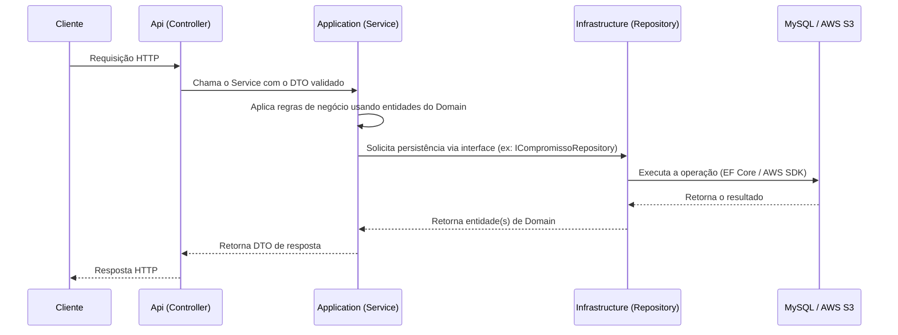

# Arquitetura — Backend euSíndico

API REST desenvolvida em **ASP.NET Core (.NET 10)**, seguindo arquitetura em camadas conforme definido no [RFC](../../documentation/RFC/RFC.md#5-arquitetura-do-sistema) (seção 5), organizada em 4 projetos.

## Fluxo de dependências

```
euSindico.Api
   ├──> euSindico.Application ──> euSindico.Domain
   └──> euSindico.Infrastructure ──> euSindico.Domain
```

Regra de ouro: **as setas só apontam para dentro**. Domain não depende de nada. Application e Infrastructure dependem apenas de Domain — nunca uma da outra. Api é a única camada que conhece todas as outras, pois é o *composition root* da aplicação (onde tudo é conectado via injeção de dependência).

---

## euSindico.Domain

Núcleo da aplicação. Contém apenas o que representa o **negócio em si**, sem depender de nenhuma tecnologia externa.

**Responsabilidades:**
- Entidades: `Usuario`, `Predio`, `Compromisso`, `Planejamento`, `TipoDocumento`, `Documento`, `Relatorio`.
- Enums e value objects do domínio.
- Invariantes e regras que pertencem à própria entidade (ex: um `Predio` excluído não pode ser reativado sem uma ação explícita).

**Não é responsabilidade desta camada:**
- Acesso a banco de dados, EF Core, migrations.
- Chamadas HTTP, DTOs de request/response de API.
- Regras de negócio que dependem de múltiplas entidades ou de orquestração (isso é caso de uso, fica na Application).
- Qualquer lógica de infraestrutura (S3, JWT, hashing).

**Acessos/dependências:** nenhuma. Não referencia nenhum outro projeto da solução nem pacotes de infraestrutura (EF Core, AWS SDK, ASP.NET). É o projeto mais "puro" — se algo aqui exigir um `using Microsoft.EntityFrameworkCore` ou `using Amazon.S3`, está no lugar errado.

---

## euSindico.Application

Camada de **casos de uso** (Services, na nomenclatura do RFC). Orquestra as regras de negócio (RN01–RN14) usando as entidades do Domain, sem saber *como* os dados são persistidos ou armazenados.

**Responsabilidades:**
- Services: `AuthService`, `PerfilService`, `PredioService`, `CompromissoService`, `PlanejamentoService`, `DocumentoService`, `RelatorioService`.
- DTOs de entrada/saída dos casos de uso.
- Interfaces (contratos) que a Infrastructure deverá implementar — ex: `IUsuarioRepository`, `IPredioRepository`, `IFileStorageService`, `IPasswordHasher`. Isso é o que permite trocar o MySQL ou o S3 sem alterar essa camada (Inversão de Dependência).
- Geração dos relatórios em PDF (uso do QuestPDF), a partir dos dados já consultados.

**Não é responsabilidade desta camada:**
- Implementar acesso a banco (isso é da Infrastructure).
- Conhecer detalhes de HTTP (status code, rotas, headers) — isso é da Api.
- Conhecer EF Core, MySQL, AWS S3 diretamente. Ela só enxerga suas próprias interfaces.

**Acessos/dependências:** referencia somente `euSindico.Domain`. Depende do pacote `QuestPDF` para geração de PDF, mas nenhum pacote de banco, ORM ou nuvem.

---

## euSindico.Infrastructure

Camada de **implementação concreta** dos detalhes técnicos — é aqui que o "como" acontece.

**Responsabilidades:**
- `AppDbContext` e configuração do Entity Framework Core / Pomelo (MySQL).
- Migrations do banco de dados.
- Repositories (`UsuarioRepository`, `PredioRepository`, `CompromissoRepository` etc.) que implementam as interfaces definidas na Application.
- Implementação do armazenamento de arquivos usando AWS S3 (implementa `IFileStorageService`).
- Implementação do hashing de senha com BCrypt (implementa `IPasswordHasher`).

**Não é responsabilidade desta camada:**
- Decidir regras de negócio (ex: se um prédio excluído pode ou não receber novos compromissos — isso é validado na Application/Domain, não aqui).
- Expor tipos do EF Core, AWS SDK ou BCrypt para fora do projeto — a Api e a Application só devem enxergar as interfaces, nunca `DbContext`, `AmazonS3Client` etc. diretamente.

**Acessos/dependências:** referencia somente `euSindico.Domain`. Acessa tecnologias externas: **MySQL** (via `Microsoft.EntityFrameworkCore` + `Pomelo.EntityFrameworkCore.MySql`), **AWS S3** (via `AWSSDK.S3`) e biblioteca de hash **BCrypt.Net-Next**.

---

## euSindico.Api

Camada de **apresentação/entrada** da aplicação. É a porta de entrada HTTP e o *composition root* — onde a aplicação é montada.

**Responsabilidades:**
- Controllers REST (`AuthController`, `PerfilController`, `PredioController`, `CompromissoController`, `PlanejamentoController`, `DocumentoController`, `RelatorioController`).
- `Program.cs`: registro de injeção de dependência (conectando as interfaces da Application às implementações da Infrastructure), configuração de autenticação JWT, middlewares, documentação OpenAPI.
- Validação de entrada (FluentValidation) e mapeamento de request/response.
- Tratamento global de erros e códigos de status HTTP.

**Não é responsabilidade desta camada:**
- Lógica de negócio (validações de regra, cálculos, orquestração) — Controllers apenas recebem a requisição, chamam o Service correspondente da Application e devolvem a resposta.
- Acesso direto a dados — mesmo referenciando `Infrastructure`, os Controllers **não devem** instanciar `Repositories` ou `DbContext` diretamente; essa referência existe apenas para o `Program.cs` registrar as implementações no container de DI.

**Acessos/dependências:** referencia `euSindico.Application` (para os casos de uso) e `euSindico.Infrastructure` (apenas para registro de DI no `Program.cs`). Pacotes: `Microsoft.AspNetCore.Authentication.JwtBearer`, `Scalar.AspNetCore` + `Microsoft.AspNetCore.OpenApi` (documentação dos contratos), `FluentValidation.AspNetCore`, `Microsoft.EntityFrameworkCore.Design` (necessário aqui para o `dotnet ef` localizar o *startup project* ao gerar migrations).

---

## Resumo rápido

| Camada | Responsabilidade | Conhece | Não conhece | Tecnologia externa |
|---|---|---|---|---|
| Domain | Representar o negócio (entidades e regras intrínsecas) | nada | tudo externo | nenhuma |
| Application | Orquestrar os casos de uso (regras de negócio da aplicação) | Domain | Infrastructure, Api, EF Core, AWS | QuestPDF |
| Infrastructure | Implementar o acesso a dados e serviços externos | Domain | Application, Api | MySQL/EF Core, AWS S3, BCrypt |
| Api | Expor a API REST e compor a aplicação (injeção de dependência) | Application, Infrastructure (só DI) | — | JWT, Scalar/OpenAPI, FluentValidation |

---

## Fluxo de uma requisição

O caminho de uma requisição (ex: `POST /compromissos`) é:


