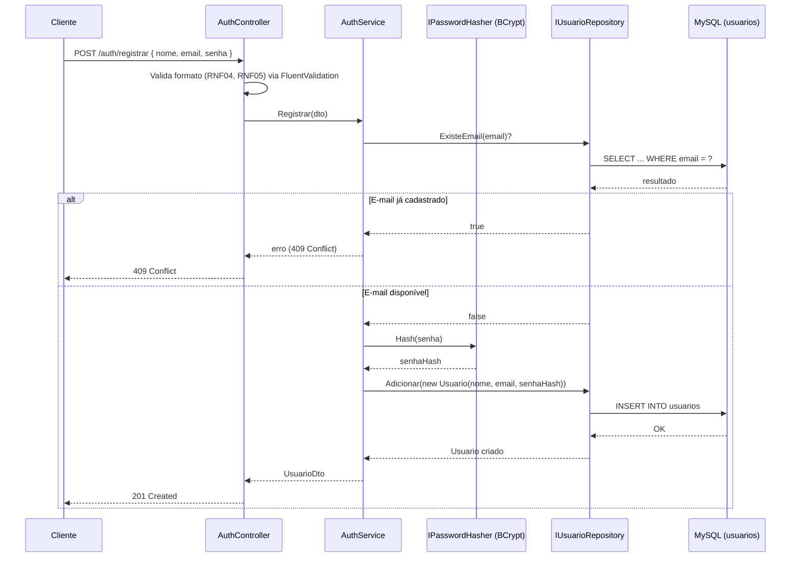
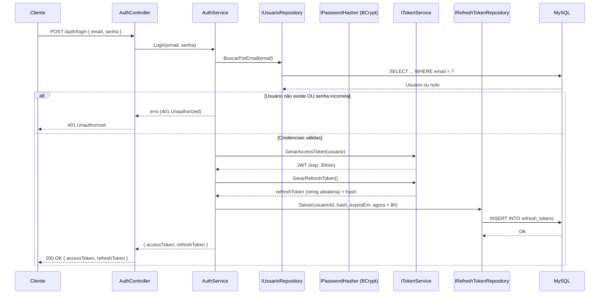
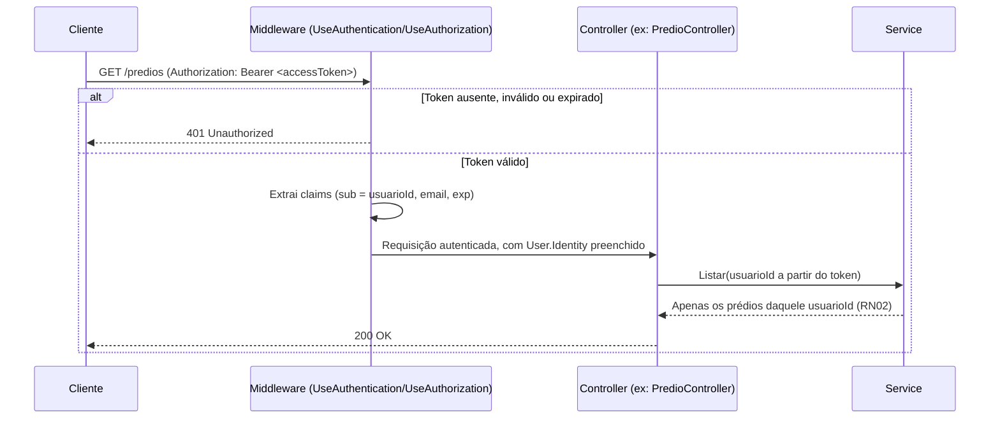
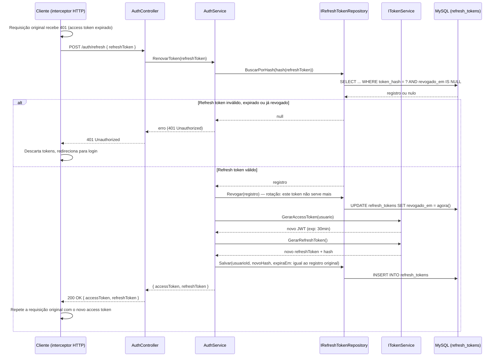
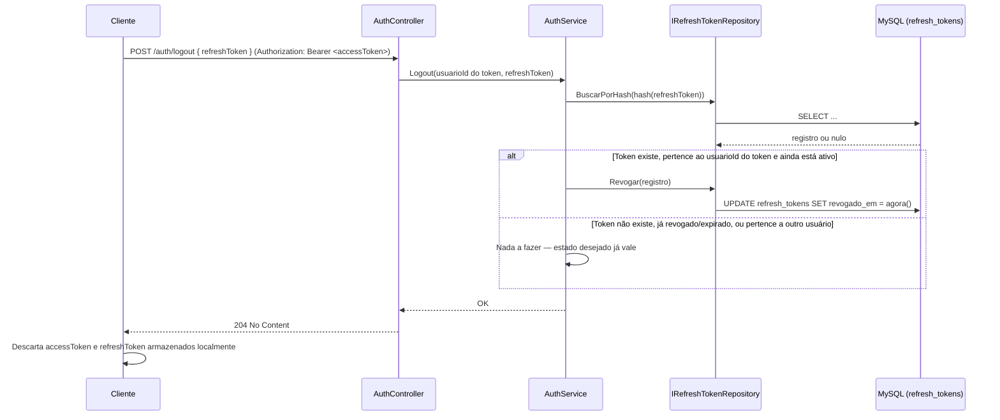
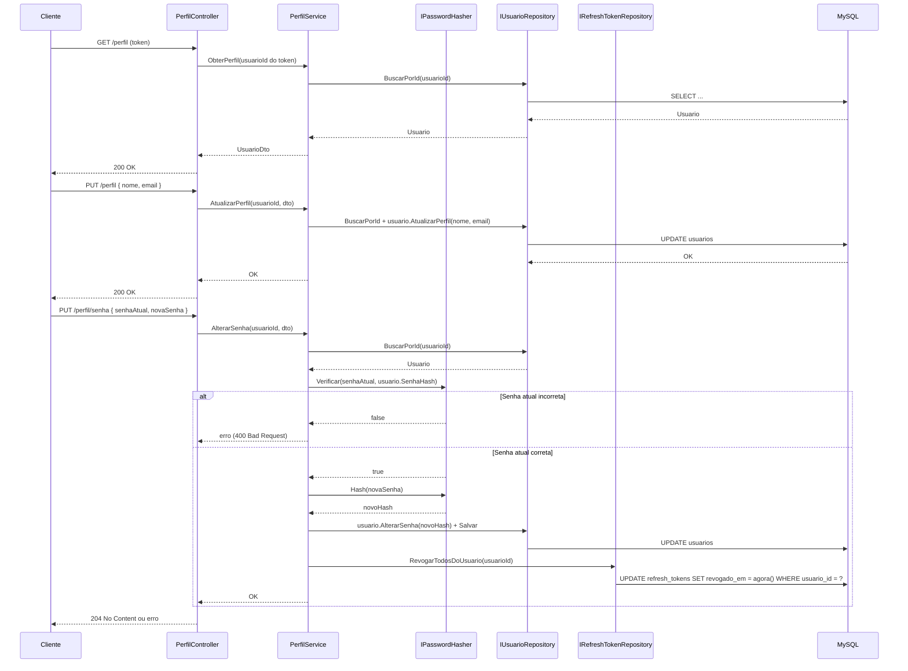
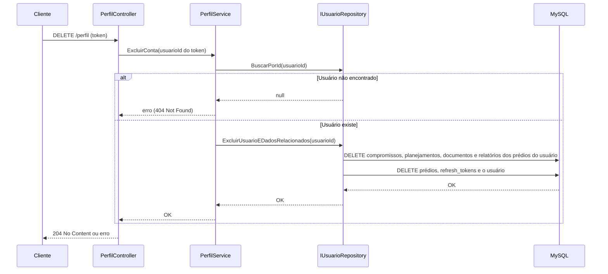
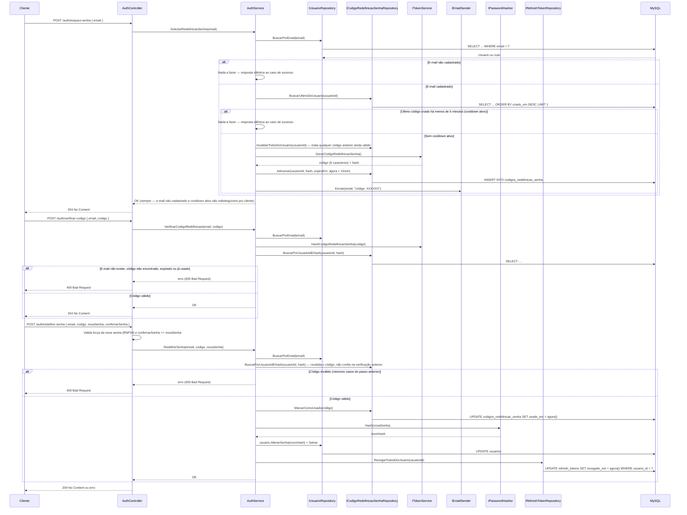

# Autenticação — Backend euSíndico

Este documento descreve o fluxo completo de autenticação e gerenciamento de conta do euSíndico, cobrindo RF01–RF07 (incluindo RF06-A), RNF02–RNF05, RN01 e RN15 do [RFC](../../documentation/RFC/RFC.md). Serve de referência para a implementação do `AuthController`/`PerfilController`.

## Sumário

- [Visão geral](#visão-geral)
- [Onde cada peça mora na arquitetura](#onde-cada-peça-mora-na-arquitetura)
- [Nova entidade: RefreshToken](#nova-entidade-refreshtoken)
- [Nova entidade: CodigoRedefinicaoSenha](#nova-entidade-codigoredefinicaosenha)
- [Fluxo 1 — Criar conta](#fluxo-1--criar-conta-rf01--implementado)
- [Fluxo 2 — Login](#fluxo-2--login-rf02--implementado)
- [Fluxo 3 — Requisição autenticada a um recurso protegido](#fluxo-3--requisição-autenticada-a-um-recurso-protegido-rn01-rn02--implementado)
- [Fluxo 4 — Renovação automática do access token](#fluxo-4--renovação-automática-do-access-token--implementado)
- [Fluxo 5 — Logout](#fluxo-5--logout-rf03--implementado)
- [Fluxo 6 — Perfil: visualizar, editar, alterar senha](#fluxo-6--perfil-visualizar-editar-alterar-senha-rf04rf06--implementado)
- [Fluxo 7 — Exclusão de conta](#fluxo-7--exclusão-de-conta-rf07--implementado)
- [Fluxo 8 — Recuperação de senha esquecida](#fluxo-8--recuperação-de-senha-esquecida-rf06-a--implementado)
- [Estrutura do access token (JWT)](#estrutura-do-access-token-jwt)
- [Validações de entrada (RNF04, RNF05)](#validações-de-entrada-rnf04-rnf05)
- [Próximos passos](#próximos-passos)

## Visão geral

- **Mecanismo:** access token (JWT, curto) + refresh token (opaco, revogável, guardado no banco).
- **Expiração do access token:** curta (ex: 30 minutos) — é o token *stateless* enviado em cada requisição.
- **Expiração do refresh token:** 8 horas a partir do login (mantém o espírito do RNF02, mas aplicado à sessão como um todo, não ao token de cada requisição).
- **Hash de senha:** BCrypt (RNF03) — a senha em texto puro nunca é persistida nem logada.
- **Autorização:** todo endpoint fora do módulo de autenticação exige um access token válido (RN01). Cada usuário só enxerga os próprios prédios e dados relacionados (RN02) — isso é aplicado usando o `sub` (id do usuário) extraído do token, nunca de um parâmetro vindo do cliente.

> Esse design substitui a versão anterior (um único JWT de 8h, sem revogação server-side). O motivo da mudança: como o euSíndico é um produto real, o gap de segurança de "token roubado continua válido por até 8h mesmo após logout" deixou de ser aceitável. Veja a comparação (tabela + razão de cada troca) em [SECURITY.md](SECURITY.md), seção 1, "Por que não um único token de 8h".

## Onde cada peça mora na arquitetura

Seguindo a divisão descrita em [ARCHITECTURE.md](ARCHITECTURE.md):

| Componente | Camada | Responsabilidade |
|---|---|---|
| `AuthController`, `PerfilController` | Api | Recebe a requisição HTTP, valida o corpo (FluentValidation), delega ao Service, devolve o status/DTO de resposta. |
| `AuthService`, `PerfilService` | Application | Orquestra o caso de uso: valida regras (ex: e-mail já cadastrado), chama o hash/verificação de senha e a geração/renovação/revogação de tokens através de interfaces. |
| `IUsuarioRepository` | Application (interface) / Infrastructure (implementação) | Busca e persiste o `Usuario` no MySQL via `AppDbContext`. |
| `IRefreshTokenRepository` | Application (interface) / Infrastructure (implementação) | Busca, persiste e revoga registros de `RefreshToken` no MySQL. |
| `IPasswordHasher` | Application (interface) / Infrastructure (implementação com BCrypt) | Gera e verifica o hash da senha. |
| `ITokenService` | Application (interface) / Infrastructure (implementação com `System.IdentityModel.Tokens.Jwt`) | Gera o access token (JWT) assinado e gera/valida o refresh token (string aleatória, guardada com hash). |
| Middleware `UseAuthentication()` / `UseAuthorization()` | Api (`Program.cs`) | Em toda requisição, valida o access token do header `Authorization: Bearer <token>` antes de o Controller ser executado. |

A entidade `Usuario` (`euSindico.Domain/Entities/Usuario.cs`) já expõe os métodos `AtualizarPerfil` e `AlterarSenha` usados pelo `PerfilService` — a senha nunca é manipulada como texto puro dentro do Domain, só o hash já calculado pela Infrastructure é passado adiante.

## Nova entidade: RefreshToken

Diferente do access token (stateless, nunca persistido), o refresh token **precisa** existir no banco para poder ser revogado. Campos em [RFC.md](../../documentation/RFC/RFC.md#522-esquema-relacional), tabela `refresh_tokens`.

Pontos importantes desse desenho:
- **Nunca guardamos o refresh token em texto puro** — só um hash dele (mesmo princípio da senha: se o banco vazar, os tokens não são diretamente utilizáveis).
- **`expira_em` é fixo desde o login**, não é estendido a cada renovação — isso limita a sessão total a 8h mesmo que o usuário fique renovando o access token o tempo todo, evitando sessões "eternas" via refresh contínuo.
- **`revogado_em` nulo = token ainda ativo.** Preenchido quando: (a) o usuário faz logout, (b) o token é usado uma vez para renovar (rotação, ver abaixo), ou (c) o usuário altera a senha/exclui a conta.

## Nova entidade: CodigoRedefinicaoSenha

Suporta o RF06-A (recuperação de senha esquecida). Mesmo espírito do `RefreshToken`: um segredo de curta duração, verificável só pelo hash, nunca guardado em texto puro. Campos em [RFC.md](../../documentation/RFC/RFC.md#522-esquema-relacional), tabela `codigos_redefinicao_senha`.

Pontos importantes desse desenho:
- **Nunca guardamos o código em texto puro** — só o hash SHA-256 (mesmo princípio do refresh token e da senha).
- **`expira_em` fixo em 15 minutos desde a geração** (RN15) — janela curta o suficiente pra não valer a pena tentar adivinhar, longa o suficiente pra o usuário checar o e-mail com calma.
- **`usado_em` nulo = código ainda válido.** Preenchido quando: (a) o código é consumido numa redefinição de senha bem-sucedida, ou (b) uma nova solicitação de código é feita (invalida qualquer código anterior do mesmo usuário — no máximo um código ativo por vez).
- **Não há índice único em `codigo_hash` isolado** (diferente de `refresh_tokens.token_hash`) — com só 6 caracteres, colisão do mesmo código entre usuários diferentes é estatisticamente plausível; a busca sempre escopa por `usuario_id` + `codigo_hash` juntos.
- **Código só com maiúsculas e números, validação case-insensitive:** o código gerado usa apenas A–Z e 0–9 (sem caracteres ambíguos como `0`/`O`/`1`/`I`/`L` — ver [SECURITY.md](SECURITY.md), seção 10). O que o usuário digita é normalizado para maiúsculas antes de hashear e comparar, então `ab12cd` e `AB12CD` validam igual — melhora a experiência em teclado mobile sem abrir mão de segurança (a normalização é só sobre o valor a ser hasheado, não amplia o espaço de códigos possíveis).

## Fluxo 1 — Criar conta (RF01) ✅ implementado

A senha em texto puro só existe entre o Controller e a chamada ao `IPasswordHasher` — nunca chega à Infrastructure/DB nem é logada.

## Fluxo 2 — Login (RF02) ✅ implementado

Por segurança, a resposta de erro é idêntica tanto para "e-mail não existe" quanto para "senha incorreta" — evita que a API revele quais e-mails estão cadastrados (*user enumeration*).

## Fluxo 3 — Requisição autenticada a um recurso protegido (RN01, RN02) ✅ implementado

> Implementado junto com o `PerfilController` (primeiro endpoint com `[Authorize]`). `UseAuthentication()`/`AddJwtBearer()` registrados no `Program.cs`, com `MapInboundClaims = false` para manter os nomes originais das claims (`sub`, `email`) em vez do remapeamento padrão do .NET para URIs legadas. O diagrama abaixo usa `PredioController` como exemplo genérico do padrão — hoje quem usa isso de fato é o `PerfilController`.

Todo endpoint fora de `/auth/*` passa pelo middleware de autenticação antes de chegar ao Controller — validação puramente *stateless*, sem consulta ao banco:

**Importante:** o `usuarioId` usado para filtrar os dados (RN02) vem sempre das claims do token (`User.FindFirst(...)`), nunca de um parâmetro de rota/query — do contrário um usuário poderia consultar dados de outro só trocando um ID na URL.

## Fluxo 4 — Renovação automática do access token ✅ implementado

Como o access token dura só ~30 minutos, o frontend precisa renová-lo silenciosamente, sem pedir login de novo. Isso é feito por um interceptor HTTP (ex: interceptor do Axios no Vue.js) que reage a qualquer `401`:

Esse processo é **automático e invisível** para o síndico — ele não vê tela de login nem percebe a renovação; a experiência continua sendo "fico logado por 8h", igual ao design anterior. Só quando o refresh token expira de fato (8h desde o login) ou é revogado é que ele volta para a tela de login.

**Rotação:** a cada renovação, o refresh token usado é revogado e um novo é emitido. Isso limita o dano se um refresh token vazar — ele só serve uma vez; se um atacante e o usuário legítimo tentarem usar o mesmo refresh token, o segundo a chegar recebe 401 (sinal de possível roubo).

## Fluxo 5 — Logout (RF03) ✅ implementado

Diferente do design anterior, o logout agora **revoga de verdade** o refresh token daquela sessão no servidor:

O endpoint exige um access token válido (`[Authorize]`) — o `usuarioId` usado para conferir a posse do refresh token vem das claims do token, nunca do corpo da requisição (RN02). Só é revogado o refresh token **daquela sessão/dispositivo** — se o síndico estiver logado em outro aparelho, essa outra sessão continua ativa. O access token em uso ainda funciona até expirar sozinho (no máximo ~30 min, já que é stateless), mas depois disso ele não consegue mais ser renovado — a sessão está, na prática, encerrada bem mais rápido do que os antigas 8h do design anterior.

**Idempotente e sem mensagens de erro:** se o refresh token informado não existir, já estiver revogado/expirado, ou pertencer a outro usuário, o endpoint devolve o mesmo `204 No Content` — nunca um erro. O objetivo do logout ("essa sessão não deve mais renovar") já vale nesses casos, e não faz sentido dar ao cliente um sinal que distinga essas situações (mesmo espírito anti-enumeração do `RenovarTokenAsync` no Fluxo 4).

### Responsabilidade do frontend no logout

O backend só cuida de metade do logout (revogar o refresh token no servidor). A outra metade é responsabilidade do frontend, e é assim que a maioria dos sistemas com access token curto + refresh token faz (Auth0, Keycloak, Cognito, etc.) — não é peculiaridade do euSíndico:

1. Chamar `POST /auth/logout` com o `refreshToken` no corpo e o `accessToken` no header `Authorization`.
2. **Apagar os tokens armazenados localmente** (`localStorage`/`sessionStorage`/cookie/store) **incondicionalmente** — mesmo se o passo 1 falhar por rede/timeout. O usuário espera sair da conta *naquele dispositivo* independente do backend responder; a chamada ao endpoint é reforço de segurança (impede renovação futura), não pré-requisito para a limpeza local.
3. Redirecionar para a tela de login.

Se o passo 2 não acontecer, num dispositivo compartilhado o próximo usuário continuaria com o access token funcionando pelos minutos restantes (risco residual, mas agora medido em minutos, não em horas, graças à revogação do refresh token no passo 1).

## Fluxo 6 — Perfil: visualizar, editar, alterar senha (RF04–RF06) ✅ implementado

Alterar a senha exige a senha atual — evita que alguém com uma sessão já aberta (token roubado, dispositivo desbloqueado) troque a senha do dono da conta sem confirmar que é ele. Além disso, trocar a senha **revoga todos os refresh tokens ativos do usuário** (todas as sessões, todos os dispositivos) — se a troca de senha foi motivada por suspeita de conta comprometida, isso derruba qualquer sessão que o invasor pudesse ter.

## Fluxo 7 — Exclusão de conta (RF07) ✅ implementado

Diferente da exclusão de `Predio` (RN08, soft delete), a exclusão de conta é **definitiva** (seção 6.2 do RFC — "a exclusão será realizada de forma permanente"), removendo o usuário e todos os dados vinculados, incluindo os refresh tokens. Como todas as chaves estrangeiras envolvidas são `Restrict` (nenhum `ON DELETE CASCADE` no banco), a `UsuarioRepository` apaga na ordem correta — filhos de `Predio` primeiro, depois `Predio`, depois `RefreshToken`, só então o `Usuario` — dentro de uma transação, para não deixar dados órfãos se alguma etapa falhar no meio.

**Sobre o access token em uso:** assim como no logout (Fluxo 5), o access token que o cliente já tem continua *stateless* e aceito até sua expiração natural (~30 min), mesmo depois que a conta (e o refresh token) já não existem mais no banco. Qualquer chamada a um endpoint que precise buscar o usuário no banco (ex: `GET /perfil`) já falha nesse intervalo com `404 Not Found`, já que o registro não existe mais — mas o access token em si não é invalidado de forma imediata.

## Fluxo 8 — Recuperação de senha esquecida (RF06-A) ✅ implementado

Três endpoints, nenhum exige autenticação (o usuário está, por definição, deslogado e sem acesso à senha):

As decisões de segurança por trás desse fluxo (anti-enumeração, formato/validade do código, cooldown de 5 minutos, reaproveitamento do rate limiting, revogação de sessões) estão detalhadas em [SECURITY.md](SECURITY.md), seção 10 — aqui fica só o que é específico da sequência entre os 3 endpoints: `verificar-codigo` existe só para a experiência do usuário, evitando que ele preencha a tela de nova senha só pra descobrir depois que o código estava errado. A validação de verdade acontece de novo em `redefinir-senha`, que nunca confia que o front só chega até ali depois de uma verificação bem-sucedida no passo anterior.

## Estrutura do access token (JWT)

| Claim | Conteúdo | Uso |
|---|---|---|
| `sub` | Id do usuário (`Usuario.Id`) | Identifica o dono da requisição — usado para filtrar dados por usuário (RN02). |
| `email` | E-mail do usuário | Conveniência, evita nova consulta ao banco só para exibir o e-mail logado. |
| `exp` | Data/hora de expiração (emissão + ~30min) | Aplicado automaticamente pelo middleware JWT Bearer — tokens expirados são rejeitados com 401. |

O token é assinado com uma chave simétrica (`HMAC-SHA256`), configurada via `Jwt:SecretKey` (User Secrets em dev, variável de ambiente em produção — mesmo padrão já usado para `ConnectionStrings:DefaultConnection`, ver [GETTING_STARTED.md](GETTING_STARTED.md)). Essa chave nunca deve ser versionada.

O refresh token **não** é um JWT — é uma string aleatória opaca de alta entropia (ex: 256 bits gerados com `RandomNumberGenerator`), sem conteúdo interpretável. Isso é intencional: ele não precisa carregar claims, só precisa ser um segredo verificável contra o hash guardado no banco.

## Validações de entrada (RNF04, RNF05)

Aplicadas na Api via FluentValidation, antes de qualquer chamada ao Service:

- **Senha (RNF04):** mínimo 8 caracteres, com letra maiúscula, letra minúscula, número e caractere especial.
- **E-mail (RNF05):** formato validado no cadastro e na atualização de perfil.

## Próximos passos

Implementados até agora: `POST /auth/registrar`, `POST /auth/login`, `POST /auth/refresh`, `POST /auth/logout`, `GET /perfil`, `PUT /perfil`, `PUT /perfil/senha`, `DELETE /perfil`, `POST /auth/esqueci-senha`, `POST /auth/verificar-codigo` e `POST /auth/redefinir-senha` (Fluxos 1 a 8), com `AuthService`, `PerfilService`, `IUsuarioRepository`, `IRefreshTokenRepository`, `ICodigoRedefinicaoSenhaRepository`, `IPasswordHasher`, `ITokenService`, `IEmailSender`/`SmtpEmailSender` (MailKit), as entidades/migrations de `RefreshToken` e `CodigoRedefinicaoSenha`, e o middleware `UseAuthentication()`/`AddJwtBearer()` já registrados no `Program.cs`.

Todo o fluxo de autenticação e gerenciamento de conta descrito neste documento está implementado.
