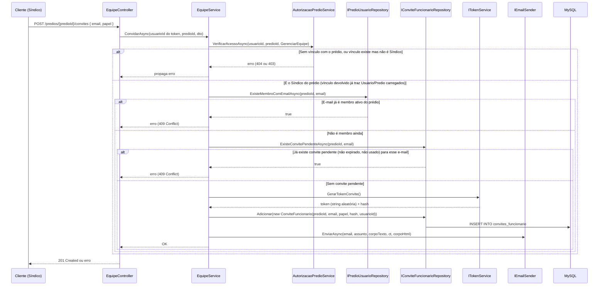
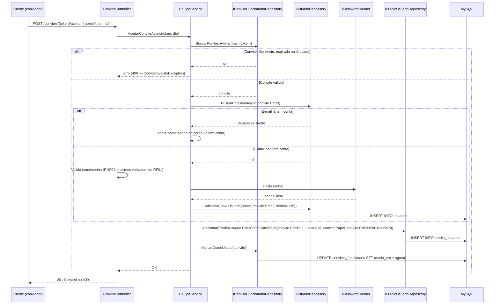
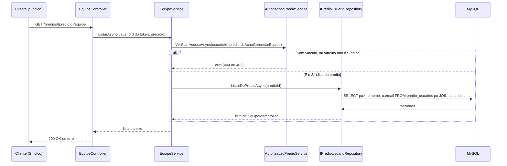
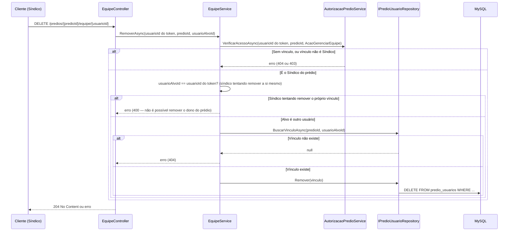

# Equipe e Acesso — Backend euSíndico

Este documento descreve o desenho do módulo de gestão de equipe/perfis de acesso (RF29–RF34, RN16–RN22) do [RFC](../../documentation/RFC/RFC.md). É o que permite a um síndico ter funcionários (hoje: uma secretária e um ajudante) com acesso supervisionado aos seus prédios, cada um com um conjunto diferente de permissões.

> **Status:** implementado (Domain, Application, Infrastructure, Api e migration — commit da migration `AddEquipeEAcesso`), **exceto a integração com o CRUD de Prédios**, que ainda não existe (ver [PREDIOS.md](PREDIOS.md)). Isso significa que, hoje, um prédio criado diretamente no banco (ou por um teste) não ganha automaticamente a linha `PredioUsuario.CriarComoDono` do seu dono — isso só passa a acontecer quando `PredioService.CriarAsync` for implementado e chamar esse método (ver nota em PREDIOS.md, seção "Notas para módulos futuros"). Até lá, `POST /predios/{id}/convites` e os demais endpoints deste módulo funcionam normalmente contra qualquer prédio que já tenha esse vínculo — só não há ainda um jeito de criar prédio *e* vínculo pela API numa única chamada. É também pré-requisito para o módulo de Compromissos: o campo `responsavel_usuario_id` descrito aqui ainda não foi adicionado à entidade `Compromisso` (fora do escopo desta etapa, junto com o resto do CRUD de Compromissos).

## Sumário

- [Visão geral](#visão-geral)
- [Onde cada peça mora na arquitetura](#onde-cada-peça-mora-na-arquitetura)
- [Novas entidades](#novas-entidades)
- [Regras de negócio aplicadas](#regras-de-negócio-aplicadas)
- [Endpoints](#endpoints)
- [Fluxo 1 — Convidar funcionário (RF29)](#fluxo-1--convidar-funcionário-rf29)
- [Fluxo 2 — Aceitar convite e criar conta (RF30)](#fluxo-2--aceitar-convite-e-criar-conta-rf30)
- [Fluxo 3 — Listar equipe de um prédio (RF31)](#fluxo-3--listar-equipe-de-um-prédio-rf31)
- [Fluxo 4 — Remover acesso de um funcionário (RF32)](#fluxo-4--remover-acesso-de-um-funcionário-rf32)
- [Autorização por perfil (RF33) — `AutorizacaoPredioService`](#autorização-por-perfil-rf33--autorizacaopredioservice)
- [Compromissos e o campo responsável (RF34, RN20, RN21)](#compromissos-e-o-campo-responsável-rf34-rn20-rn21)
- [Segurança](#segurança)
- [Decisões desta etapa (não previstas no RFC)](#decisões-desta-etapa-não-previstas-no-rfc)
- [Pendências registradas](#pendências-registradas)
- [Testes previstos](#testes-previstos)
- [Próximos passos](#próximos-passos)

## Visão geral

- O sistema deixa de ser "1 usuário = 1 dono de prédio" para um modelo de **membresia**: um prédio pode ter vários usuários vinculados, cada um com um **perfil** (`Sindico = 1`, `Gestor = 2` ou `Colaborador = 3`) — RN18. Nomes genéricos de propósito (nível de permissão, não cargo real da pessoa) — um síndico pode convidar qualquer tipo de funcionário (secretária, zelador, contador...) com o papel adequado.
- `Predio.UsuarioId` continua existindo e significando "dono/criador" (usado só para contar o limite de 20 prédios ativos, [PREDIOS.md](PREDIOS.md)) — mas deixa de ser a única fonte de verdade para autorização. Toda checagem de acesso passa a consultar `predio_usuarios`.
- **Cadastro de funcionário fecha por convite** (decisão confirmada): `POST /auth/registrar` continua existindo, mas cria só contas "raiz" (síndicos). Um funcionário só ganha conta através de um link de convite emitido pelo síndico — ele nunca se autocadastra achando que vira dono de algo.
- **Colaborador enxerga só o que é seu** (RN21, confirmado): mesmo dentro de um prédio onde também atuam o Síndico e um Gestor, o usuário com papel Colaborador só vê, edita e remove os compromissos onde ele é o responsável.
- **Síndico e Gestor alternam entre "meus" e "todos"** (RF34, confirmado): mesmo nível de visibilidade entre os dois perfis — a tela de compromissos abre em "meus" por padrão, com um filtro para trocar para "todos os compromissos do prédio".

## Onde cada peça mora na arquitetura

Seguindo [ARCHITECTURE.md](ARCHITECTURE.md) e o mesmo padrão dos módulos existentes:

| Componente | Camada | Status | Responsabilidade |
|---|---|---|---|
| `PredioUsuario`, `PapelPredio` (enum) | Domain | ✅ implementado | Entidade de vínculo usuário–prédio e o enum de perfis. |
| `ConviteFuncionario` | Domain | ✅ implementado | Entidade do convite pendente (mesmo espírito de `CodigoRedefinicaoSenha`). |
| `EquipeController` | Api | ✅ implementado | Convidar, listar, remover membros — rotas sob `/predios/{predioId}/...`. |
| `ConviteController` | Api | ✅ implementado | `GET /convites/{token}` e `POST /convites/{token}/aceitar` — únicas rotas deste módulo sem `[Authorize]`, pelo mesmo motivo do fluxo de recuperação de senha (quem aceita ainda não tem sessão). |
| `EquipeService` | Application | ✅ implementado | Orquestra convite, aceite, listagem e remoção; valida RN16–RN19, RN22. |
| `IPredioUsuarioRepository` / `PredioUsuarioRepository` | Application / Infrastructure | ✅ implementado | Persistência do vínculo. |
| `IConviteFuncionarioRepository` / `ConviteFuncionarioRepository` | Application / Infrastructure | ✅ implementado | Persistência do convite. |
| `AutorizacaoPredioService` | Application | ✅ implementado | Serviço compartilhado por **todos** os módulos (Compromissos, Planejamentos, Documentos, Relatórios, Prédios) para resolver "esse usuário pode fazer X neste prédio?" — ver [seção dedicada](#autorização-por-perfil-rf33--iautorizacaopredioservice). Concreto na Application (sem interface própria), mesmo padrão de `AuthService`/`PerfilService` — usa `IPredioUsuarioRepository` para consultar o vínculo. |
| `IConviteLinkBuilder` / `ConviteLinkBuilder` | Application / Infrastructure | ✅ implementado | Monta a URL de aceite do convite a partir de `Frontend:BaseUrl` (novo secret, ver GETTING_STARTED.md) — a Application nunca lê configuração diretamente. |
| `ITokenService.GerarTokenConvite`/`HashTokenConvite` (já existia, estendido) | Application / Infrastructure | ✅ implementado | Reaproveita a mesma construção do refresh token (string aleatória de alta entropia). |
| `IEmailSender`/`SmtpEmailSender` (já existia, estendido) | Application / Infrastructure | ✅ estendido | Envio do e-mail de convite. Ganhou um parâmetro `corpoHtml` opcional (`multipart/alternative` via `MimeKit.BodyBuilder`) — RF06-A continua enviando só texto, sem HTML. |
| `ConviteInvalidoException`, `EmailJaVinculadoException`, `AcaoNaoPermitidaException`, `PredioNaoEncontradoException`, `MembroNaoEncontradoException`, `RemoverDonoDoPredioException`, `DadosCadastroObrigatoriosException` | Application | ✅ implementado | Mapeadas para `400`/`403`/`404`/`409` no `ApplicationExceptionHandler`. |
| Integração com `PredioService.CriarAsync` | Application (a fazer junto do CRUD de Prédios) | 🔲 pendente | Criar a linha `PredioUsuario.CriarComoDono` ao criar um prédio — ver [PREDIOS.md](PREDIOS.md). |

## Novas entidades

### PredioUsuario (Domain)

```csharp
public enum PapelPredio { Sindico = 1, Gestor = 2, Colaborador = 3 } // valores fixos, nunca renumerados

public class PredioUsuario
{
    public int Id { get; private set; }
    public int PredioId { get; private set; }
    public int UsuarioId { get; private set; }
    public PapelPredio Papel { get; private set; }
    public int? ConvidadoPorUsuarioId { get; private set; }
    public DateTime CriadoEm { get; private set; }

    public static PredioUsuario CriarComoDono(int predioId, int usuarioId) { /* Papel = Sindico; ConvidadoPorUsuarioId = null */ }
    public static PredioUsuario CriarComoConvidado(int predioId, int usuarioId, PapelPredio papel, int convidadoPorUsuarioId) { /* ... */ }
}
```

`CriarComoDono` é chamada pelo `PredioService.CriarAsync` (fora do escopo deste documento, mas é o ponto de integração com [PREDIOS.md](PREDIOS.md) — ver nota na seção "Notas para módulos futuros" daquele documento) — todo prédio, ao ser criado, já nasce com uma linha de equipe para o próprio dono. Sem isso, o dono não teria como passar pela checagem do `AutorizacaoPredioService` sobre seu próprio prédio.

### ConviteFuncionario (Domain)

```csharp
public class ConviteFuncionario
{
    public int Id { get; private set; }
    public int PredioId { get; private set; }
    public string Email { get; private set; }
    public PapelPredio Papel { get; private set; }
    public string TokenHash { get; private set; }
    public int CriadoPorUsuarioId { get; private set; }
    public DateTime CriadoEm { get; private set; }
    public DateTime ExpiraEm { get; private set; }
    public DateTime? UsadoEm { get; private set; }

    public ConviteFuncionario(int predioId, string email, PapelPredio papel, string tokenHash, int criadoPorUsuarioId) { /* Papel restrito a Gestor/Colaborador — nunca Sindico */ }
    public void MarcarComoUsado() { /* UsadoEm = UtcNow */ }
}
```

Mesmo princípio de `CodigoRedefinicaoSenha` ([AUTHENTICATION.md](AUTHENTICATION.md)): o token em texto puro nunca é persistido, só o hash; `UsadoEm` nulo = convite ainda pendente (RN17). O construtor rejeita `Papel = Sindico` — um convite nunca cria outro dono, só Gestor ou Colaborador (dono é sempre quem cria o prédio).

## Regras de negócio aplicadas

| Regra | Como é aplicada |
|---|---|
| RN16 — acesso só com vínculo explícito | Toda leitura/escrita em `/predios/{id}/...` passa por `AutorizacaoPredioService`, que busca a linha em `predio_usuarios`. Sem linha → `404` (mesmo padrão anti-enumeração de `PredioNaoEncontradoException`). |
| RN17 — convite expira e é de uso único | `ConviteFuncionario.ExpiraEm` + `UsadoEm`; ambos checados em `POST /convites/{token}/aceitar`. |
| RN18 — perfil é por vínculo, não por usuário | `PredioUsuario.Papel` vive na linha do vínculo, não em `Usuario` — o mesmo `usuario_id` pode aparecer em várias linhas de `predio_usuarios` com papéis diferentes. |
| RN19 — só Síndico gerencia equipe | `EquipeService` checa `Papel == Sindico` antes de convidar/listar/remover; qualquer outro papel recebe `403` (`AcaoNaoPermitidaException`). |
| RN20 — responsável do compromisso conforme perfil | Ver [seção dedicada](#compromissos-e-o-campo-responsável-rf34-rn20-rn21). |
| RN21 — ajudante só vê os próprios compromissos | Ver [seção dedicada](#compromissos-e-o-campo-responsável-rf34-rn20-rn21). |
| RN22 — remover acesso não apaga histórico | `EquipeService.RemoverAsync` apaga só a linha de `predio_usuarios`; `compromissos.responsavel_usuario_id` continua apontando para o `usuario_id` removido (FK `Restrict`, não `Cascade` — consistente com o padrão já usado no projeto, [ARCHITECTURE.md](ARCHITECTURE.md)). |

## Endpoints

| Método | Rota | Ação | Autenticado? | Perfil exigido | Sucesso | Erros possíveis |
|---|---|---|---|---|---|---|
| `POST` | `/predios/{predioId}/convites` | Convidar funcionário (RF29) | Sim | Síndico | `201 Created` | `400`, `403`, `404` (prédio), `409` (já é membro ou já há convite pendente para o e-mail) |
| `GET` | `/predios/{predioId}/equipe` | Listar equipe (RF31) | Sim | Síndico | `200 OK` | `403`, `404` |
| `DELETE` | `/predios/{predioId}/equipe/{usuarioId}` | Remover acesso (RF32) | Sim | Síndico | `204 No Content` | `403`, `404` |
| `GET` | `/convites/{token}` | Detalhes do convite (para a tela de aceite) | **Não** | — | `200 OK` | `400`/`404` (token inválido/expirado — resposta única, sem distinguir causa) |
| `POST` | `/convites/{token}/aceitar` | Aceitar convite e criar conta (RF30) | **Não** | — | `201 Created` | `400`/`404` (token inválido/expirado) |

`GET`/`POST` de `/convites/{token}` não exigem `[Authorize]` pelo mesmo motivo do fluxo de recuperação de senha: quem está aceitando um convite, por definição, ainda não tem sessão no sistema.

## Fluxo 1 — Convidar funcionário (RF29)



A ação exigida (`AcaoPredio.GerenciarEquipe`) é a mesma checagem que os outros módulos vão reaproveitar (ver [seção dedicada](#autorização-por-perfil-rf33--autorizacaopredioservice)) — aqui ela é exclusiva do Síndico.

**Conteúdo do e-mail (RF29):** identifica quem convidou e para qual prédio — `"{nome do síndico} convidou você para fazer parte da equipe do prédio \"{nome do prédio}\" no euSíndico, como {papel}"` — em vez de um convite genérico sem contexto. O nome do síndico e do prédio vêm do próprio vínculo devolvido por `VerificarAcessoAsync` (já carrega `Usuario`/`Predio`, sem consulta extra). O e-mail é enviado como `multipart/alternative` (`IEmailSender.EnviarAsync` ganhou um parâmetro `corpoHtml` opcional — texto simples continua sendo o único corpo quando omitido, como no RF06-A):
- **Texto simples** (fallback): a frase acima + o link cru.
- **HTML**: mesma frase + um botão estilizado "**Aceitar convite**" (cor `#1E4FA8`, o azul institucional do tema, [`vuetify.ts`](../../frontend/src/plugins/vuetify.ts)) apontando pro link, com o link também por extenso logo abaixo (caso o botão não renderize no cliente de e-mail).
- **Nome do síndico e do prédio são HTML-encoded** (`WebUtility.HtmlEncode`) antes de entrar no corpo HTML — defesa em profundidade (mesmo raciocínio do [SECURITY.md](SECURITY.md), seção 3: "qualquer consumidor futuro desse dado, como e-mail de notificação, precisa lembrar de escapar corretamente"), já que o nome do prédio ainda não tem uma validação de formato própria (CRUD de Prédios não implementado).

## Fluxo 2 — Aceitar convite e criar conta (RF30)

Dois caminhos, dependendo de o e-mail convidado já ter conta ou não — em ambos, o próprio token (só chega a quem recebeu o e-mail) já é a prova de posse do e-mail, mesmo raciocínio do RF06-A:



**Nada de auto-login aqui** — igual ao `POST /auth/registrar` (RF01), aceitar o convite só cria a conta/vínculo; o cliente ainda precisa chamar `POST /auth/login` depois, mantendo o mesmo padrão do resto da API (nenhum outro endpoint de criação devolve token).

**Por que o corpo aceita `nome`/`senha` como opcionais:** o mesmo endpoint serve os dois casos (conta nova vs. conta já existente) para o frontend não precisar saber de antemão qual caminho vai seguir — `GET /convites/{token}` (chamado antes, na tela de aceite) já pode devolver um indicador tipo `contaJaExiste: boolean` para o frontend decidir se mostra o formulário de nome/senha ou só um botão "vincular à minha conta".

## Fluxo 3 — Listar equipe de um prédio (RF31)



## Fluxo 4 — Remover acesso de um funcionário (RF32)



Um síndico nunca pode remover o próprio vínculo por este endpoint — isso deixaria o prédio sem dono e sem ninguém para gerenciar a equipe. (Excluir o prédio inteiro já é coberto por `DELETE /predios/{id}`, [PREDIOS.md](PREDIOS.md).)

## Autorização por perfil (RF33) — `AutorizacaoPredioService`

Hoje, `PredioService` (e todo módulo futuro) checaria "esse `usuarioId` é dono deste prédio?" direto contra `predios.usuario_id`. Com múltiplos usuários por prédio, essa checagem vira duas perguntas em sequência, centralizadas num serviço só para não duplicar a lógica em cada módulo (Compromissos, Planejamentos, Documentos, Relatórios, Prédios):

```csharp
// Application/Equipe/AutorizacaoPredioService.cs — classe concreta, sem interface própria,
// mesmo padrão de AuthService/PerfilService (a Application não precisa trocar sua
// implementação, só as dependências que ela usa — IPredioUsuarioRepository).
public class AutorizacaoPredioService(IPredioUsuarioRepository predioUsuarioRepository)
{
    public Task<PapelPredio> VerificarAcessoAsync(int usuarioId, int predioId, AcaoPredio acao, CancellationToken ct = default);
}

// Application/Equipe/AcaoPredio.cs — cresce um valor por vez, conforme cada módulo é
// implementado de fato (evita declarar ações de módulos que ainda não existem).
public enum AcaoPredio
{
    GerenciarEquipe,
    // Próximos valores, já desenhados em PREDIOS.md (CRUD de Prédios ainda não implementado):
    // VisualizarPredio (Síndico/Gestor/Colaborador), GerenciarPredio (só Síndico — editar/excluir o prédio).
    // Prováveis quando os demais módulos forem desenhados:
    // CriarCompromisso, EditarCompromissoAlheio, GerenciarPlanejamento, GerenciarDocumento, GerenciarRelatorio...
}
```

`VerificarAcessoAsync`:
1. Busca a linha em `predio_usuarios` para `(usuarioId, predioId)`. Não existe → `PredioNaoEncontradoException` (`404`) — mesmo efeito de "não existe" que já vale hoje para um prédio de outro usuário (anti-enumeração, [PREDIOS.md](PREDIOS.md)).
2. Existe → confere se `acao` está na lista de ações permitidas para aquele `Papel` (matriz abaixo). Não permitida → `AcaoNaoPermitidaException` (`403`).
3. Permitida → devolve o `Papel` para o Service chamador (útil quando o próprio Service precisa se comportar diferente conforme o papel, não só permitir/negar — ver `CriarCompromisso` abaixo).

**Matriz de permissões (RF33):**

| Ação | Síndico | Gestor | Colaborador | Implementado? |
|---|---|---|---|---|
| Editar/excluir prédio, gerenciar equipe | ✅ | ❌ | ❌ | ✅ gerenciar equipe (este documento); editar/excluir prédio depende do CRUD de Prédios |
| Criar/editar/remover compromisso | ✅ (qualquer um do prédio) | ✅ (qualquer um do prédio) | ✅ (só os próprios — ver seção seguinte) | 🔲 módulo de Compromissos ainda não existe |
| Concluir compromisso | ✅ | ✅ | ✅ (só os próprios) | 🔲 idem |
| Visualizar compromisso alheio (de outro usuário) | ✅ | ✅ | ❌ | 🔲 idem |
| Planejamentos, documentos, relatórios (CRUD completo) | ✅ | ✅ | ❌ — só visualização/download de documentos | 🔲 módulos ainda não existem |

Essa tabela é o que efetivamente responde à pergunta original "o que cada perfil pode acessar" — fica registrada aqui como a fonte de verdade a manter atualizada conforme os módulos de Compromissos/Planejamentos/Documentos/Relatórios forem desenhados em detalhe (hoje ainda não têm um documento próprio, como [PREDIOS.md](PREDIOS.md) tem para Prédios). Só a linha "gerenciar equipe" tem código de fato hoje — as demais são o desenho já acordado, aplicado quando cada módulo for construído.

## Compromissos e o campo responsável (RF34, RN20, RN21)

Esta é a regra que faz o usuário com papel Colaborador "não ver o dos outros" funcionar de fato — sem ela, ele enxergaria todos os compromissos do prédio, só sem poder editá-los, o que não é o comportamento pedido.

**Ao criar um compromisso** (`POST /predios/{predioId}/compromissos`, fora do escopo deste documento mas já usando este desenho):
- Se quem cria tem papel **Colaborador**: `responsavel_usuario_id` é sempre o próprio usuário — o `CompromissoService` ignora/rejeita qualquer `responsavelUsuarioId` vindo no corpo da requisição (RN20). Não é uma checagem de validação, é o Service nem olhar esse campo do DTO quando o papel é Colaborador.
- Se quem cria tem papel **Síndico** ou **Gestor**: pode informar `responsavelUsuarioId` no corpo, escolhendo entre os membros vinculados àquele prédio (validado contra `predio_usuarios` — um `usuarioId` que não pertence à equipe do prédio é rejeitado com `400`); se omitido, o padrão é o próprio criador.

**Ao listar compromissos** (`GET /predios/{predioId}/compromissos?escopo=meus|todos`, RF34):
- **Colaborador:** o parâmetro `escopo` é **ignorado no backend** — a query sempre filtra `responsavel_usuario_id = usuarioId do token`, mesmo que o cliente envie `escopo=todos` (RN21 é uma restrição rígida, não uma preferência de UI; o front nem deveria oferecer essa opção a esse papel, mas o backend não confia nisso).
- **Síndico e Gestor:** `escopo` padrão é `meus` (filtra por `responsavel_usuario_id = usuarioId do token`) quando o parâmetro não é enviado; `escopo=todos` remove esse filtro e retorna todos os compromissos do prédio, de qualquer responsável.

Isso é uma extensão da regra de posse que `PredioService` já aplica (usuário só mexe no que é seu) para um segundo nível de granularidade, dentro do mesmo prédio.

## Segurança

- **Token de convite:** mesma construção do refresh token e do código de redefinição de senha — string aleatória de alta entropia (`RandomNumberGenerator`), nunca armazenada em texto puro, só o hash. Como é de alta entropia (diferente do código de 6 caracteres do RF06-A), não precisa de rate limiting dedicado para inviabilizar força bruta — mas `POST /convites/{token}/aceitar` ainda assim herda a política `"auth"` de rate limiting (5 req/min por IP+rota) por consistência com os demais endpoints públicos não autenticados.
- **IDOR/anti-enumeração:** `GET /convites/{token}` com token inválido/expirado devolve a mesma resposta (`400`/`404` genérico) independente da causa — não revela se o token só está errado ou se já expirou/foi usado.
- **Enumeração de e-mails cadastrados via convite:** diferente do login/recuperação de senha, `POST /predios/{predioId}/convites` **não** precisa de resposta anti-enumeração — quem chama esse endpoint já é o síndico autenticado, convidando um e-mail que ele mesmo escolheu (não é um endpoint público testável em massa contra a base de usuários). Retornar `409` explícito quando o e-mail já é membro ou já tem convite pendente é aceitável e mais útil para a UI do que uma resposta genérica.
- **Um síndico não pode ser rebaixado/removido do próprio prédio** por este módulo (ver Fluxo 4) — evita um prédio ficar "órfão" de gestão.
- **`AcaoNaoPermitidaException` (403) vs. `PredioNaoEncontradoException` (404):** a distinção importa aqui — um usuário sem nenhum vínculo com o prédio recebe `404` (não sabe nem que o prédio existe, mesmo padrão de IDOR de [PREDIOS.md](PREDIOS.md)); um usuário **com** vínculo mas sem permissão para a ação (ex: ajudante tentando `DELETE` num compromisso alheio) recebe `403` — nesse caso não há risco de enumeração, porque ele já sabe que o prédio existe (é membro dele).

## Decisões desta etapa (não previstas no RFC)

Pontos que o RFC (mesmo na v2.2.0) não especifica em detalhe e que foram decididos nesta etapa de design — mesmo espírito das "Decisões confirmadas" de [PREDIOS.md](PREDIOS.md):

1. **Validade do convite:** proposta de **7 dias** a partir da criação — a confirmar. Prazo generoso o bastante para o funcionário ver o e-mail com calma, mas sem deixar convites pendentes indefinidamente.
2. **Reenvio de convite:** se o convite expirar antes de ser aceito, o síndico chama `POST /predios/{predioId}/convites` de novo com o mesmo e-mail — não existe um endpoint de "reenviar" dedicado; o convite antigo (expirado) simplesmente nunca mais valida, e um novo é criado normalmente (a checagem de "convite pendente" em `ExisteConvitePendenteAsync` já exclui os expirados).
3. **Cancelar convite pendente antes de expirar:** fora do escopo desta primeira versão — fica como próximo passo natural (`DELETE /predios/{predioId}/convites/{conviteId}`), sem impacto no desenho atual.
4. **Um funcionário pode ser convidado para vários prédios do mesmo síndico, com papéis diferentes em cada um** — já suportado pelo modelo (RN18), sem necessidade de nada extra.

## Pendências registradas

Fora do escopo desta primeira versão, mas o desenho já não impede:

- Cancelamento de convite pendente (ver decisão 3 acima).
- Alterar o papel de um funcionário já vinculado sem precisar remover e reconvidar (`PATCH /predios/{predioId}/equipe/{usuarioId}`).
- Um funcionário visualizar, ele mesmo, a lista de prédios/papéis que possui (hoje coberto indiretamente pela tela "Prédios" do frontend, que já lista só os prédios vinculados — ver [ARCHITECTURE.md do frontend](../../frontend/documentation/ARCHITECTURE.md)).

## Testes previstos

Seguindo a convenção já estabelecida no projeto ([PREDIOS.md](PREDIOS.md), [GETTING_STARTED.md](GETTING_STARTED.md)) — implementados:

- `euSindico.Domain.Tests/PredioUsuarioTests.cs`, `ConviteFuncionarioTests.cs` — construtores, `MarcarComoUsado`, `EstaValido` (novo, expirado, usado), rejeição de `Papel = Sindico` (dono e convite).
- `euSindico.Application.Tests/Equipe/EquipeServiceTests.cs` — convite (incluindo e-mail já membro, convite duplicado), aceite (conta nova e conta existente), listagem, remoção (incluindo tentativa de remover o próprio síndico).
- `euSindico.Application.Tests/Equipe/AutorizacaoPredioServiceTests.cs` — casos de `404` (sem vínculo), `403` (vínculo sem permissão) e permissão concedida (Síndico).
- `euSindico.Api.Tests/Controllers/EquipeControllerTests.cs`, `ConviteControllerTests.cs` — mesmo padrão dos controllers existentes.
- `euSindico.Api.Tests/Validators/ConvidarFuncionarioDtoValidatorTests.cs`, `AceitarConviteDtoValidatorTests.cs` — incluindo o caso `<script>...</script>` (mesmo espírito do teste que motivou `NomeValidator`/`EmailValidator`).
- `euSindico.Api.Tests/Middleware/ApplicationExceptionHandlerTests.cs` — casos novos para `PredioNaoEncontradoException`, `AcaoNaoPermitidaException`, `ConviteInvalidoException`, `EmailJaVinculadoException`.

Pendente para quando o módulo de Compromissos for desenhado: testes específicos de `responsavel_usuario_id` (ajudante não conseguindo ver/editar compromisso alheio, síndico/secretária alternando `escopo=meus|todos`).

## Próximos passos

Implementado nesta etapa: `PredioUsuario`/`PapelPredio`/`ConviteFuncionario` (Domain) + migration (`AddEquipeEAcesso`), `IPredioUsuarioRepository`/`IConviteFuncionarioRepository` + implementações, `AutorizacaoPredioService`, `IConviteLinkBuilder`/`ConviteLinkBuilder` (+ `Frontend:BaseUrl`, ver GETTING_STARTED.md), `ITokenService.GerarTokenConvite`/`HashTokenConvite` (extensão do `TokenService` existente), `EquipeService` + DTOs, as sete exceções novas + mapeamento no `ApplicationExceptionHandler`, `EquipeController`/`ConviteController`, validators, registro em ambos os `DependencyInjection.cs`, e os testes listados acima.

Pendente: ajustar `PredioService.CriarAsync` (quando o CRUD de Prédios for implementado, ver [PREDIOS.md](PREDIOS.md)) para também criar a linha `PredioUsuario.CriarComoDono` na mesma transação do `INSERT` do prédio — sem isso, um prédio criado pela API ainda não tem dono habilitado a convidar/gerenciar equipe.
