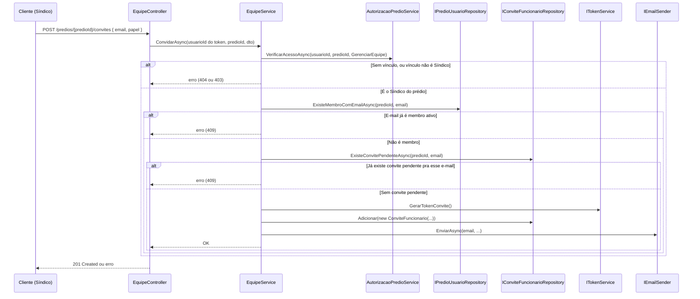
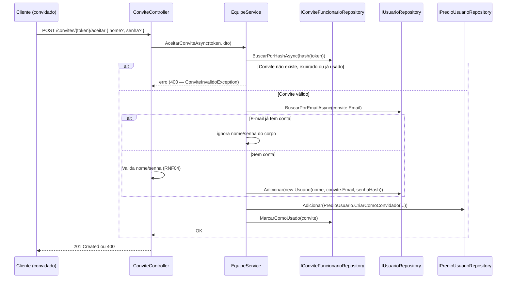

# Equipe e Acesso — Backend euSíndico

Este documento descreve o módulo de gestão de equipe/perfis de acesso (RF29–RF34, RN16–RN22) do [RFC](../../documentation/RFC/RFC.md). É o que permite a um síndico ter funcionários (hoje: secretária e ajudante) com acesso supervisionado aos seus prédios, cada um com um conjunto diferente de permissões.

> **Status:** implementado (Domain, Application, Infrastructure, Api e migration `AddEquipeEAcesso`), já integrado ao CRUD de Prédios: `PredioService.CriarAsync` (RF08) cria a linha `PredioUsuario.CriarComoDono` na mesma transação do prédio, e `PredioService.ObterAsync` (RF09) reaproveita `AutorizacaoPredioService.VerificarAcessoAsync` — ver [PREDIOS.md](PREDIOS.md). Pré-requisito do módulo de Compromissos: `responsavel_usuario_id` ainda não foi adicionado à entidade `Compromisso` (fora do escopo desta etapa).

## Sumário

- [Visão geral](#visão-geral)
- [Onde cada peça mora na arquitetura](#onde-cada-peça-mora-na-arquitetura)
- [Novas entidades](#novas-entidades)
- [Regras de negócio aplicadas](#regras-de-negócio-aplicadas)
- [Endpoints](#endpoints)
- [Fluxo 1 — Convidar funcionário (RF29)](#fluxo-1--convidar-funcionário-rf29)
- [Fluxo 2 — Aceitar convite e criar conta (RF30)](#fluxo-2--aceitar-convite-e-criar-conta-rf30)
- [Fluxos 3 e 4 — Listar e remover equipe (RF31, RF32)](#fluxos-3-e-4--listar-e-remover-equipe-rf31-rf32)
- [Autorização por perfil (RF33) — `AutorizacaoPredioService`](#autorização-por-perfil-rf33--autorizacaopredioservice)
- [Compromissos e o campo responsável (RF34, RN20, RN21)](#compromissos-e-o-campo-responsável-rf34-rn20-rn21)
- [Segurança](#segurança)
- [Decisões desta etapa (não previstas no RFC)](#decisões-desta-etapa-não-previstas-no-rfc)
- [Pendências registradas](#pendências-registradas)
- [Testes](#testes)

## Visão geral

- O sistema deixa de ser "1 usuário = 1 dono de prédio" para um modelo de **membresia**: um prédio pode ter vários usuários vinculados, cada um com um **perfil** (`Sindico = 1`, `Gestor = 2`, `Colaborador = 3`) — RN18. Nomes genéricos de propósito (nível de permissão, não cargo real) — o síndico pode convidar qualquer tipo de funcionário com o papel adequado.
- `Predio.UsuarioId` continua significando "dono/criador" (só usado pro limite de 20 prédios ativos, [PREDIOS.md](PREDIOS.md)) — mas deixa de ser a única fonte de verdade pra autorização; toda checagem passa a consultar `predio_usuarios`.
- **Cadastro de funcionário fecha por convite:** `POST /auth/registrar` continua criando só contas "raiz" (síndicos); um funcionário só ganha conta via link de convite emitido pelo síndico.
- **Colaborador enxerga só o que é seu** (RN21): mesmo num prédio com Síndico/Gestor, o Colaborador só vê/edita/remove os compromissos onde é responsável.
- **Síndico e Gestor alternam entre "meus" e "todos"** (RF34): tela de compromissos abre em "meus" por padrão, com filtro pra "todos do prédio".

## Onde cada peça mora na arquitetura

Seguindo [ARCHITECTURE.md](ARCHITECTURE.md) e o padrão dos módulos existentes:

| Componente | Camada | Status | Responsabilidade |
|---|---|---|---|
| `PredioUsuario`, `PapelPredio` (enum) | Domain | ✅ | Entidade de vínculo usuário–prédio e enum de perfis. |
| `ConviteFuncionario` | Domain | ✅ | Entidade do convite pendente (mesmo espírito de `CodigoRedefinicaoSenha`). |
| `EquipeController` | Api | ✅ | Convidar, listar, remover — rotas sob `/predios/{predioId}/...`. |
| `ConviteController` | Api | ✅ | `GET /convites/{token}` e `POST /convites/{token}/aceitar` — únicas rotas sem `[Authorize]` (quem aceita ainda não tem sessão, mesmo motivo do RF06-A). |
| `EquipeService` | Application | ✅ | Orquestra convite, aceite, listagem, remoção; valida RN16–RN19, RN22. |
| `IPredioUsuarioRepository`/`PredioUsuarioRepository` | Application/Infrastructure | ✅ | Persistência do vínculo. |
| `IConviteFuncionarioRepository`/`ConviteFuncionarioRepository` | Application/Infrastructure | ✅ | Persistência do convite. |
| `AutorizacaoPredioService` | Application | ✅ | Serviço compartilhado por **todos** os módulos (Compromissos, Planejamentos, Documentos, Relatórios, Prédios) pra "esse usuário pode fazer X neste prédio?" — ver [seção dedicada](#autorização-por-perfil-rf33--autorizacaopredioservice). Concreto, sem interface própria (mesmo padrão de `AuthService`/`PerfilService`). |
| `IConviteLinkBuilder`/`ConviteLinkBuilder` | Application/Infrastructure | ✅ | Monta a URL de aceite a partir de `Frontend:BaseUrl` (GETTING_STARTED.md). |
| `ITokenService.GerarTokenConvite`/`HashTokenConvite` | Application/Infrastructure | ✅ | Reaproveita a construção do refresh token. |
| `IEmailSender`/`SmtpEmailSender` | Application/Infrastructure | ✅ estendido | Ganhou `corpoHtml` opcional (`multipart/alternative` via `MimeKit.BodyBuilder`); RF06-A continua só texto. |
| `ConviteInvalidoException`, `EmailJaVinculadoException`, `AcaoNaoPermitidaException`, `PredioNaoEncontradoException`, `MembroNaoEncontradoException`, `RemoverDonoDoPredioException`, `DadosCadastroObrigatoriosException` | Application | ✅ | Mapeadas para `400`/`403`/`404`/`409` no `ApplicationExceptionHandler`. |
| Integração com `PredioService.CriarAsync`/`ObterAsync` | Application | ✅ | Feita — ver Status, no topo. |

## Novas entidades

### PredioUsuario (Domain)

```csharp
public enum PapelPredio { Sindico = 1, Gestor = 2, Colaborador = 3 } // valores fixos, nunca renumerados

public class PredioUsuario
{
    public int Id { get; private set; }
    public int PredioId { get; private set; }
    public int UsuarioId { get; private set; }
    public PapelPredio Papel { get; private set; }
    public int? ConvidadoPorUsuarioId { get; private set; }
    public DateTime CriadoEm { get; private set; }

    public static PredioUsuario CriarComoDono(int predioId, int usuarioId) { /* Papel = Sindico; ConvidadoPorUsuarioId = null */ }
    public static PredioUsuario CriarComoConvidado(int predioId, int usuarioId, PapelPredio papel, int convidadoPorUsuarioId) { /* ... */ }
}
```

`CriarComoDono` é chamada por `PredioService.CriarAsync` — todo prédio já nasce com uma linha de equipe para o próprio dono, sem a qual ele não passaria na checagem do `AutorizacaoPredioService` sobre seu próprio prédio.

### ConviteFuncionario (Domain)

```csharp
public class ConviteFuncionario
{
    public int Id { get; private set; }
    public int PredioId { get; private set; }
    public string Email { get; private set; }
    public PapelPredio Papel { get; private set; }
    public string TokenHash { get; private set; }
    public int CriadoPorUsuarioId { get; private set; }
    public DateTime CriadoEm { get; private set; }
    public DateTime ExpiraEm { get; private set; }
    public DateTime? UsadoEm { get; private set; }

    public ConviteFuncionario(int predioId, string email, PapelPredio papel, string tokenHash, int criadoPorUsuarioId) { /* Papel restrito a Gestor/Colaborador */ }
    public void MarcarComoUsado() { /* UsadoEm = UtcNow */ }
}
```

Mesmo princípio de `CodigoRedefinicaoSenha` ([AUTHENTICATION.md](AUTHENTICATION.md)): token em texto puro nunca é persistido, só o hash; `UsadoEm` nulo = pendente (RN17). O construtor rejeita `Papel = Sindico` — convite nunca cria outro dono.

## Regras de negócio aplicadas

| Regra | Como é aplicada |
|---|---|
| RN16 — acesso só com vínculo explícito | Toda leitura/escrita em `/predios/{id}/...` passa por `AutorizacaoPredioService`. Sem linha em `predio_usuarios` → `404` (anti-enumeração). |
| RN17 — convite expira e é de uso único | `ConviteFuncionario.ExpiraEm` + `UsadoEm`, checados em `POST /convites/{token}/aceitar`. |
| RN18 — perfil é por vínculo, não por usuário | `PredioUsuario.Papel` vive na linha do vínculo — o mesmo `usuario_id` pode ter papéis diferentes em prédios diferentes. |
| RN19 — só Síndico gerencia equipe | `EquipeService` checa `Papel == Sindico`; outro papel → `403`. |
| RN20 — responsável do compromisso conforme perfil | Ver [seção dedicada](#compromissos-e-o-campo-responsável-rf34-rn20-rn21). |
| RN21 — Colaborador só vê os próprios | Ver [seção dedicada](#compromissos-e-o-campo-responsável-rf34-rn20-rn21). |
| RN22 — remover acesso não apaga histórico | `EquipeService.RemoverAsync` apaga só a linha de `predio_usuarios`; `compromissos.responsavel_usuario_id` continua apontando pro `usuario_id` removido (FK `Restrict`, não `Cascade`). |

## Endpoints

| Método | Rota | Ação | Autenticado? | Perfil exigido | Sucesso | Erros possíveis |
|---|---|---|---|---|---|---|
| `POST` | `/predios/{predioId}/convites` | Convidar (RF29) | Sim | Síndico | `201` | `400`, `403`, `404`, `409` (já membro/já convidado) |
| `GET` | `/predios/{predioId}/equipe` | Listar (RF31) | Sim | Síndico | `200` | `403`, `404` |
| `DELETE` | `/predios/{predioId}/equipe/{usuarioId}` | Remover (RF32) | Sim | Síndico | `204` | `403`, `404` |
| `GET` | `/convites/{token}` | Detalhes do convite | **Não** | — | `200` | `400`/`404` (resposta única) |
| `POST` | `/convites/{token}/aceitar` | Aceitar e criar conta (RF30) | **Não** | — | `201` | `400`/`404` |

## Fluxo 1 — Convidar funcionário (RF29)



A ação exigida (`AcaoPredio.GerenciarEquipe`) é a checagem base que os outros módulos vão reaproveitar (ver [Autorização por perfil](#autorização-por-perfil-rf33--autorizacaopredioservice)).

**E-mail de convite:** identifica quem convidou, pra qual prédio e com qual papel (nome do síndico/prédio vêm do vínculo já carregado por `VerificarAcessoAsync`, sem consulta extra), enviado como `multipart/alternative` (texto simples + HTML com botão) — nome do síndico e do prédio são HTML-encoded no corpo HTML (defesa em profundidade, [SECURITY.md](SECURITY.md) seção 3).

## Fluxo 2 — Aceitar convite e criar conta (RF30)

Dois caminhos, conforme o e-mail convidado já tem conta ou não — o próprio token (só chega a quem recebeu o e-mail) já é prova de posse do e-mail, mesmo raciocínio do RF06-A:



**Sem auto-login** — igual ao `POST /auth/registrar`: aceitar o convite só cria conta/vínculo, o cliente ainda chama `POST /auth/login` depois (padrão consistente com o resto da API).

`nome`/`senha` são opcionais no corpo porque o mesmo endpoint serve os dois casos (conta nova vs. existente) — `GET /convites/{token}` já devolve `contaJaExiste: boolean` pro frontend decidir se mostra o formulário ou só um botão "vincular à minha conta".

## Fluxos 3 e 4 — Listar e remover equipe (RF31, RF32)

Ambos reaproveitam a mesma checagem `AutorizacaoPredioService.VerificarAcessoAsync(..., GerenciarEquipe)` do Fluxo 1 (sem vínculo → `404`; vínculo mas não é Síndico → `403`):

- **Fluxo 3 — Listar (RF31):** `GET /predios/{predioId}/equipe` → `IPredioUsuarioRepository.ListarDoPredioAsync(predioId)` (`SELECT pu.*, u.nome, u.email FROM predio_usuarios pu JOIN usuarios u ...`) → lista de `EquipeMembroDto`.
- **Fluxo 4 — Remover (RF32):** `DELETE /predios/{predioId}/equipe/{usuarioId}` → antes de buscar o vínculo alvo, checa se `usuarioAlvoId == usuarioId do token` (Síndico tentando remover a si mesmo) → `400` nesse caso, porque deixaria o prédio sem dono e sem ninguém pra gerenciar a equipe (excluir o prédio inteiro já é coberto por `DELETE /predios/{id}`, [PREDIOS.md](PREDIOS.md)). Alvo é outro usuário sem vínculo → `404`; com vínculo → `PU.Remover(vinculo)`.

## Autorização por perfil (RF33) — `AutorizacaoPredioService`

Com múltiplos usuários por prédio, "esse `usuarioId` é dono deste prédio?" vira duas perguntas em sequência, centralizadas num serviço só pra não duplicar a lógica em cada módulo:

```csharp
// Application/Equipe/AutorizacaoPredioService.cs — classe concreta, sem interface própria
public class AutorizacaoPredioService(IPredioUsuarioRepository predioUsuarioRepository)
{
    public Task<PapelPredio> VerificarAcessoAsync(int usuarioId, int predioId, AcaoPredio acao, CancellationToken ct = default);
}

// Application/Equipe/AcaoPredio.cs — cresce um valor por vez, conforme cada módulo é implementado
public enum AcaoPredio
{
    GerenciarEquipe,
    // Próximos, já desenhados em PREDIOS.md: VisualizarPredio, GerenciarPredio.
    // Prováveis quando os demais módulos forem desenhados: CriarCompromisso, EditarCompromissoAlheio,
    // GerenciarPlanejamento, GerenciarDocumento, GerenciarRelatorio...
}
```

`VerificarAcessoAsync`: busca o vínculo `(usuarioId, predioId)` — não existe → `404` (`PredioNaoEncontradoException`, anti-enumeração); existe → confere se `acao` está na lista permitida pro `Papel` (matriz abaixo) — não permitida → `403` (`AcaoNaoPermitidaException`); permitida → devolve o `Papel` (útil quando o Service chamador se comporta diferente conforme o papel, ex: `CriarCompromisso`).

**Matriz de permissões (RF33):**

| Ação | Síndico | Gestor | Colaborador | Implementado? |
|---|---|---|---|---|
| Editar/excluir prédio, gerenciar equipe | ✅ | ❌ | ❌ | ✅ gerenciar equipe; editar/excluir prédio pendente ([PREDIOS.md](PREDIOS.md)) |
| Criar/editar/remover compromisso | ✅ (qualquer um) | ✅ (qualquer um) | ✅ (só os próprios) | 🔲 módulo de Compromissos não existe |
| Concluir compromisso | ✅ | ✅ | ✅ (só os próprios) | 🔲 idem |
| Visualizar compromisso alheio | ✅ | ✅ | ❌ | 🔲 idem |
| Planejamentos, documentos, relatórios (CRUD completo) | ✅ | ✅ | ❌ — só visualização/download de documentos | 🔲 módulos não existem |

Essa tabela é a fonte de verdade a manter atualizada conforme Compromissos/Planejamentos/Documentos/Relatórios forem desenhados em detalhe — só a linha "gerenciar equipe" tem código hoje.

## Compromissos e o campo responsável (RF34, RN20, RN21)

Regra que faz o Colaborador "não ver o dos outros" funcionar de fato — sem ela, ele enxergaria todos os compromissos do prédio, só sem poder editá-los.

**Ao criar** (`POST /predios/{predioId}/compromissos`, fora do escopo deste documento):
- **Colaborador:** `responsavel_usuario_id` é sempre o próprio usuário — o Service ignora/rejeita `responsavelUsuarioId` do corpo (RN20).
- **Síndico/Gestor:** pode informar `responsavelUsuarioId`, validado contra `predio_usuarios` (usuário fora da equipe → `400`); se omitido, padrão é o próprio criador.

**Ao listar** (`GET /predios/{predioId}/compromissos?escopo=meus|todos`, RF34):
- **Colaborador:** `escopo` é **ignorado no backend** — sempre filtra pelo próprio usuário, mesmo que o cliente envie `escopo=todos` (RN21 é restrição rígida, não preferência de UI).
- **Síndico/Gestor:** padrão `meus`; `escopo=todos` remove o filtro.

## Segurança

- **Token de convite:** mesma construção do refresh token/código de redefinição — alta entropia, nunca em texto puro. `POST /convites/{token}/aceitar` ainda herda a política `"auth"` de rate limiting por consistência com os demais endpoints públicos, mesmo sem precisar pra inviabilizar força bruta.
- **IDOR/anti-enumeração:** `GET /convites/{token}` com token inválido/expirado devolve a mesma resposta, sem distinguir causa.
- **`POST /predios/{predioId}/convites` não precisa de resposta anti-enumeração de e-mail** — quem chama já é o síndico autenticado, convidando um e-mail que ele escolheu (não é endpoint público testável em massa). `409` explícito quando já é membro/já tem convite é mais útil pra UI.
- **Síndico não pode ser rebaixado/removido do próprio prédio** por este módulo (Fluxo 4) — evita prédio órfão de gestão.
- **`403` vs. `404`:** sem vínculo → `404` (não sabe que o prédio existe); com vínculo mas sem permissão → `403` (já sabe que existe, é membro) — mesma distinção de [PREDIOS.md](PREDIOS.md).

## Decisões desta etapa (não previstas no RFC)

1. **Validade do convite:** proposta de **7 dias** — a confirmar.
2. **Reenvio:** sem endpoint dedicado — o síndico chama `POST .../convites` de novo com o mesmo e-mail; o convite antigo expirado nunca mais valida.
3. **Cancelar convite pendente antes de expirar:** fora do escopo desta versão (`DELETE /predios/{predioId}/convites/{conviteId}`, próximo passo natural).
4. **Um funcionário pode ser convidado pra vários prédios do mesmo síndico, com papéis diferentes** — já suportado pelo modelo (RN18).

## Pendências registradas

Fora do escopo desta primeira versão, sem impedimento no desenho atual:

- Cancelamento de convite pendente (decisão 3 acima).
- Alterar o papel de um funcionário já vinculado sem remover e reconvidar (`PATCH /predios/{predioId}/equipe/{usuarioId}`).
- Funcionário visualizar, ele mesmo, a lista de prédios/papéis que possui (hoje coberto indiretamente pela tela "Prédios" do frontend).

## Testes

Convenção do projeto ([PREDIOS.md](PREDIOS.md), [GETTING_STARTED.md](GETTING_STARTED.md)) — já implementados, arquivos documentam os cenários pelos próprios nomes de teste:

- `euSindico.Domain.Tests/PredioUsuarioTests.cs`, `ConviteFuncionarioTests.cs`
- `euSindico.Application.Tests/Equipe/EquipeServiceTests.cs`, `AutorizacaoPredioServiceTests.cs`
- `euSindico.Api.Tests/Controllers/EquipeControllerTests.cs`, `ConviteControllerTests.cs`
- `euSindico.Api.Tests/Validators/ConvidarFuncionarioDtoValidatorTests.cs`, `AceitarConviteDtoValidatorTests.cs`
- `euSindico.Api.Tests/Middleware/ApplicationExceptionHandlerTests.cs`

Pendente pra quando Compromissos for desenhado: testes de `responsavel_usuario_id` (Colaborador não vendo/editando compromisso alheio, Síndico/Gestor alternando `escopo=meus|todos`).
