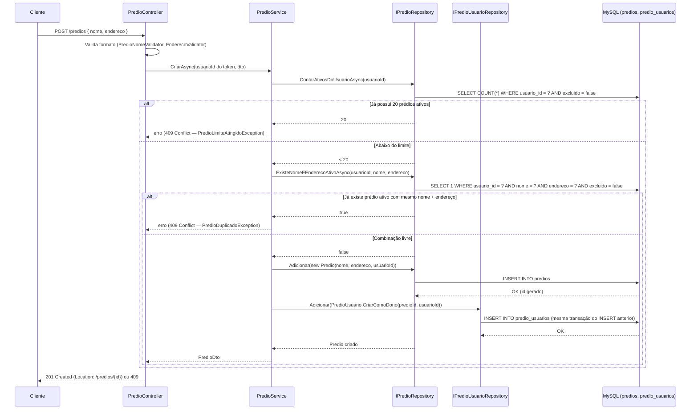
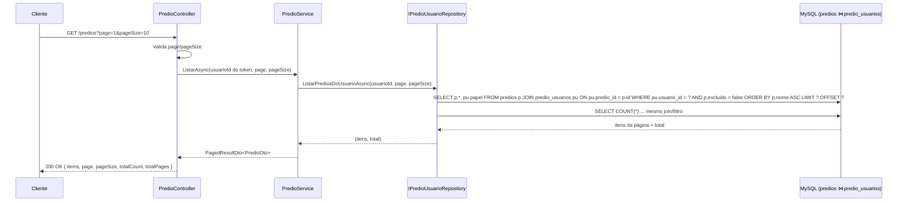
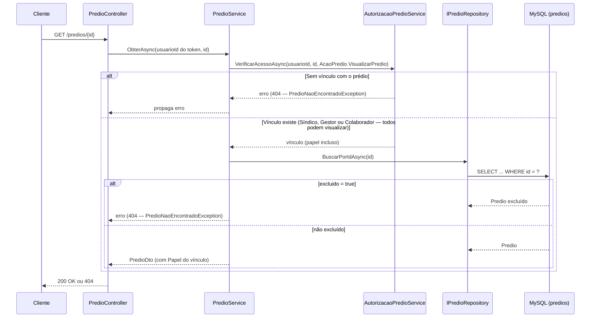
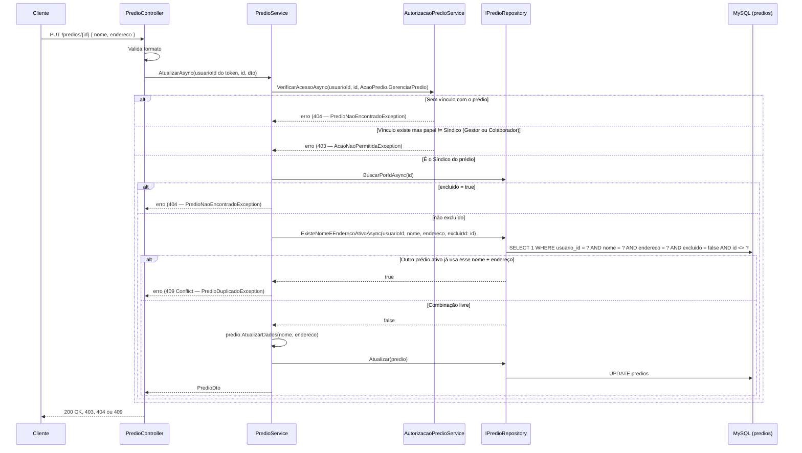
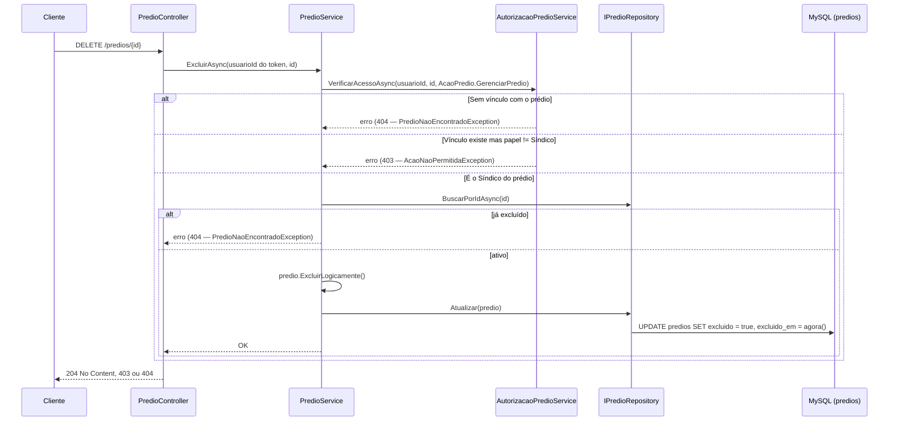

# Prédios — Backend euSíndico

Este documento descreve o fluxo completo do CRUD de prédios (RF08–RF11, RNF10, RN02, RN07–RN09) do [RFC](../../documentation/RFC/RFC.md). Serve de referência para a implementação do `PredioController`/`PredioService`/`PredioRepository`.

> **Status:** documento de design, aguardando aprovação antes da implementação. A entidade `Predio` e sua configuração EF Core (`PredioConfiguration`) **já existem e já estão migradas** (tabela `predios` criada desde `InitialCreate`) — falta construir a Application (`PredioService`, DTOs, interface do repositório), a Infrastructure (`PredioRepository`) e a Api (`PredioController`, validators, exceção mapeada), além dos testes correspondentes.
>
> **Revisão desta etapa:** o rascunho original deste documento antecede a implementação de [EQUIPE.md](EQUIPE.md) (RF29–RF34, modelo de múltiplos usuários por prédio) e por isso ainda descrevia autorização e listagem com base só em `predios.usuario_id` (modelo de dono único). Esta revisão corrige isso: os fluxos abaixo já usam `predio_usuarios`/`AutorizacaoPredioService`, como o próprio EQUIPE.md já previa ser necessário (ver antiga nota em "Notas para módulos futuros"). Também corrige um conflito real — `PredioNaoEncontradoException` já existe em `euSindico.Application/Common/Exceptions/` desde a implementação de Equipe; o rascunho original propunha recriá-la, o que resultaria em uma classe duplicada.

## Sumário

- [Visão geral](#visão-geral)
- [Onde cada peça mora na arquitetura](#onde-cada-peça-mora-na-arquitetura)
- [Entidade Predio (já existente)](#entidade-predio-já-existente)
- [Regras de negócio aplicadas](#regras-de-negócio-aplicadas)
- [Endpoints](#endpoints)
- [Fluxo 1 — Criar prédio (RF08)](#fluxo-1--criar-prédio-rf08)
- [Fluxo 2 — Listar prédios, paginado (RF09, RNF10)](#fluxo-2--listar-prédios-paginado-rf09-rnf10)
- [Fluxo 3 — Obter detalhes de um prédio (RF09)](#fluxo-3--obter-detalhes-de-um-prédio-rf09)
- [Fluxo 4 — Editar prédio (RF10)](#fluxo-4--editar-prédio-rf10)
- [Fluxo 5 — Remover prédio (RF11, RN07, RN08)](#fluxo-5--remover-prédio-rf11-rn07-rn08)
- [Validação de entrada e sanitização](#validação-de-entrada-e-sanitização)
- [Paginação (RNF10)](#paginação-rnf10)
- [Tratamento de exceções](#tratamento-de-exceções)
- [Segurança](#segurança)
- [Decisões confirmadas](#decisões-confirmadas)
- [Pendência: restaurar prédio excluído](#pendência-restaurar-prédio-excluído)
- [Testes previstos](#testes-previstos)
- [Notas para módulos futuros](#notas-para-módulos-futuros)
- [Próximos passos](#próximos-passos)

## Visão geral

- Todo endpoint exige `[Authorize]` — sem access token válido, `401` antes de chegar ao Controller (RN01).
- **Duas checagens diferentes, não uma só** (correção em relação ao rascunho original, que tratava tudo como "RN02 — só o dono"):
  - **Criar prédio, contra o limite/duplicidade (RF08):** continua escopado ao **dono/criador** (`Predio.UsuarioId`) — um síndico não deveria ser bloqueado pelo limite de 20 prédios ou por uma duplicidade de nome+endereço de outro síndico, mesmo que ele tenha funcionários em comum. `usuarioId` vem sempre da claim `sub` do token.
  - **Listar, obter, editar e remover um prédio já existente (RF09–RF11):** usa o **vínculo** do usuário com aquele prédio (`predio_usuarios`, RN16) — não mais `predios.usuario_id` diretamente. Isso é a extensão de RN02 que RN16 já previa ("Um usuário só acessa um prédio ao qual possui vínculo explícito — como dono ou como funcionário convidado") e que o [EQUIPE.md](EQUIPE.md) já constrói (`AutorizacaoPredioService`), mas que este documento, na sua primeira versão, não chegou a aplicar nos fluxos abaixo.
- **Visualizar (`GET`) é permitido a qualquer papel vinculado** (Síndico, Gestor ou Colaborador) — um funcionário convidado precisa navegar até os módulos do prédio (Compromissos, Documentos etc.) mesmo sem poder editá-lo. **Editar e excluir (`PUT`/`DELETE`) são exclusivos do papel Síndico** (RF33, mesma matriz de permissões de EQUIPE.md — só o dono edita/exclui o prédio em si). Listar (`GET /predios`) retorna todos os prédios em que o usuário tem **qualquer** vínculo, não só os que ele criou — do contrário um Gestor/Colaborador nunca veria os prédios para os quais foi convidado.
- Exclusão é lógica (soft delete, RN08): `Predio.ExcluirLogicamente()` já existe na entidade e marca `Excluido = true` / `ExcluidoEm = DateTime.UtcNow`. Nenhuma linha é apagada da tabela `predios`.
- Prédios excluídos ficam **invisíveis** para o próprio dono em toda operação de leitura/escrita (listar, obter, editar, remover de novo) — tratados exatamente como "não existe" (RN08: "indisponível para consulta na interface da aplicação").
- Confirmação antes de excluir (RN07) é responsabilidade do **frontend** (modal de confirmação) — o backend não implementa um passo de confirmação; `DELETE /predios/{id}` executa a exclusão lógica imediatamente quando chamado.

## Onde cada peça mora na arquitetura

Seguindo [ARCHITECTURE.md](ARCHITECTURE.md) e o mesmo padrão do módulo de Auth/Perfil ([AUTHENTICATION.md](AUTHENTICATION.md)):

| Componente | Camada | Status | Responsabilidade |
|---|---|---|---|
| `Predio` | Domain | ✅ já existe | Entidade com invariantes (`AtualizarDados`, `ExcluirLogicamente`), setters privados. |
| `PredioConfiguration` | Infrastructure | ✅ já existe | Mapeamento EF Core (tabela `predios`, índice composto `(usuario_id, excluido)`). |
| `PredioController` | Api | 🔲 a criar | Recebe a requisição HTTP, valida o corpo/query (FluentValidation), delega ao Service. |
| `PredioService` | Application | 🔲 a criar | Orquestra o caso de uso: cria a linha de dono em `predio_usuarios` (RF08), aplica as regras de duplicidade/limite (escopadas ao dono) e delega a checagem de vínculo/papel (RF09–RF11) ao `AutorizacaoPredioService`. |
| `IPredioRepository` | Application (interface) | 🔲 a criar | Contrato de persistência do `Predio` em si (CRUD de campos, contagem/duplicidade escopadas ao dono). |
| `PredioRepository` | Infrastructure (implementação) | 🔲 a criar | Busca/persiste `Predio` no MySQL via `AppDbContext`. |
| `IPredioUsuarioRepository` | Application (interface) | ✅ já existe (Equipe) | `PredioService` passa a depender dela: `Adicionar` (criar o vínculo de dono no Fluxo 1) e, via `AutorizacaoPredioService`, `BuscarVinculoAsync`/`ListarPrediosDoUsuarioAsync` para os Fluxos 2–5. |
| `AutorizacaoPredioService` | Application | ✅ já existe (Equipe) | Reaproveitado para os Fluxos 3–5 (`VerificarAcessoAsync`) — precisa ganhar as ações `VisualizarPredio` e `GerenciarPredio` na sua matriz de permissões (hoje só tem `GerenciarEquipe`), ver [Próximos passos](#próximos-passos). |
| `PredioDuplicadoException`, `PredioLimiteAtingidoException` | Application | 🔲 a criar | Mapeadas para `409` no `ApplicationExceptionHandler`. |
| `PredioNaoEncontradoException` | Application | ✅ já existe (Equipe) | **Não recriar** — mesma classe usada por `AutorizacaoPredioService` para "sem vínculo com o prédio" (já mapeada para `404`); `PredioService` reaproveita a mesma exceção para manter a resposta anti-enumeração consistente entre os dois módulos. |
| `PredioNomeValidator`, `EnderecoValidator` | Api | 🔲 a criar | Validação de formato de `Nome`/`Endereco` (ver seção de sanitização). |

## Entidade Predio (já existente)

```csharp
public class Predio
{
    public int Id { get; private set; }
    public string Nome { get; private set; }
    public string Endereco { get; private set; }
    public int UsuarioId { get; private set; }
    public DateTime CriadoEm { get; private set; }
    public bool Excluido { get; private set; }
    public DateTime? ExcluidoEm { get; private set; }

    public Predio(string nome, string endereco, int usuarioId) { /* Excluido = false; CriadoEm = UtcNow */ }
    public void AtualizarDados(string nome, string endereco) { /* ... */ }
    public void ExcluirLogicamente() { /* Excluido = true; ExcluidoEm = UtcNow */ }
}
```

Nada muda aqui para o CRUD principal (RF08–RF11). Ainda não existe um método de reativação (`Reativar`) — não é necessário para este CRUD, mas será adicionado quando a restauração de prédios excluídos for implementada (ver [Pendência: restaurar prédio excluído](#pendência-restaurar-prédio-excluído)).

## Regras de negócio aplicadas

| Regra | Como é aplicada |
|---|---|
| RN16 — usuário só acessa prédio com vínculo explícito (estende RN02) | `GET/PUT/DELETE /predios/{id}` e `GET /predios` passam por `predio_usuarios` (via `AutorizacaoPredioService` ou consulta direta na listagem) — nunca mais por `predios.usuario_id` isolado. Sem vínculo → `404` (`PredioNaoEncontradoException`, reaproveitada de Equipe), igual a um prédio inexistente (anti-enumeração). |
| RF33 — ações restritas por papel | `PUT`/`DELETE /predios/{id}` exigem papel Síndico (`AcaoPredio.GerenciarPredio`); com vínculo mas papel diferente → `403` (`AcaoNaoPermitidaException`, já existente). `GET` é liberado a qualquer papel vinculado (`AcaoPredio.VisualizarPredio`). |
| RF08 — limite e duplicidade continuam escopados ao dono | `POST /predios` usa `Predio.UsuarioId` (o criador), não `predio_usuarios` — ver [Visão geral](#visão-geral). |
| RN07 — confirmação antes de excluir | Responsabilidade do frontend; o backend apenas executa. |
| RN08 — exclusão lógica | `ExcluirLogicamente()` na entidade; toda leitura filtra `Excluido == false`. |
| RN09 — prédio excluído não pode ser usado por outros módulos | Fora do escopo deste CRUD (módulos de Compromissos/Planejamentos/Documentos/Relatórios ainda não existem), mas o desenho do repositório já deixa isso reutilizável — ver [Notas para módulos futuros](#notas-para-módulos-futuros). Nota importante: quando esses módulos existirem, o filtro por prédio excluído é uma questão de **leitura** (join/filtro na consulta), não de exclusão em cascata — nenhum compromisso, planejamento, documento ou relatório é apagado ou alterado quando o prédio é excluído; eles só somem das telas enquanto o prédio estiver excluído. |
| RNF10 — listagens paginadas | `GET /predios` aceita `page`/`pageSize` e retorna um envelope paginado. |
| **Nova regra** — `Nome` + `Endereco` não podem se repetir entre prédios **ativos** do mesmo usuário | Não prevista no RFC, definida nesta etapa de design (ver [Validação de entrada e sanitização](#validação-de-entrada-e-sanitização)). `Nome` sozinho pode se repetir (dois prédios podem ter nomes iguais ou parecidos — ex: blocos de um mesmo residencial, ou prédios de nome coincidente na cidade); a combinação `Nome`+`Endereco` idêntica é que é bloqueada. |
| **Nova regra** — máximo de 20 prédios **ativos** por usuário | Não prevista no RFC, definida nesta etapa de design. Prédios excluídos (soft delete) não contam para o limite. |

## Endpoints

| Método | Rota | Ação | Perfil exigido | Sucesso | Erros possíveis |
|---|---|---|---|---|---|
| `POST` | `/predios` | Criar prédio (RF08) | qualquer usuário autenticado (vira Síndico do prédio criado) | `201 Created` | `400` (validação), `409` (duplicidade/limite, escopados ao criador) |
| `GET` | `/predios?page=&pageSize=` | Listar prédios **vinculados** ao usuário, paginado (RF09) | Síndico, Gestor ou Colaborador (qualquer vínculo) | `200 OK` | `400` (parâmetros de paginação inválidos) |
| `GET` | `/predios/{id}` | Obter detalhes de um prédio (RF09) | Síndico, Gestor ou Colaborador (qualquer vínculo) | `200 OK` | `404` (sem vínculo — não existe, não é vinculado, ou excluído) |
| `PUT` | `/predios/{id}` | Editar prédio (RF10) | Síndico | `200 OK` | `400` (validação), `404` (sem vínculo), `403` (vínculo, mas não é Síndico) |
| `DELETE` | `/predios/{id}` | Remover prédio — soft delete (RF11) | Síndico | `204 No Content` | `404` (sem vínculo), `403` (vínculo, mas não é Síndico) |

> **Pendência registrada (fora do escopo desta etapa):** restaurar um prédio excluído (`GET /predios/excluidos` + `POST /predios/{id}/restaurar`) fica para uma implementação futura — ver [Pendência: restaurar prédio excluído](#pendência-restaurar-prédio-excluído). O desenho abaixo (entidade, exceções, repositório) já é construído considerando essa extensão, para não exigir retrabalho quando ela for priorizada.

## Fluxo 1 — Criar prédio (RF08)



**O `INSERT` em `predio_usuarios` é obrigatório e faz parte da mesma transação do `INSERT` em `predios`** — sem essa linha (`PredioUsuario.CriarComoDono`, já existente desde [EQUIPE.md](EQUIPE.md)), o próprio criador do prédio não passaria na checagem de `AutorizacaoPredioService` sobre o prédio que acabou de criar, e ficaria sem conseguir convidar equipe, editar ou mesmo visualizar o próprio prédio nos Fluxos 2–5 abaixo. Isso corrige a lacuna do rascunho original deste documento, que tratava essa integração só como uma nota lateral (ver "Notas para módulos futuros") sem incorporá-la ao fluxo de fato.

`usuarioId` nunca vem do corpo da requisição — é sempre extraído da claim `sub` do access token, exatamente como em `PerfilController`. O cliente não consegue definir `Id`, `UsuarioId`, `CriadoEm` ou `Excluido` (o DTO de entrada só expõe `Nome`/`Endereco` — ver [Segurança](#segurança), mass assignment).

**Sobre o `Location` header (`201 Created`):** é um cabeçalho HTTP padrão que aponta para a URL do recurso recém-criado (ex: `Location: /predios/42`) — convenção REST, não um requisito funcional (o corpo da resposta já traz o `PredioDto` completo, então o frontend não *precisa* dele para funcionar). Gerado de graça pelo helper `CreatedAtAction` do ASP.NET Core, sem custo de implementação extra — por isso vale adotar aqui, mesmo o `AuthController.Registrar` não usando isso hoje (não é uma mudança retroativa nesse outro controller, só um padrão novo e melhor para prédios).

**Sobre checar limite e duplicidade via consulta antes do `INSERT` (em vez de índice único no banco):** ao contrário do e-mail (`usuarios.email`, que tem `UNIQUE` no schema do RFC), a combinação `(usuario_id, nome, endereco)` não pode virar um índice único direto no MySQL porque um prédio excluído continua ocupando a linha — um índice único bloquearia recriar um prédio com o mesmo nome+endereço depois de excluí-lo, mesmo isso sendo permitido (a regra é "não repetir entre os **ativos**"). MySQL não tem índice único parcial/filtrado como Postgres/SQL Server. A verificação fica então na aplicação (mesmo padrão de `ExisteEmailAsync` do `AuthService`, só que escopada também por `excluido = false`), com uma pequena janela de corrida teórica entre a consulta e o `INSERT` — aceitável dado o volume esperado (RNF07: 100 usuários simultâneos no sistema todo, e criar um prédio não é uma ação de alta frequência/concorrência por usuário).

## Fluxo 2 — Listar prédios, paginado (RF09, RNF10)



**Correção em relação ao rascunho original:** a listagem não filtra mais por `predios.usuario_id` (isso listaria só os prédios que o usuário *criou*) — filtra por vínculo em `predio_usuarios`, para incluir também os prédios em que o usuário é Gestor ou Colaborador (RN16). Isso muda a consulta de `IPredioRepository` para `IPredioUsuarioRepository` (já existe, de Equipe) e exige um método novo nela (`ListarPrediosDoUsuarioAsync`, ver [Próximos passos](#próximos-passos)) — não é mais uma query direta e isolada em `predios`.

**`PredioDto` ganha um campo `Papel`** (o papel do usuário autenticado *naquele* prédio, ex: `"Sindico"`, `"Gestor"`, `"Colaborador"`) — sem isso o frontend não teria como decidir, por prédio, se mostra as opções de editar/excluir/gerenciar equipe (exclusivas de Síndico) ou só as de navegação (Gestor/Colaborador). Mesmo espírito do `papel` já exposto em `EquipeMembroDto` (EQUIPE.md).

Não há mais um índice novo a criar aqui — o índice único existente em `predio_usuarios (predio_id, usuario_id)` (EQUIPE.md) já cobre o `JOIN` acima pelo lado de `usuario_id`; o índice composto `(usuario_id, excluido)` de `predios` deixa de ser usado por esta listagem (continua útil só para `ContarAtivosDoUsuarioAsync`/`ExisteNomeEEnderecoAtivoAsync` no Fluxo 1, que seguem escopados ao dono).

## Fluxo 3 — Obter detalhes de um prédio (RF09)



**Correção em relação ao rascunho original:** a checagem deixa de ser "pertence ao usuário" (`predios.usuario_id`) e passa a ser "tem vínculo" (`predio_usuarios`, via `AutorizacaoPredioService`) — permitindo que Gestor e Colaborador também vejam o prédio, não só o Síndico. Um prédio soft-deletado continua tratado como "não encontrado" mesmo para quem tem vínculo — a exclusão lógica do prédio não é revertida pela existência do vínculo.

## Fluxo 4 — Editar prédio (RF10)

Mesmo padrão do Fluxo 3 para localizar o prédio (busca + checagem de vínculo + checagem de não-excluído), mas agora exigindo especificamente o papel Síndico:



**Correção em relação ao rascunho original:** a checagem de posse migra de `predios.usuario_id` para `predio_usuarios` + papel — um Gestor ou Colaborador com vínculo agora recebe `403` (sabe que o prédio existe, só não pode editá-lo), diferente de quem não tem vínculo nenhum, que recebe `404` (nem sabe que o prédio existe — mesma distinção já usada em [EQUIPE.md](EQUIPE.md), seção Segurança). A checagem de duplicidade continua escopada ao dono (`usuarioId` aqui é sempre quem tem papel Síndico, então equivale ao `Predio.UsuarioId`).

**Editar um prédio excluído não é possível** — não por uma checagem nova, mas porque, depois de confirmado o vínculo/papel, a busca do prédio já trata "excluído" como "não encontrado", então a requisição nunca chega a checar duplicidade ou alterar dados.

O limite de 20 ativos **não** é checado na edição — editar não cria um prédio novo, então não afeta a contagem. A checagem de duplicidade usa `excluirId: id` para não comparar o prédio consigo mesmo (senão salvar sem alterar nome/endereço sempre daria falso-positivo de duplicidade).

## Fluxo 5 — Remover prédio (RF11, RN07, RN08)



**Diferente do logout** (que é idempotente e sempre `204`), excluir um prédio já excluído retorna `404` — porque, ao contrário de "encerrar uma sessão" (onde "já não há sessão" é um estado válido e esperado), um prédio já excluído é, para todos os efeitos de leitura/escrita do usuário, um prédio que **não existe mais** (RN08). Chamar `DELETE` de novo não tem um "estado desejado" implícito da mesma forma que o logout tem.

**Correção em relação ao rascunho original:** mesma migração de checagem dos Fluxos 3 e 4 — vínculo inexistente é `404`, vínculo existente com papel Gestor/Colaborador é `403` (não `404`), só o Síndico chega a executar a exclusão de fato. Remover o vínculo do próprio Síndico com o prédio **não** é feito por este endpoint (isso deixaria o prédio "órfão" de dono) — excluir o prédio inteiro via `DELETE /predios/{id}` continua sendo a única forma de um Síndico se desvincular do próprio prédio, e a linha do dono em `predio_usuarios` permanece intacta mesmo após o soft delete (só o `Predio` é marcado como excluído; nenhum vínculo é apagado, mesmo raciocínio de RN22 em EQUIPE.md — remoção de acesso não apaga histórico).

## Validação de entrada e sanitização

Seguindo a estratégia de duas camadas já estabelecida em [SECURITY.md](SECURITY.md) (seção 3) — validação de formato como defesa em profundidade contra XSS, não "sanitização" (remoção/escape de tags):

| Campo | Validator | Regra proposta | Por que não reaproveitar um validator existente |
|---|---|---|---|
| `Nome` (prédio) | `PredioNomeValidator` (novo) | Máx. 150 caracteres, `^[\p{L}\p{N}\s.,'\-()/ºª]+$` (letras, números, espaço e pontuação comum em nomes de edifício: `.`, `,`, `'`, `-`, `()`, `/`, `º/ª`) | O `NomeValidator` existente é para **nome de pessoa** (`^[\p{L}\s'-]+$`, só letras) — nomes de prédio legitimamente contêm números ("Edifício Solar II", "Bloco A - Torre 2", "Residencial 9 de Julho"). Reaproveitar o validator de pessoa rejeitaria entradas válidas. |
| `Endereco` | `EnderecoValidator` (novo) | Máx. 255 caracteres, `^[\p{L}\p{N}\s.,'\-\/ºª]+$` (mesma família de caracteres, sem símbolos de markup) | Não existe validator de endereço hoje. Endereços têm números, vírgulas e abreviações (`Rua`, `Nº`, `Apto`) — mesmo raciocínio do `Nome`. |

Ambos os regex são **allowlists** (só aceitam os caracteres esperados) — o mesmo efeito colateral do `NomeValidator`/`EmailValidator`: um payload como `<script>alert(1)</script>` é rejeitado por não conter caracteres válidos de nome/endereço (`<`, `>`, `;` não estão na lista), não porque o validator "detecta scripts".

**Normalização antes de persistir:** `Nome`/`Endereco` devem ser normalizados com `.Trim()` no `PredioService` antes de `new Predio(...)`/`AtualizarDados(...)` — o regex permite espaços internos (necessário, ex: "Bloco A") mas não impede espaços só nas pontas (`"  Nome  "` passa no regex). Sem o trim, dois prédios "Nome" e "Nome " seriam tecnicamente diferentes na base — inclusive escapando da checagem de duplicidade abaixo por um espaço a mais, o que é ainda mais importante de evitar agora que existe uma regra de negócio em cima dessa comparação.

**Duplicidade — `Nome` + `Endereco` (regra nova, RN não prevista no RFC):** um usuário não pode ter dois prédios **ativos** com `Nome` e `Endereco` idênticos ao mesmo tempo. `Nome` sozinho pode repetir (ex: "Residencial Silva - Bloco 1" e "Residencial Silva - Bloco 2" no mesmo endereço, ou dois prédios de nomes coincidentes na cidade em endereços diferentes) — só a combinação exata dos dois campos é bloqueada. A comparação é feita **após o `.Trim()`** e escopada a `usuario_id` + `excluido = false` (dois usuários diferentes podem ter prédios com o mesmo nome+endereço sem problema; um prédio excluído não "reserva" a combinação para sempre). Violação → `PredioDuplicadoException` (`409 Conflict`), tanto na criação quanto na edição.

**Limite de prédios ativos (regra nova, RN não prevista no RFC):** máximo de **20 prédios ativos por usuário** (prédios excluídos não contam). Verificado só na criação — editar um prédio existente não aumenta a contagem. Violação → `PredioLimiteAtingidoException` (`409 Conflict`).

**Mass assignment:** `CriarPredioDto`/`AtualizarPredioDto` expõem só `Nome`/`Endereco` — não existe caminho para o cliente definir `Id`, `UsuarioId`, `CriadoEm`, `Excluido` ou `ExcluidoEm` via request body, já que o model binding do ASP.NET Core só popula os campos declarados no `record`.

## Paginação (RNF10)

Primeiro endpoint paginado do backend — não há precedente no código a seguir, então o desenho abaixo fica proposto para aprovação (e deve ser reaproveitado depois por Compromissos/Planejamentos/Documentos/Relatórios, todos também exigidos por RNF10):

- **Query params:** `page` (padrão `1`, mínimo `1`) e `pageSize` (padrão `10`, mínimo `1`, **máximo `20`**) — valores baixos de propósito, alinhados à abordagem mobile-first do projeto (RNF08): uma tela de celular dificilmente exibe 20+ itens de uma vez, e o teto também evita que um cliente force uma consulta desproporcional (`ORDER BY` sobre uma tabela maior do que precisa) — mesmo espírito defensivo do `QueueLimit = 0` do rate limiter. O usuário poderá ajustar `pageSize` numa tela de configurações do frontend, sempre respeitando o teto de `20`.
- **Validação:** `page`/`pageSize` fora da faixa retornam `400 Bad Request`, não um "clamp" silencioso — mais previsível para quem consome a API.
- **Envelope de resposta (`PagedResultDto<T>` genérico, reutilizável pelos módulos futuros):**

```json
{
  "items": [ { "id": 1, "nome": "Edifício Aurora", "endereco": "Rua X, 100", "criadoEm": "2026-07-01T12:00:00Z" } ],
  "page": 1,
  "pageSize": 10,
  "totalCount": 34,
  "totalPages": 4
}
```

- **Ordenação:** por `Nome` (ordem alfabética crescente) — confirmado. Não há regra do RFC equivalente à RN14 (que só se aplica a Compromissos) para prédios; alfabética é a mais previsível numa lista que o usuário navega manualmente numa tela pequena.

## Tratamento de exceções

**Só duas exceções novas** — `PredioNaoEncontradoException` **não** é criada aqui: já existe em `euSindico.Application/Common/Exceptions/` desde a implementação de Equipe (usada por `AutorizacaoPredioService` para "sem vínculo com o prédio", já mapeada para `404` no `ApplicationExceptionHandler`) e é reaproveitada tal qual pelo `PredioService`. Recriá-la geraria uma classe duplicada no mesmo namespace — erro de compilação, não só uma inconsistência de design. `AcaoNaoPermitidaException` (usada nos Fluxos 3–5 para "vínculo existe, mas papel não permite") também já existe e já está mapeada para `403`, mesma razão.

Seguindo o padrão *one-liner* de `euSindico.Application/Common/Exceptions/`, as duas exceções genuinamente novas deste módulo:

```csharp
public class PredioDuplicadoException() : Exception("Já existe um prédio ativo com esse nome e endereço.");
public class PredioLimiteAtingidoException() : Exception("Limite de 20 prédios ativos atingido.");
```

Adicionadas ao `switch` do `ApplicationExceptionHandler` (`PredioNaoEncontradoException` e `AcaoNaoPermitidaException` já estão lá, não precisam de nova entrada):

```csharp
PredioDuplicadoException => StatusCodes.Status409Conflict,
PredioLimiteAtingidoException => StatusCodes.Status409Conflict,
```

`PredioNaoEncontradoException` cobre várias causas distintas (inexistente, sem vínculo, excluído) — de propósito, pelo mesmo motivo anti-enumeração do `CredenciaisInvalidasException`/`RefreshTokenInvalidoException`: diferenciar "não existe" de "você não tem vínculo" na resposta permitiria a um usuário autenticado descobrir, por tentativa e erro de IDs sequenciais, quais prédios (e indiretamente, quais IDs de outros usuários) existem no sistema. `AcaoNaoPermitidaException` (403), por outro lado, só é usada quando o vínculo **existe** — nesse caso não há risco de enumeração (o usuário já sabe que o prédio existe, é membro dele), então a resposta pode ser específica.

`PredioDuplicadoException`/`PredioLimiteAtingidoException` usam `409 Conflict` — mesma família de status já usada por `EmailJaCadastradoException`, mantendo o projeto sem introduzir um código novo (ex: `422 Unprocessable Entity`) só para essas duas regras.

## Segurança

- **Autorização (RN01/RN16):** `[Authorize]` em todo o controller; `usuarioId` sempre da claim `sub`, nunca de rota/query/body — idêntico ao `PerfilController`. A checagem de acesso a um prédio existente (`GET/PUT/DELETE /predios/{id}`) passa por `AutorizacaoPredioService`/`predio_usuarios` (RN16), não mais só por `predios.usuario_id` — ver [Visão geral](#visão-geral).
- **IDOR (Insecure Direct Object Reference):** `GET/PUT/DELETE /predios/{id}` sempre checam vínculo antes de qualquer operação; um ID de prédio sem vínculo nunca é distinguível de um ID inexistente na resposta (`404`, `PredioNaoEncontradoException`). **`403` (`AcaoNaoPermitidaException`) só é usado quando o vínculo existe mas o papel não permite a ação** (ex: Gestor tentando `DELETE`) — nesse caso não há risco de enumeração, porque o usuário já sabe que o prédio existe (é membro dele); mesma distinção 403-vs-404 já documentada em [EQUIPE.md](EQUIPE.md), seção Segurança.
- **XSS:** allowlist de caracteres em `Nome`/`Endereco` (defesa em profundidade — a defesa primária continua sendo o escape padrão do Vue.js no frontend).
- **SQL Injection:** EF Core parametrizado, igual ao resto do projeto — nenhuma concatenação manual de SQL nas queries de listagem/filtro.
- **Mass assignment:** DTOs de entrada restritos a `Nome`/`Endereco` (ver seção de validação).
- **Enumeração de recursos:** resposta idêntica (`404`, mesma mensagem) para "não existe", "não é seu" e "já excluído" (ver seção de exceções).
- **Rate limiting:** **não** aplicado a `/predios/*` — a política `"auth"` (5 req/min) existe para proteger contra força bruta de credenciais/códigos (login, registro, recuperação de senha); prédios não têm esse risco (não há segredo para adivinhar) e são endpoints usados normalmente em alta frequência pela UI (paginação, navegação). Nenhum novo risco de negação de serviço é introduzido, mas fica registrado como decisão explícita, não omissão.
- **Erro mínimo (padrão do projeto):** `ProblemDetails` só com `Status`/`Title`, sem `type`/`code` extra, consistente com o restante da API.

## Decisões confirmadas

Pontos que o RFC não especificava e que foram decididos nesta etapa de design (substituem as propostas da primeira versão deste documento):

1. **Duplicidade** — `Nome` sozinho pode repetir; a combinação `Nome`+`Endereco` idêntica entre prédios **ativos** do mesmo usuário é bloqueada (`409`, `PredioDuplicadoException`). Ver [Validação de entrada e sanitização](#validação-de-entrada-e-sanitização).
2. **Limite por usuário** — 20 prédios **ativos** por usuário (excluídos não contam), checado só na criação (`409`, `PredioLimiteAtingidoException`).
3. **Ordenação da listagem** — alfabética por `Nome`, crescente.
4. **Paginação** — `pageSize` padrão `10`, mínimo `1`, máximo `20` (reduzido do rascunho inicial por conta da abordagem mobile-first do projeto — RNF08).
5. **`Location` header no `201 Created`** — sim, via `CreatedAtAction`.
6. **Autorização integrada ao modelo de Equipe (RN16, RF33)** — decidido nesta revisão: `GET /predios` lista por vínculo (`predio_usuarios`), não por criação; `GET /predios/{id}` é liberado a qualquer papel vinculado; `PUT`/`DELETE /predios/{id}` exigem papel Síndico via `AutorizacaoPredioService`. Substitui o desenho do rascunho original, que checava tudo contra `predios.usuario_id` e não permitia a um Gestor/Colaborador sequer ver os prédios em que atua.
7. **`PredioDto` ganha o campo `Papel`** — o papel do usuário autenticado naquele prédio, para o frontend decidir quais ações mostrar por prédio.
8. **`PredioNaoEncontradoException` é reaproveitada de Equipe, não recriada** — corrige um conflito de classe duplicada presente no rascunho original.

## Pendência: restaurar prédio excluído

**Fora do escopo desta implementação** (a decidir por conta própria: RF08–RF11 não previa isso), mas fica registrado como próximo passo natural do módulo de Prédios, e o desenho atual já é construído para acomodar essa extensão sem retrabalho:

- **`Predio.Reativar()`** — método simétrico a `ExcluirLogicamente()` (`Excluido = false; ExcluidoEm = null`), a ser adicionado à entidade quando essa etapa for priorizada. Ainda não existe hoje.
- **`GET /predios/excluidos`** (paginado, mesmo padrão de `GET /predios` mas filtrando `Excluido == true`) e **`POST /predios/{id}/restaurar`** — dois endpoints novos, reaproveitando toda a infraestrutura de paginação/validação já construída para o restante do CRUD.
- **Reaplica as duas regras novas desta etapa:** restaurar um prédio pode esbarrar no limite de 20 ativos (`PredioLimiteAtingidoException`) ou colidir com um prédio ativo que passou a ocupar o mesmo `Nome`+`Endereco` enquanto o original estava excluído (`PredioDuplicadoException`) — as mesmas exceções e verificações do fluxo de criação/edição, sem necessidade de criar exceções novas.
- **Sugestão de restauração na criação (decisão desta rodada):** quando `POST /predios` encontrar um prédio **excluído** (não ativo) com o mesmo `Nome`+`Endereco`, o backend deve sinalizar isso ao cliente em vez de criar um duplicado silenciosamente — uma nova exceção (ex: `PredioExcluidoComMesmosDadosException`, carregando o `id` do prédio excluído encontrado) permite ao frontend perguntar "deseja restaurar esse prédio?" antes de criar um novo. Se o usuário confirmar, o frontend chama `POST /predios/{id}/restaurar`; se preferir criar mesmo assim, `POST /predios` é reenviado com um sinal explícito (ex: `forcarCriacao: true`) para pular essa checagem da segunda vez. Isso só é possível quando o endpoint de restauração existir — por isso fica atrelado a esta pendência, não implementável isoladamente.
- **Prazo de retenção antes do expurgo definitivo (decisão desta rodada):** **sem prazo definido por enquanto** — um prédio excluído continua recuperável indefinidamente (mesmo comportamento de hoje). Fica registrado como ponto a revisitar quando a restauração for priorizada: não há requisito do RFC pedindo um prazo, mas o princípio da necessidade da LGPD (Art. 6º, VI) sugere que reter um prédio excluído para sempre, sem uma finalidade clara, merece um limite. Se um prazo for adotado depois (ex: 30 ou 90 dias), vai exigir um job agendado para expurgo definitivo (hard delete, seguindo a mesma lógica de exclusão em cascata usada em `ExcluirUsuarioEDadosRelacionadosAsync`) — peça de infraestrutura que ainda não existe no projeto (não há `BackgroundService`/agendador em nenhum módulo hoje).
- **Sem migration nova** — o campo `Excluido`/`ExcluidoEm` já existe na tabela `predios`.

Avaliação de esforço: pequeno-médio — a maior parte do trabalho (repositório, DTOs, exceções, paginação) já vai existir por causa do CRUD principal; o incremento real é o método `Reativar()` na entidade, os dois endpoints no Controller/Service, e a checagem adicional contra excluídos na criação.

## Testes previstos

Seguindo a convenção já estabelecida (`Metodo_condicao_resultado`, `Moq` para dependências, `TestValidate` para validators):

- `euSindico.Domain.Tests/PredioTests.cs` — primeiro teste real de entidade do Domain (hoje só há um placeholder): construtor, `AtualizarDados`, `ExcluirLogicamente`.
- `euSindico.Application.Tests/Predios/PredioServiceTests.cs` — mock de `IPredioRepository` **e** `IPredioUsuarioRepository` (`PredioService` passa a depender dos dois), cobrindo:
  - criação: `PredioUsuario.CriarComoDono` é de fato persistido junto do `Predio` (não só o `Predio` isoladamente); `PredioDuplicadoException` (nome+endereço repetido, criação e edição, incluindo editar sem mudar nada — não deve disparar falso positivo); `PredioLimiteAtingidoException` (21ª tentativa com 20 ativos já existentes) — ambas seguem escopadas ao dono;
  - listagem paginada: retorna prédios onde o usuário tem vínculo como Síndico **ou** Gestor **ou** Colaborador, não só os criados por ele; `PredioDto.Papel` reflete o papel correto de cada vínculo;
  - obtenção/edição/remoção: `404` (`PredioNaoEncontradoException`) para "sem vínculo" e "já excluído"; `403` (`AcaoNaoPermitidaException`) para "vínculo existe mas papel é Gestor/Colaborador" tentando `PUT`/`DELETE`; `200`/`204` para Síndico com vínculo válido; `GET` funcionando também para Gestor/Colaborador (sem exigir papel Síndico).
- `euSindico.Api.Tests/Controllers/PredioControllerTests.cs` — mesmo padrão do `PerfilControllerTests` (Service real + repositórios mockados, claim `sub` simulada), cobrindo os mesmos casos de papel acima na camada HTTP.
- `euSindico.Api.Tests/Validators/PredioNomeValidatorTests.cs` e `EnderecoValidatorTests.cs` — casos válidos/inválidos via `[Theory]`/`[InlineData]`, incluindo o caso `<script>...</script>` (mesmo espírito do teste que motivou o `NomeValidator`/`EmailValidator`, SECURITY.md seção 3).
- **Sem testes de integração de `PredioRepository` contra banco real por enquanto** — não existe precedente no projeto (`euSindico.Infrastructure.Tests` só cobre `Security/`); fica como gap conhecido, não bloqueante, igual para qualquer repositório futuro.

## Notas para módulos futuros

**Equipe e perfis de acesso (v2.2.0 do RFC, RF29–RF34):** a integração entre este CRUD e `predio_usuarios`/`AutorizacaoPredioService`, que o rascunho original desta seção só registrava como pendência futura, já foi incorporada aos Fluxos 1–5 nesta revisão — não é mais um "próximo passo", é parte do desenho a implementar já na primeira versão do módulo de Prédios (ver [EQUIPE.md](EQUIPE.md) para o desenho completo do lado de Equipe).

RN09 ("prédio excluído não pode ser usado para cadastro/edição de compromissos, planejamentos, documentos ou relatórios") não é responsabilidade deste CRUD, mas o desenho aqui já deixa o caminho pronto: quando os módulos de Compromissos/Planejamentos/Documentos/Relatórios forem implementados, cada `Service` correspondente deve reaproveitar `AutorizacaoPredioService.VerificarAcessoAsync` (com a `AcaoPredio` específica daquele módulo — ex: `CriarCompromisso`, já prevista em EQUIPE.md) antes de aceitar um `predioId` em qualquer criação/edição, e checar `!Excluido` no `Predio` correspondente — **não** a antiga checagem direta contra `predios.usuario_id` (que deixou de ser a fonte de verdade para autorização a partir desta revisão).

## Próximos passos

Depois da aprovação deste documento:

1. **`AutorizacaoPredioService`/`AcaoPredio` (EQUIPE.md, já implementados) precisam de dois valores novos:** adicionar `VisualizarPredio` (permitida a `Sindico`, `Gestor` e `Colaborador`) e `GerenciarPredio` (permitida só a `Sindico`) ao enum `AcaoPredio` e à matriz `PermissoesPorAcao` em `AutorizacaoPredioService` — sem isso, `VerificarAcessoAsync` lança `KeyNotFoundException` ao tentar essas ações (a matriz hoje só tem `GerenciarEquipe`). É a única alteração deste módulo que toca código já existente de Equipe.
2. **`IPredioUsuarioRepository` (já existe) ganha um método novo:** `ListarPrediosDoUsuarioAsync(usuarioId, page, pageSize)` — join com `predios` filtrando `excluido = false`, para o Fluxo 2.
3. Criar `IPredioRepository` (`BuscarPorIdAsync`, `ContarAtivosDoUsuarioAsync`, `ExisteNomeEEnderecoAtivoAsync`, `AdicionarAsync`, `AtualizarAsync` — sem `ListarDoUsuarioAsync`, que migrou para `IPredioUsuarioRepository`) + `PredioRepository`.
4. Criar `PredioService` (dependendo de `IPredioRepository`, `IPredioUsuarioRepository` e `AutorizacaoPredioService`) + DTOs (`CriarPredioDto`, `AtualizarPredioDto`, `PredioDto` com o campo `Papel`, `PagedResultDto<T>`, `ListarPrediosQueryDto`).
5. Criar as duas exceções novas (`PredioDuplicadoException`, `PredioLimiteAtingidoException` + mapeamento no `ApplicationExceptionHandler`) — **não recriar `PredioNaoEncontradoException`**, já existe e já está mapeada.
6. Criar `PredioNomeValidator`/`EnderecoValidator` + seus DTO validators, `PredioController`, registro em `DependencyInjection.cs` (Application e Infrastructure).
7. Testes listados acima, incluindo os casos de papel (Síndico/Gestor/Colaborador).

Nenhuma migration nova é necessária — as tabelas `predios` e `predio_usuarios` já existem desde `InitialCreate`/`AddEquipeEAcesso`.

Fica registrado para depois (fora desta etapa): `Predio.Reativar()`, `GET /predios/excluidos` e `POST /predios/{id}/restaurar` (ver [Pendência: restaurar prédio excluído](#pendência-restaurar-prédio-excluído)).
