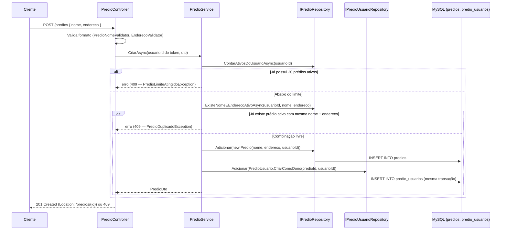
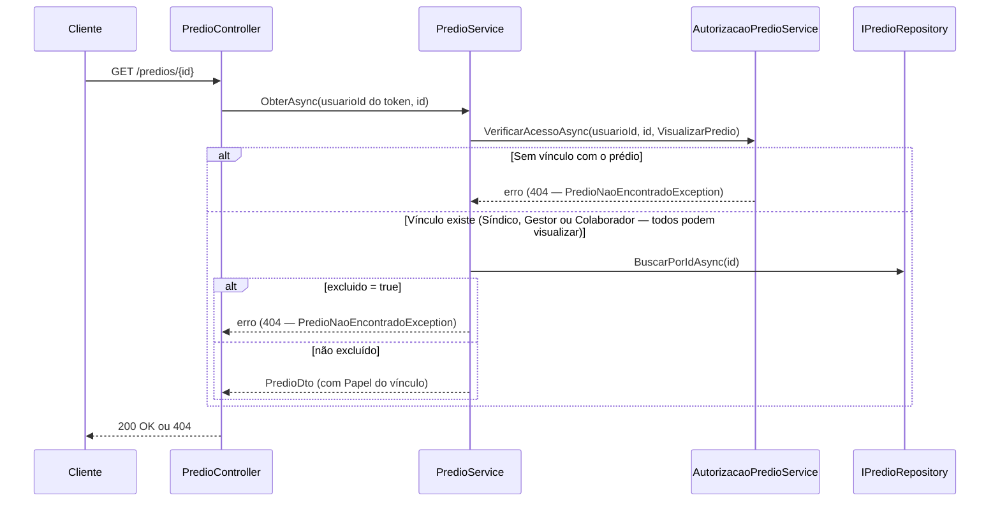

# Prédios — Backend euSíndico

Este documento descreve o CRUD de prédios (RF08–RF11, RNF10, RN02, RN07–RN09) do [RFC](../../documentation/RFC/RFC.md). Referência para `PredioController`/`PredioService`/`PredioRepository`.

> **Status:** implementado — CRUD completo (RF08–RF11): `POST`/`GET /predios`/`GET`/`PUT`/`DELETE /predios/{id}`. Único ponto fora do escopo é a restauração de prédio excluído (ver [Pendência](#pendência-restaurar-prédio-excluído)).

## Sumário

- [Visão geral](#visão-geral)
- [Onde cada peça mora na arquitetura](#onde-cada-peça-mora-na-arquitetura)
- [Entidade Predio](#entidade-predio)
- [Regras de negócio aplicadas](#regras-de-negócio-aplicadas)
- [Endpoints](#endpoints)
- [Fluxo 1 — Criar prédio (RF08)](#fluxo-1--criar-prédio-rf08)
- [Fluxo 3 — Obter detalhes de um prédio (RF09)](#fluxo-3--obter-detalhes-de-um-prédio-rf09)
- [Fluxos 2, 4 e 5](#fluxos-2-4-e-5)
- [Validação de entrada e sanitização](#validação-de-entrada-e-sanitização)
- [Paginação (RNF10)](#paginação-rnf10)
- [Tratamento de exceções](#tratamento-de-exceções)
- [Segurança](#segurança)
- [Decisões confirmadas](#decisões-confirmadas)
- [Pendência: restaurar prédio excluído](#pendência-restaurar-prédio-excluído)
- [Testes](#testes)
- [Notas para módulos futuros](#notas-para-módulos-futuros)

## Visão geral

- Todo endpoint exige `[Authorize]` — `401` antes do Controller sem token válido (RN01).
- **Duas checagens diferentes, não uma só:**
  - **Criar prédio (RF08):** escopado ao **dono/criador** (`Predio.UsuarioId`) — o limite de 20 prédios e a duplicidade de nome+endereço não devem ser afetados por prédios de outros síndicos, mesmo que compartilhem funcionários. `usuarioId` sempre vem da claim `sub` do token.
  - **Listar, obter, editar e remover um prédio existente (RF09–RF11):** usa o **vínculo** do usuário com aquele prédio (`predio_usuarios`, RN16) via `AutorizacaoPredioService` — nunca `predios.usuario_id` diretamente.
- **`GET` é permitido a qualquer papel vinculado** (Síndico, Gestor ou Colaborador) — um funcionário convidado precisa navegar pelos módulos do prédio mesmo sem poder editá-lo. **`PUT`/`DELETE` são exclusivos do papel Síndico** (RF33). `GET /predios` lista todos os prédios com **qualquer** vínculo, não só os criados pelo usuário — senão um Gestor/Colaborador nunca veria os prédios pra que foi convidado.
- Exclusão é lógica (RN08): `Predio.ExcluirLogicamente()` marca `Excluido = true`/`ExcluidoEm = UtcNow`; nenhuma linha é apagada. Prédios excluídos ficam **invisíveis** em toda leitura/escrita (tratados como "não existe", RN08).
- Confirmação antes de excluir (RN07) é responsabilidade do **frontend** (modal) — `DELETE /predios/{id}` executa a exclusão lógica imediatamente quando chamado.

## Onde cada peça mora na arquitetura

Seguindo [ARCHITECTURE.md](ARCHITECTURE.md) e o padrão do módulo de Auth/Perfil ([AUTHENTICATION.md](AUTHENTICATION.md)):

| Componente | Camada | Status | Responsabilidade |
|---|---|---|---|
| `Predio` | Domain | ✅ | Entidade com invariantes (`AtualizarDados`, `ExcluirLogicamente`), setters privados. |
| `PredioConfiguration` | Infrastructure | ✅ | Mapeamento EF Core (tabela `predios`, índice composto `(usuario_id, excluido)`). |
| `PredioController` | Api | ✅ | `Criar`, `Listar`, `Obter`, `Atualizar`, `Remover`. |
| `PredioService` | Application | ✅ | `CriarAsync` (cria a linha de dono em `predio_usuarios`, aplica duplicidade/limite escopados ao dono); `ObterAsync`/`AtualizarAsync`/`ExcluirAsync` (delegam ao `AutorizacaoPredioService`); `ListarAsync` (via `IPredioUsuarioRepository`). |
| `IPredioRepository` | Application (interface) | ✅ | `ContarAtivosDoUsuarioAsync`, `ExisteNomeEEnderecoAtivoAsync` (com `excluirId` opcional), `AdicionarComDonoAsync`, `BuscarPorIdAsync`, `AtualizarAsync`. |
| `PredioRepository` | Infrastructure | ✅ | Busca/persiste `Predio` no MySQL via `AppDbContext`. |
| `IPredioUsuarioRepository` | Application (interface) | ✅ | `ListarPrediosDoUsuarioAsync` (Fluxo 2, novo nesta etapa) além dos métodos já existentes de Equipe. |
| `AutorizacaoPredioService` | Application | ✅ | Matriz com `VisualizarPredio` (Síndico/Gestor/Colaborador) e `GerenciarPredio` (só Síndico, novo nesta etapa), além de `GerenciarEquipe`. |
| `PredioDuplicadoException`, `PredioLimiteAtingidoException` | Application | ✅ | Mapeadas para `409` no `ApplicationExceptionHandler`. |
| `PredioNaoEncontradoException` | Application | ✅ já existe (Equipe) | **Não recriar** — reaproveitada de `AutorizacaoPredioService`, já mapeada para `404`. |
| `PredioNomeValidator`, `EnderecoValidator`, `PredioFormDtoValidator` | Api | ✅ | Validação de formato de `Nome`/`Endereco`. `PredioFormDtoValidator` é único para criação e edição — os dois DTOs têm o mesmo formato ([Validação de entrada e sanitização](#validação-de-entrada-e-sanitização)). |
| `PagedResultDto<T>` | Application (`Common/Dtos`) | ✅ | Envelope genérico de paginação (RNF10), reutilizável pelos módulos futuros. |

## Entidade Predio

```csharp
public class Predio
{
    public int Id { get; private set; }
    public string Nome { get; private set; }
    public string Endereco { get; private set; }
    public int UsuarioId { get; private set; }
    public DateTime CriadoEm { get; private set; }
    public bool Excluido { get; private set; }
    public DateTime? ExcluidoEm { get; private set; }

    public Predio(string nome, string endereco, int usuarioId) { /* Excluido = false; CriadoEm = UtcNow */ }
    public void AtualizarDados(string nome, string endereco) { /* ... */ }
    public void ExcluirLogicamente() { /* Excluido = true; ExcluidoEm = UtcNow */ }
}
```

Não existe ainda um método `Reativar()` — só será adicionado quando a restauração de prédios excluídos for implementada (ver [Pendência](#pendência-restaurar-prédio-excluído)).

## Regras de negócio aplicadas

| Regra | Como é aplicada |
|---|---|
| RN16 — usuário só acessa prédio com vínculo explícito | `GET/PUT/DELETE /predios/{id}` e `GET /predios` passam por `predio_usuarios` (via `AutorizacaoPredioService` ou consulta direta na listagem). Sem vínculo → `404` (anti-enumeração, ver [Segurança](#segurança)). |
| RF33 — ações restritas por papel | `PUT`/`DELETE` exigem papel Síndico (`AcaoPredio.GerenciarPredio`); vínculo existe mas papel diferente → `403`. `GET` liberado a qualquer papel vinculado (`AcaoPredio.VisualizarPredio`). |
| RF08 — limite e duplicidade escopados ao dono | `POST /predios` usa `Predio.UsuarioId` (o criador), não `predio_usuarios`. |
| RN07 — confirmação antes de excluir | Responsabilidade do frontend; o backend só executa. |
| RN08 — exclusão lógica | `ExcluirLogicamente()` na entidade; toda leitura filtra `Excluido == false`. |
| RN09 — prédio excluído não pode ser usado por outros módulos | Fora do escopo deste CRUD (Compromissos/Planejamentos/Documentos/Relatórios ainda não existem). Quando existirem, o filtro é de **leitura** (join/where), não exclusão em cascata — nada é apagado quando o prédio é excluído, só some das telas. |
| RNF10 — listagens paginadas | `GET /predios` aceita `page`/`pageSize`, retorna envelope paginado (ver [Paginação](#paginação-rnf10)). |
| **Nova regra** — `Nome`+`Endereco` não repetem entre prédios **ativos** do mesmo usuário | Não prevista no RFC. `Nome` sozinho pode repetir; só a combinação idêntica dos dois é bloqueada. |
| **Nova regra** — máx. 20 prédios **ativos** por usuário | Não prevista no RFC. Excluídos não contam. |

## Endpoints

| Método | Rota | Ação | Perfil exigido | Sucesso | Erros possíveis |
|---|---|---|---|---|---|
| `POST` | `/predios` | Criar prédio (RF08) | qualquer usuário autenticado (vira Síndico) | `201 Created` | `400`, `409` (duplicidade/limite, escopados ao criador) |
| `GET` | `/predios?page=&pageSize=` | Listar vinculados, paginado (RF09) | Síndico/Gestor/Colaborador | `200 OK` | `400` (paginação) |
| `GET` | `/predios/{id}` | Detalhes (RF09) | Síndico/Gestor/Colaborador | `200 OK` | `404` (sem vínculo/inexistente/excluído) |
| `PUT` | `/predios/{id}` | Editar (RF10) | Síndico | `200 OK` | `400`, `404`, `403` |
| `DELETE` | `/predios/{id}` | Remover — soft delete (RF11) | Síndico | `204 No Content` | `404`, `403` |

> Restaurar um prédio excluído (`GET /predios/excluidos` + `POST /predios/{id}/restaurar`) fica para depois — ver [Pendência](#pendência-restaurar-prédio-excluído).

## Fluxo 1 — Criar prédio (RF08)



**O `INSERT` em `predio_usuarios` é obrigatório, na mesma transação do `INSERT` em `predios`** — sem essa linha (`PredioUsuario.CriarComoDono`), o criador não passaria na checagem de `AutorizacaoPredioService` sobre o próprio prédio, e ficaria sem conseguir convidar equipe, editar ou visualizar o que acabou de criar.

`usuarioId` sempre vem da claim `sub` do token, nunca do corpo — o DTO de entrada só expõe `Nome`/`Endereco` (mass assignment, ver [Segurança](#segurança)).

**`Location` header via `CreatedAtAction`** — convenção REST, gerado de graça pelo ASP.NET Core (o corpo já traz o `PredioDto` completo, então não é estritamente necessário pro frontend funcionar).

**Duplicidade/limite checados por consulta, não índice único:** diferente do e-mail (`UNIQUE` no schema), `(usuario_id, nome, endereco)` não pode virar índice único porque um prédio excluído continua ocupando a linha — bloquearia recriar o mesmo nome+endereço depois de excluir, o que é permitido (a regra é "não repetir entre os **ativos**"). MySQL não tem índice único parcial/filtrado como Postgres/SQL Server. Há uma janela de corrida teórica entre consulta e `INSERT` — aceitável dado o volume esperado (RNF07: 100 usuários simultâneos no sistema todo; criar prédio não é ação de alta concorrência por usuário).

## Fluxo 3 — Obter detalhes de um prédio (RF09)



Um prédio soft-deletado continua "não encontrado" mesmo para quem tem vínculo — a exclusão lógica não é revertida pela existência do vínculo. Esse é o padrão de checagem (vínculo → papel → não-excluído) que os Fluxos 4 e 5 reaproveitam, só trocando a ação final.

## Fluxos 2, 4 e 5

Os três reaproveitam o mesmo padrão do Fluxo 3 (`AutorizacaoPredioService.VerificarAcessoAsync` → busca → checagem de excluído); aqui só a diferença de cada um:

- **Fluxo 2 — Listar, paginado (RF09, RNF10):** não passa por `AutorizacaoPredioService` — filtra direto por vínculo em `predio_usuarios` (`IPredioUsuarioRepository.ListarPrediosDoUsuarioAsync`), já que "qualquer vínculo" cobre todos os papéis. Query equivalente: `SELECT p.*, pu.papel FROM predios p JOIN predio_usuarios pu ON pu.predio_id = p.id WHERE pu.usuario_id = ? AND p.excluido = false ORDER BY p.nome ASC LIMIT ? OFFSET ?`. O índice único existente em `predio_usuarios (predio_id, usuario_id)` já cobre esse join; não foi preciso criar índice novo.
- **Fluxo 4 — Editar (RF10):** ação exigida é `AcaoPredio.GerenciarPredio` (só Síndico) em vez de `VisualizarPredio` — vínculo existe mas papel é Gestor/Colaborador → `403` (não `404`, já sabe que o prédio existe). Depois da checagem de excluído, roda `ExisteNomeEEnderecoAtivoAsync(..., excluirId: id)` (mesma duplicidade do Fluxo 1, com `id <> ?` pra não comparar o prédio consigo mesmo — sem isso, salvar sem mudar nome/endereço sempre daria falso-positivo). Limite de 20 **não** é checado aqui — editar não cria prédio novo.
- **Fluxo 5 — Remover (RF11):** mesma checagem de `GerenciarPredio` do Fluxo 4, sem duplicidade — só `ExcluirLogicamente()` + `UPDATE`. **Diferente do logout** (idempotente, sempre `204`): excluir um prédio já excluído retorna `404`, porque um prédio excluído é "não existe mais" (RN08), sem o "estado desejado" implícito que o logout tem. Remover o vínculo do próprio Síndico **não** é feito por este endpoint (deixaria o prédio órfão) — a linha de dono em `predio_usuarios` permanece intacta após o soft delete, só o `Predio` é marcado excluído (mesmo raciocínio de RN22 em EQUIPE.md).

## Validação de entrada e sanitização

Seguindo a estratégia de duas camadas de [SECURITY.md](SECURITY.md) (seção 3) — validação de formato como defesa em profundidade contra XSS, não "sanitização":

| Campo | Validator | Regra | Por que não reaproveitar um validator existente |
|---|---|---|---|
| `Nome` (prédio) | `PredioNomeValidator` | Máx. 150, `^[\p{L}\p{N}\s.,'\-()/ºª]+$` | `NomeValidator` existente é de **pessoa** (só letras) — nomes de prédio legitimamente têm números ("Edifício Solar II", "Bloco A - Torre 2"). |
| `Endereco` | `EnderecoValidator` | Máx. 255, `^[\p{L}\p{N}\s.,'\-\/ºª]+$` | Não existia validator de endereço. Endereços têm números, vírgulas, abreviações (`Rua`, `Nº`, `Apto`). |

Ambos os regex são **allowlists** — um payload `<script>alert(1)</script>` é rejeitado por não conter `<`, `>`, `;`, não porque o validator "detecta scripts".

**Normalização:** `Nome`/`Endereco` levam `.Trim()` no `PredioService` antes de persistir — sem isso, `"Nome"` e `"Nome "` escapariam da checagem de duplicidade por um espaço.

**Duplicidade** (`Nome`+`Endereco`, regra nova): comparação feita **após o `.Trim()`**, escopada a `usuario_id` + `excluido = false`. Violação → `PredioDuplicadoException` (`409`), na criação e na edição.

**Limite** (20 ativos por usuário, regra nova): checado só na criação → `PredioLimiteAtingidoException` (`409`).

**Um DTO só para criar e editar:** `PredioFormDto(Nome, Endereco)` é usado tanto em `POST /predios` quanto em `PUT /predios/{id}` — os dois formulários têm exatamente o mesmo formato e as mesmas regras, então não há razão pra manter dois tipos (e dois validators) idênticos. Se um dia divergirem, separar de novo é um refactor pequeno.

**Mass assignment:** `PredioFormDto` expõe só `Nome`/`Endereco` — sem caminho pro cliente definir `Id`/`UsuarioId`/`CriadoEm`/`Excluido` via body.

## Paginação (RNF10)

Primeiro endpoint paginado do backend — desenho a ser reaproveitado por Compromissos/Planejamentos/Documentos/Relatórios (todos também exigidos por RNF10):

- **Query params:** `page` (padrão `1`, mín. `1`) e `pageSize` (padrão `10`, mín. `1`, **máx. `20`**) — teto baixo de propósito (mobile-first, RNF08): uma tela de celular dificilmente exibe 20+ itens, e evita `ORDER BY` desproporcional (mesmo espírito do `QueueLimit = 0` do rate limiter).
- **Validação:** fora da faixa → `400`, sem clamp silencioso.
- **Envelope (`PagedResultDto<T>`, genérico e reutilizável):**

```json
{
  "items": [ { "id": 1, "nome": "Edifício Aurora", "endereco": "Rua X, 100", "criadoEm": "2026-07-01T12:00:00Z" } ],
  "page": 1,
  "pageSize": 10,
  "totalCount": 34,
  "totalPages": 4
}
```

- **Ordenação:** por `Nome`, crescente — mais previsível numa lista navegada manualmente numa tela pequena (sem RN equivalente à RN14, que só vale pra Compromissos).

## Tratamento de exceções

Só duas exceções novas — `PredioNaoEncontradoException` **não** é criada aqui (já existe desde Equipe, reaproveitada) nem `AcaoNaoPermitidaException` (idem).

```csharp
public class PredioDuplicadoException() : Exception("Já existe um prédio ativo com esse nome e endereço.");
public class PredioLimiteAtingidoException() : Exception("Limite de 20 prédios ativos atingido.");
```

```csharp
PredioDuplicadoException => StatusCodes.Status409Conflict,
PredioLimiteAtingidoException => StatusCodes.Status409Conflict,
```

`409 Conflict` — mesma família já usada por `EmailJaCadastradoException`, sem introduzir `422` só pra essas duas regras. O porquê de `PredioNaoEncontradoException` cobrir várias causas com a mesma resposta está em [Segurança](#segurança) (anti-enumeração).

## Segurança

- **Autorização (RN01/RN16):** `[Authorize]` no controller; `usuarioId` sempre da claim `sub`. Acesso a um prédio existente passa por `AutorizacaoPredioService`/`predio_usuarios`.
- **IDOR / anti-enumeração:** `GET/PUT/DELETE /predios/{id}` checam vínculo antes de qualquer operação. Um ID sem vínculo nunca é distinguível de um ID inexistente (`404`, `PredioNaoEncontradoException`, cobre "não existe" + "não é seu" + "já excluído" com a mesma resposta — evita descobrir, por tentativa de IDs sequenciais, quais prédios/usuários existem). **`403` (`AcaoNaoPermitidaException`) só é usado quando o vínculo existe mas o papel não permite** (ex: Gestor tentando `DELETE`) — aí não há risco de enumeração, o usuário já sabe que o prédio existe.
- **XSS:** allowlist de caracteres em `Nome`/`Endereco` (defesa em profundidade — a primária é o escape padrão do Vue.js).
- **SQL Injection:** EF Core parametrizado.
- **Mass assignment:** DTOs restritos a `Nome`/`Endereco`.
- **Rate limiting:** **não** aplicado a `/predios/*` — a política `"auth"` protege contra força bruta de credenciais; prédios não têm esse risco e são endpoints de alta frequência normal da UI. Decisão explícita, não omissão.
- **Erro mínimo:** `ProblemDetails` só com `Status`/`Title`, sem `type`/`code` extra (padrão do projeto).

## Decisões confirmadas

Pontos que o RFC não especificava:

1. **Duplicidade** — `Nome` sozinho pode repetir; `Nome`+`Endereco` idêntico entre ativos do mesmo usuário é bloqueado.
2. **Limite** — 20 ativos por usuário, checado só na criação.
3. **Ordenação** — alfabética por `Nome`, crescente.
4. **Paginação** — `pageSize` padrão `10`, máx. `20` (mobile-first, RNF08).
5. **`Location` no `201`** — via `CreatedAtAction`.
6. **Autorização integrada ao modelo de Equipe** — `GET /predios` lista por vínculo; `GET /predios/{id}` liberado a qualquer papel; `PUT`/`DELETE` exigem Síndico.
7. **`PredioDto.Papel`** — papel do usuário autenticado naquele prédio, pro frontend decidir quais ações mostrar.
8. **`PredioNaoEncontradoException` reaproveitada de Equipe, não recriada.**

## Pendência: restaurar prédio excluído

Fora do escopo desta implementação — próximo passo natural, sem migration nova (`Excluido`/`ExcluidoEm` já existem):

- `Predio.Reativar()` (simétrico a `ExcluirLogicamente()`), ainda não existe.
- `GET /predios/excluidos` (paginado) + `POST /predios/{id}/restaurar` — reaproveitam toda a infra de paginação/validação já construída.
- Restaurar pode esbarrar no limite de 20 ou colidir com um prédio ativo que passou a ocupar o mesmo nome+endereço — mesmas exceções do fluxo de criação/edição, sem precisar de exceção nova.
- Ao decidir essa etapa, vale revisitar: se `POST /predios` deveria sinalizar quando encontra um prédio *excluído* com mesmo nome+endereço (oferecer restaurar em vez de criar duplicado), e se deveria existir um prazo de retenção antes do expurgo definitivo (hoje não há — LGPD, princípio da necessidade, Art. 6º VI, sugere que vale um limite, mas isso exige um `BackgroundService`/agendador que ainda não existe no projeto).

Esforço estimado: pequeno-médio — a maior parte (repositório, DTOs, exceções, paginação) já existe por causa do CRUD principal.

## Testes

Convenção do projeto: `Metodo_condicao_resultado`, `Moq`, `TestValidate` para validators.

Cobre os cinco fluxos — ver os arquivos, que já documentam os cenários pelos próprios nomes de teste:
- `euSindico.Domain.Tests/PredioTests.cs`
- `euSindico.Application.Tests/Predios/PredioServiceTests.cs` — inclui listagem por qualquer papel vinculado, exclusão do próprio id na checagem de duplicidade da edição (`excluirId`), e os casos `404`/`403` de edição/remoção por papel.
- `euSindico.Application.Tests/Equipe/AutorizacaoPredioServiceTests.cs` — cobre `AcaoPredio.GerenciarPredio` (só Síndico) e `VisualizarPredio`.
- `euSindico.Api.Tests/Controllers/PredioControllerTests.cs` — inclui os limites de paginação (`400` fora da faixa `1..20`).
- `euSindico.Api.Tests/Validators/PredioNomeValidatorTests.cs`, `EnderecoValidatorTests.cs`

**Sem testes de integração de `PredioRepository`/`PredioUsuarioRepository` contra banco real** — gap conhecido, sem precedente no projeto (`euSindico.Infrastructure.Tests` só cobre `Security/`).

## Notas para módulos futuros

RN09 ("prédio excluído não pode ser usado por Compromissos/Planejamentos/Documentos/Relatórios") não é responsabilidade deste CRUD, mas o desenho já deixa o caminho pronto: cada `Service` futuro deve reaproveitar `AutorizacaoPredioService.VerificarAcessoAsync` (com a `AcaoPredio` específica, ex: `CriarCompromisso`, já prevista em EQUIPE.md) antes de aceitar um `predioId`, e checar `!Excluido` — nunca mais a antiga checagem direta contra `predios.usuario_id`.

