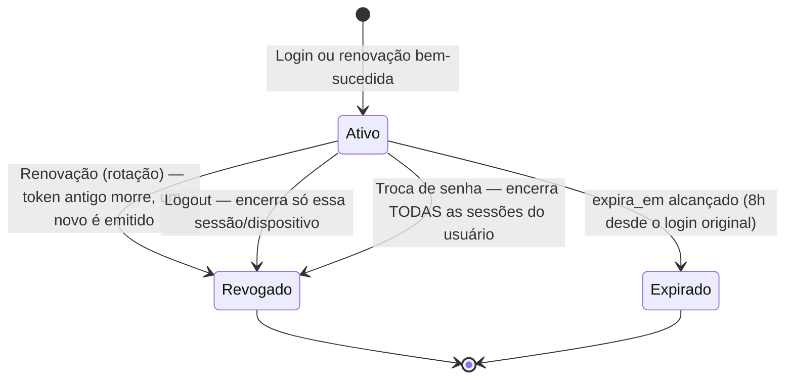

# Segurança — Backend euSíndico

Este documento reúne as medidas de segurança implementadas no backend do euSíndico, com foco especial no modelo de tokens e na proteção contra injeção de scripts (XSS). Complementa o [AUTHENTICATION.md](AUTHENTICATION.md) (que descreve os *fluxos*) e a seção 6 do [RFC](../../documentation/RFC/RFC.md) (que descreve as *intenções* de segurança do projeto).

> O euSíndico é um produto real, não só um exercício acadêmico — as decisões abaixo são avaliadas com esse padrão.

## Sumário

1. [Autenticação: access token + refresh token](#1-autenticação-access-token--refresh-token)
2. [Senhas](#2-senhas)
3. [Validação de entrada e proteção contra scripts maliciosos (XSS)](#3-validação-de-entrada-e-proteção-contra-scripts-maliciosos-xss)
4. [Tratamento de erros](#4-tratamento-de-erros)
5. [Autorização (RN01, RN02)](#5-autorização-rn01-rn02)
6. [Segredos e configuração](#6-segredos-e-configuração)
7. [Acesso a dados](#7-acesso-a-dados)
8. [Comunicação](#8-comunicação)
9. [Rate limiting (proteção contra força bruta)](#9-rate-limiting-proteção-contra-força-bruta)
10. [Recuperação de senha (esqueci minha senha)](#10-recuperação-de-senha-esqueci-minha-senha)
11. [Mapeamento com a seção 6.1 do RFC (OWASP Top 10)](#11-mapeamento-com-a-seção-61-do-rfc-owasp-top-10)
12. [Pendências conhecidas](#12-pendências-conhecidas)

## 1. Autenticação: access token + refresh token

O sistema usa dois tokens com propósitos e níveis de confiança diferentes, em vez de um único JWT de longa duração:

| | Access token | Refresh token |
|---|---|---|
| Formato | JWT (auto-contido, assinado com HMAC-SHA256) | String aleatória opaca (256 bits), sem conteúdo interpretável |
| Onde vive | Só no cliente — nunca é persistido no servidor | No cliente **e** no servidor (tabela `refresh_tokens`, guardado como hash SHA-256) |
| Duração | Curta: ~30 minutos (`Jwt:AccessTokenMinutes`) | Longa: 8 horas a partir do login, fixas desde a emissão original |
| Uso | Enviado em todo endpoint protegido, header `Authorization: Bearer <token>` | Usado só para trocar por um access token novo (`POST /auth/refresh`) ou encerrar uma sessão (`POST /auth/logout`) — nunca em requisições normais |
| Pode ser revogado? | Não — validação *stateless*, sem consulta ao banco | Sim — é justamente para isso que existe a tabela `refresh_tokens` |

### Por que não um único token de 8h

A versão original do design usava um único JWT válido por 8h, sem revogação possível no servidor. Isso foi trocado porque, com token único, um token roubado (ou uma sessão esquecida aberta) continuava válido por até 8h mesmo depois do usuário clicar em "sair" — o servidor não tinha como invalidar algo que nunca guardou. Com o modelo atual, um access token vazado expira sozinho em no máximo ~30 minutos, e não pode ser renovado se o refresh token correspondente já tiver sido revogado.

| | Token único de 8h (design anterior) | Access curto + refresh revogável (atual) |
|---|---|---|
| Logout revoga no servidor? | Não — só o cliente descarta | Sim — refresh token é revogado, sessão morre em minutos |
| Token roubado expira em | Até 8h | Até ~30min (o access token vazado não pode ser renovado sem o refresh) |
| Troca de senha invalida sessões abertas? | Não | Sim (revoga todos os refresh tokens do usuário) |
| Exige tabela extra no banco? | Não | Sim (`refresh_tokens`) |
| Exige lógica extra no frontend? | Não | Sim (interceptor de renovação automática) — mas invisível ao usuário |
| Experiência do síndico | Logado por 8h | Logado por 8h (idêntica — a renovação é transparente) |

A complexidade extra (uma tabela, um endpoint, um interceptor) troca por uma redução real na janela de exposição de um token comprometido — de horas para minutos — sem custo nenhum de UX pro síndico.

### Ciclo de vida do refresh token

O campo `revogado_em` (tabela `refresh_tokens`) é `NULL` enquanto o token está ativo. Ao ser preenchido com um timestamp, o token morre — mesmo que `expira_em` ainda não tenha chegado. Cenários que preenchem esse campo:

| Cenário | Escopo da revogação | Status |
|---|---|---|
| Troca de senha (`PUT /perfil/senha`) | Todas as sessões do usuário, todos os dispositivos | ✅ implementado |
| Logout (`POST /auth/logout`) | Só a sessão/dispositivo atual | ✅ implementado |
| Renovação/rotação (`POST /auth/refresh`) | O token usado na renovação (um novo é emitido no lugar) | ✅ implementado |

**Importante sobre a renovação:** revogar o refresh token não invalida o access token já emitido — ele é *stateless* (seção "Validação do access token" abaixo) e continua aceito até seus próprios ~30 minutos expirarem, mesmo que o refresh token correspondente já tenha sido revogado (troca de senha, rotação ou logout). O que a revogação garante é que, na próxima vez que o access token expirar, a renovação falha e o cliente é forçado a logar de novo — não uma invalidação imediata. Ver também a nota sobre `RefreshTokenInvalidoException` na seção 4.

**Importante sobre o logout:** diferente da renovação, o logout **não** distingue "token inválido" de "token já revogado" nem retorna erro — o endpoint sempre responde `204 No Content`, revogando o token quando ele existe, pertence ao usuário autenticado e ainda está ativo, ou simplesmente não fazendo nada nos demais casos (mesmo espírito anti-enumeração da seção 4). O `usuarioId` da claim do access token é sempre conferido contra o dono do refresh token antes de revogar — evita que um access token válido revogue a sessão de outro usuário mesmo que o refresh token informado seja adivinhado.

**Importante sobre `expira_em`:** a cada rotação, o novo refresh token herda o `expira_em` do token substituído — não é recalculado como "agora + 8h". Isso mantém a sessão total limitada a 8h fixas desde o login original, mesmo que o access token seja renovado várias vezes nesse período.

### Validação do access token

Configurada em `Program.cs` via `AddJwtBearer`:
- **Assinatura:** HMAC-SHA256, chave simétrica (`Jwt:SecretKey`, nunca versionada — ver seção 6).
- **Emissor/audiência:** validados contra `Jwt:Issuer`/`Jwt:Audience`.
- **Expiração:** validada automaticamente pelo middleware (`ValidateLifetime = true`), sem tolerância de relógio (`ClockSkew = TimeSpan.Zero`) — evita aceitar um token alguns segundos após expirar.
- **Claims:** `MapInboundClaims = false` mantém os nomes originais (`sub`, `email`) em vez do remapeamento padrão do .NET para URIs legadas — usado tanto pela geração (`TokenService`) quanto pela leitura (`PerfilController`).

## 2. Senhas

- **Hash:** BCrypt (`IPasswordHasher`), nunca a senha em texto puro é persistida ou logada — ela só existe entre o Controller e a chamada ao hasher.
- **Força exigida no cadastro/troca (RNF04):** mínimo 8 caracteres, com maiúscula, minúscula, número e caractere especial (`SenhaForteValidator`).
- **Login não valida força:** só presença — validar a força de uma senha existente na tela de login serviria só para um invasor descobrir as regras, sem nenhum benefício real.
- **Troca de senha exige a senha atual** — impede que alguém com uma sessão já aberta (dispositivo desbloqueado, token roubado) troque a senha do dono da conta sem confirmar que é ele.
- **Troca de senha revoga todas as sessões ativas** (ver seção 1) — se a troca foi motivada por suspeita de conta comprometida, derruba qualquer sessão que um invasor pudesse ter.

## 3. Validação de entrada e proteção contra scripts maliciosos (XSS)

### A estratégia em duas camadas

O RFC (seção 6.1) já definia a proteção contra XSS como responsabilidade do **front-end**: o Vue.js escapa por padrão todo conteúdo interpolado (`{{ }}`), tratando-o sempre como texto, nunca como HTML — só executaria um `` é rejeitado porque não é um nome ou e-mail válido, e o efeito colateral é que scripts nunca chegam a ser persistidos.

Por que uma camada só no front não é suficiente:
- Qualquer outro consumidor futuro desse dado (geração de PDF de relatórios via QuestPDF, e-mail de notificação, um painel administrativo) precisaria lembrar de escapar corretamente — um único ponto que esqueça reabre a vulnerabilidade.
- Dado inválido (tags HTML num campo "nome") é um problema de qualidade de dado por si só, independente de ser ou não malicioso.

### Onde está implementado hoje

| Campo | Validator | Regra |
|---|---|---|
| `Nome` (cadastro, editar perfil) | `NomeValidator` | Só letras (com acentuação, via `\p{L}`), espaços, hífen e apóstrofo — `^[\p{L}\s'-]+$` |
| `Email` (cadastro, login, editar perfil) | `EmailValidator` | Regex baseada no padrão HTML5 (`<input type="email">`), mais rígida que o `.EmailAddress()` padrão do FluentValidation — exige estrutura de domínio válida (com ponto) e bloqueia caracteres como `<`, `>`, `(`, `)` na parte local |

Exemplo real que motivou essa camada: `{"nome": ""}` e `{"email": "@hot"}` eram aceitos pela validação padrão do FluentValidation antes dessa correção (hoje retornam `400 Bad Request` nos dois casos).

### O que ainda não está coberto

Campos de texto livre que ainda vão ser criados em módulos futuros (`titulo` e `detalhes` de Compromisso/Planejamento, por exemplo) têm o mesmo risco em potencial e precisam da mesma atenção quando forem implementados — não há uma regra genérica de "todo campo de texto é validado assim" no projeto ainda, cada campo precisa da sua própria regra de validação deliberada.

## 4. Tratamento de erros

`ApplicationExceptionHandler` (`euSindico.Api/Middleware/`) centraliza a tradução de exceções de negócio em respostas HTTP:

| Exceção | Status | Observação |
|---|---|---|
| `EmailJaCadastradoException` | 409 | |
| `CredenciaisInvalidasException` | 401 | Mesma mensagem para "e-mail não existe" e "senha incorreta" (ver abaixo) |
| `RefreshTokenInvalidoException` | 401 | Mesma mensagem para token inexistente, expirado ou já revogado — não dá pra um cliente (legítimo ou não) distinguir as causas, e não faria diferença na ação a tomar (relogar) |
| `SenhaAtualIncorretaException` | 400 | |
| `UsuarioNaoEncontradoException` | 404 | |
| Qualquer exceção não mapeada | 500 | Mensagem sempre genérica ao cliente |

**Nunca expor detalhe interno:** para qualquer exceção não mapeada explicitamente (bug, falha inesperada), a resposta ao cliente é sempre um texto genérico fixo (`"Ocorreu um erro inesperado. Tente novamente mais tarde."`) — a mensagem real da exceção só vai para o log (`ILogger`, integrado ao OpenTelemetry). Isso atende diretamente à seção 6.1 do RFC: *"tratamento adequado de erros sem exposição de informações sensíveis"*.

**Proteção contra enumeração de usuários:** no login, a resposta é idêntica tanto para "e-mail não cadastrado" quanto para "senha incorreta" — do contrário, a API revelaria quais e-mails existem no sistema só pela diferença na mensagem de erro.

## 5. Autorização (RN01, RN02)

- Todo endpoint fora de `/auth/*` exige `[Authorize]` — sem token válido, `401` antes mesmo de chegar ao Controller.
- O `usuarioId` usado para filtrar dados (ex: "só meus prédios") vem **sempre** da claim `sub` do token (`User.FindFirstValue(...)`), nunca de um parâmetro de rota ou query string — evita que um usuário autenticado acesse dados de outro só trocando um ID na URL.

## 6. Segredos e configuração

- Nenhum segredo (connection string, `Jwt:SecretKey`, `Smtp:Usuario`/`Smtp:Senha`) é versionado — `appsettings.json` só tem placeholders vazios.
- Desenvolvimento local: [User Secrets](https://learn.microsoft.com/aspnet/core/security/app-secrets) do .NET, fora do repositório.
- CI (GitHub Actions): secret do repositório `JWT_SECRET_KEY_TEST_FOR_SONAR`, injetado como variável de ambiente `Jwt__SecretKey` só no step de testes — usado exclusivamente para os testes de integração conseguirem subir a aplicação (`WebApplicationFactory`), nunca assina token de usuário real.
- Produção: variáveis de ambiente (ou um secret manager), nunca arquivo. Detalhes em [GETTING_STARTED.md](GETTING_STARTED.md).
- A chave JWT é gerada aleatoriamente (256+ bits) — nunca reaproveitada entre ambientes.
- **Falha rápido na inicialização** se `Jwt:SecretKey` não estiver configurado (`Program.cs`) — sem essa validação, o erro só aparecia na primeira requisição que passasse pelo middleware de autenticação (`UseAuthentication()` tenta inicializar o esquema JWT em toda requisição, não só nas protegidas por `[Authorize]` — ver detalhe abaixo), com um stack trace bem menos óbvio de diagnosticar.

## 7. Acesso a dados

- Toda consulta passa pelo Entity Framework Core com *parameterized queries* — sem concatenação de SQL manual, o que já elimina a classe mais comum de SQL Injection (RFC 6.1).
- FKs configuradas com `DeleteBehavior.Restrict` por padrão (ver [ARCHITECTURE.md](ARCHITECTURE.md)) — evita cascatas de exclusão acidentais; exclusões em massa (ex: exclusão de conta) são orquestradas explicitamente no código, não implícitas no banco.

## 8. Comunicação

- `UseHttpsRedirection()` — força HTTPS entre cliente e servidor (RFC 6.1).
- CORS ainda não configurado — só será necessário quando o front-end (origem diferente) existir; fica registrado aqui como pendência a não esquecer nessa hora.

## 9. Rate limiting (proteção contra força bruta)

`POST /auth/login` e `POST /auth/registrar` usam o rate limiter nativo do ASP.NET Core (`Microsoft.AspNetCore.RateLimiting`, configurado em `Program.cs`), com o atributo `[EnableRateLimiting("auth")]`:

- **Partição:** IP do cliente + rota (`RemoteIpAddress` + `Request.Path`) — cada endpoint tem seu próprio contador por IP, então esgotar o limite de `/auth/login` não afeta `/auth/registrar` e vice-versa.
- **Janela fixa:** 5 requisições por minuto, por partição. A janela abre na **primeira requisição** daquela partição (IP + rota), não no momento em que um cliente é bloqueado — então o tempo de espera real após um `429` varia entre poucos segundos e ~1 minuto, dependendo de quando dentro da janela as 5 tentativas foram consumidas. Por ser janela fixa (não deslizante), o contador zera de uma vez a cada minuto — tecnicamente é possível um pico de até 10 requisições numa janela de tempo bem curta (5 no fim de uma janela + 5 no início da próxima), o que é aceitável aqui (ver decisão sobre lockout progressivo abaixo).
- **Sem fila:** requisições além do limite são rejeitadas na hora (`QueueLimit = 0`) — enfileirar só atrasaria um ataque de força bruta, não o impediria.
- **Resposta:** `429 Too Many Requests`, com o mesmo formato mínimo (`ProblemDetails` com `Status`/`Title`) usado pelo resto da API.

### Por que não lockout progressivo (por enquanto)

Uma alternativa considerada foi um bloqueio com duração crescente a cada violação repetida (ex: 2 min, depois 5 min, depois 10 min), em vez de uma janela fixa que sempre reseta igual. Decisão: não implementar por ora, por dois motivos:

- **Ganho de segurança marginal:** com `RNF04` já exigindo senha de 8+ caracteres com maiúscula, minúscula, número e caractere especial, o espaço de senhas possíveis já é grande o suficiente para que 5 tentativas/minuto (~7.200/dia) tornem força bruta impraticável de qualquer forma — escalar o tempo de bloqueio não muda essa conclusão de forma relevante.
- **Complexidade desproporcional:** os algoritmos nativos do `Microsoft.AspNetCore.RateLimiting` (janela fixa/deslizante/token bucket) não têm um modo "aumenta a cada violação" pronto — isso exigiria manter um contador extra de violações por partição, e esse contador teria o mesmo problema de estado distribuído do rate limiter em si (ver pendência bloqueante abaixo): se o App Runner escalar para múltiplas instâncias, cada uma contaria violações separadamente, a menos que esse estado morasse num cache compartilhado (ex: Redis) — infraestrutura nova, não só código.

Fica registrado como melhoria futura, não como pendência bloqueante.

**Por que por IP, e não por conta/e-mail:** limitar por conta (ex: "bloquear a conta após 5 tentativas erradas") criaria um vetor de negação de serviço — qualquer pessoa poderia trancar a conta de outro usuário só errando a senha dele de propósito, sem precisar acertar nada. Limitar por IP protege contra o mesmo cenário de força bruta sem esse efeito colateral.

**⚠️ Bloqueante antes de produção:** `RemoteIpAddress` é o IP de quem conecta diretamente ao servidor. O backend será hospedado em **AWS App Runner** (ver [ARCHITECTURE.md](ARCHITECTURE.md), seção "Hospedagem"), que fica atrás de um proxy gerenciado — todo tráfego externo passa por ele antes de chegar no container. Sem correção, `RemoteIpAddress` passa a ser o IP interno do proxy do App Runner, **igual para todos os clientes**, não o IP de cada usuário. Isso não abre brecha de segurança (força bruta continua sendo bloqueada), mas degrada a experiência de uso normal: usuários legítimos e não-relacionados passam a compartilhar o mesmo limite de 5 requisições/minuto em `/auth/login` e `/auth/registrar` só por estarem atrás do mesmo proxy — o suficiente para vários síndicos tentando logar por perto do mesmo minuto começarem a receber `429` sem terem feito nada de errado.

A correção é configurar `ForwardedHeadersMiddleware` para confiar no cabeçalho `X-Forwarded-For` que o App Runner injeta, restringindo a confiança à rede/proxy do próprio App Runner (`ForwardedHeadersOptions.KnownProxies`/`KnownNetworks`) — nunca aceitar esse cabeçalho de qualquer origem, senão um cliente externo poderia forjá-lo pra burlar o rate limiting inteiro fingindo IPs diferentes a cada requisição. Isso ainda não foi feito porque depende de conhecer a faixa de rede exata usada pelo App Runner, que só dá pra confirmar na documentação da AWS no momento de configurar o deploy — ver item bloqueante na seção 12.

## 10. Recuperação de senha (esqueci minha senha)

Fluxo em 3 endpoints (RF06-A), sem exigir autenticação — detalhamento completo em [AUTHENTICATION.md](AUTHENTICATION.md), Fluxo 8. Resumo das decisões de segurança:

**Anti-enumeração consistente com o resto da API:** `POST /auth/esqueci-senha` responde `204 No Content` de forma **idêntica** exista ou não o e-mail informado — só dispara o envio de e-mail quando o usuário existe, mas o cliente não recebe nenhum sinal que distinga os dois casos (mesmo princípio de `CredenciaisInvalidasException`/`RefreshTokenInvalidoException`, seção 4). Diferente do login, essa API não expõe "e-mail não cadastrado": expor isso permitiria enumerar contas cadastradas só testando e-mails em sequência.

**Código:** 6 caracteres, só letras maiúsculas (A–Z) e números (0–9), gerados com `RandomNumberGenerator` (mesma fonte de aleatoriedade criptográfica do refresh token), evitando caracteres visualmente ambíguos (`0`/`O`, `1`/`I`/`L`). Nunca armazenado em texto puro — só o hash SHA-256 (tabela `codigos_redefinicao_senha`), mesmo princípio do refresh token.

**Validação case-insensitive:** o código digitado pelo usuário é normalizado (removendo espaços e convertendo para maiúsculas) antes de calcular o hash pra comparação — já que o código gerado só usa maiúsculas, digitar em minúsculas continua funcionando. Melhora a experiência em dispositivos móveis (teclado alterna case sozinho, autocorretor, etc.) sem abrir mão de nenhuma segurança, já que a normalização acontece só no servidor, sobre o valor que será hasheado — não muda o espaço de valores possíveis do código em si.

**Validade e uso único:** expira em 15 minutos (`usado_em IS NULL AND expira_em > agora`, RN15). Uma nova solicitação de código invalida qualquer código anterior ainda válido do mesmo usuário — no máximo um código ativo por vez.

**Cooldown de 5 minutos entre solicitações, por conta:** complementa o rate limiting por IP (abaixo) — aquele limita *quantas requisições* por minuto, mas ainda deixaria um único IP disparar dezenas de e-mails por hora contra a mesma conta (5/min × 60min). O cooldown resolve isso na origem: um novo código só é gerado e enviado se o último código daquele `usuario_id` (independente de já usado, expirado ou ainda válido) tiver sido criado há 5+ minutos. Se o cooldown ainda estiver ativo, `POST /auth/esqueci-senha` continua respondendo `204 No Content` **sem gerar nem enviar nada** — a mesma resposta genérica de sempre, então quem chama o endpoint duas vezes seguidas não consegue distinguir "aguardando cooldown" de "e-mail não cadastrado" (mesmo cuidado anti-enumeração do restante do fluxo). A UX de "aguarde 5 minutos" pra desestimular cliques repetidos fica a cargo do front-end (desabilitar o botão localmente); o backend só garante que o cooldown vale mesmo que o front seja contornado.

**Envio síncrono, sem fila própria:** `IEmailSender.EnviarAsync` é chamado com `await` dentro da própria requisição — `POST /auth/esqueci-senha` só responde depois que o envio ao servidor SMTP terminar (ou falhar). Adequado à escala do projeto (RNF07: 100 usuários simultâneos); a fila de entrega em si é responsabilidade do provedor SMTP (Gmail/Mailtrap/SES), não da aplicação. Uma fila própria (`BackgroundService`, ou AWS SQS quando a infra AWS entrar de vez) fica registrada como evolução futura, não como necessidade atual.

**Verificação do código reaplicada na redefinição:** `POST /auth/verificar-codigo` existe só para a UX (o front avança de tela sem esperar o usuário digitar a senha nova pra descobrir que o código está errado), mas não é um limite de segurança por si só — `POST /auth/redefinir-senha` **sempre** revalida o código recebido antes de trocar a senha, em vez de confiar que o front só chega a essa tela depois de uma verificação bem-sucedida. Mesma mensagem de erro genérica (`CodigoRedefinicaoInvalidoException`, 400) para "e-mail não existe", "código errado" e "código expirado/já usado" — de novo, anti-enumeração.

**Rate limiting reaproveitado:** os 3 endpoints usam a mesma política `[EnableRateLimiting("auth")]` da seção 9 (5 requisições/minuto, por IP + rota) — cada rota tem seu próprio contador independente, então testar códigos em `/auth/verificar-codigo` esgota o limite dali, não o de `/auth/login`. Isso cobre também a tentativa de força bruta contra o próprio código de 6 caracteres.

**Redefinição derruba todas as sessões ativas** — mesmo comportamento da troca de senha autenticada (seção 2): se a senha foi esquecida ou comprometida, qualquer sessão que um invasor pudesse ter é encerrada.

**Segredo de aplicação novo:** credenciais SMTP (`Smtp:Usuario`, `Smtp:Senha`) seguem o mesmo tratamento do `Jwt:SecretKey` (seção 6) — User Secrets em desenvolvimento, nunca versionadas; em produção, variável de ambiente ou secret manager.

## 11. Mapeamento com a seção 6.1 do RFC (OWASP Top 10)

| Medida do RFC | Onde está implementada |
|---|---|
| Autenticação segura | JWT + BCrypt (seções 1–2) |
| Controle de autorização | `[Authorize]` + `usuarioId` via claim (seção 5) |
| Validação de entrada de dados | FluentValidation, incluindo `NomeValidator`/`EmailValidator` (seção 3) |
| Proteção contra SQL Injection | EF Core parameterizado (seção 7) |
| Proteção contra XSS | Renderização segura do Vue (front) + validação de entrada (backend, defesa em profundidade) (seção 3) |
| HTTPS | `UseHttpsRedirection()` (seção 8) |
| Tratamento de erros sem exposição de dados sensíveis | `ApplicationExceptionHandler` (seção 4) |
| Proteção contra força bruta | Rate limiting em `/auth/login` e `/auth/registrar` (seção 9) |
| Recuperação de conta sem exposição de dados | Código de verificação por e-mail, anti-enumeração, uso único (seção 10) |

## 12. Pendências conhecidas

**Bloqueantes antes de produção** (afetam usuários legítimos desde o primeiro dia, não são "nice to have"):

- `ForwardedHeadersMiddleware` configurado para o App Runner, para o rate limiting (seção 9) identificar o IP real do cliente em vez do IP do proxy.

**Podem esperar o gatilho correspondente:**

- CORS, quando o front-end existir (domínio da origem ainda não é conhecido).
