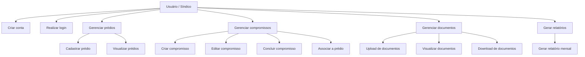
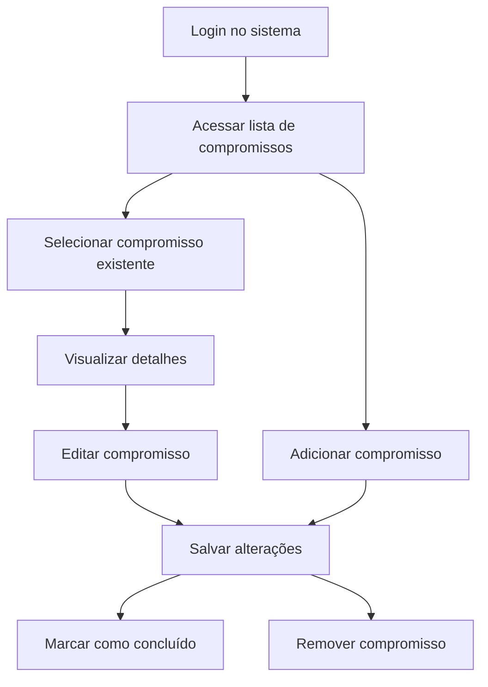
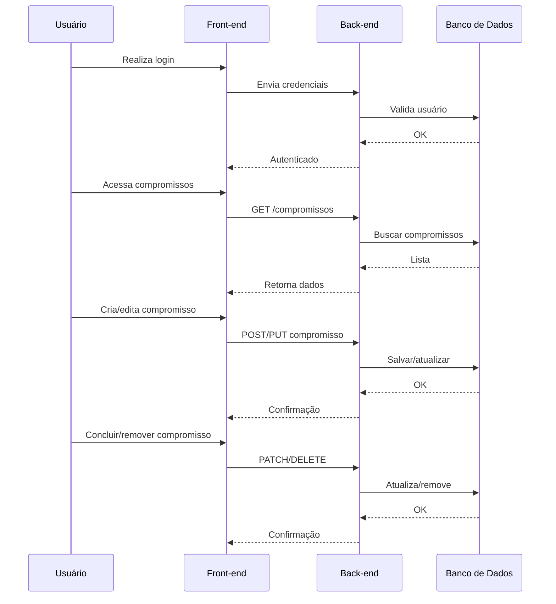
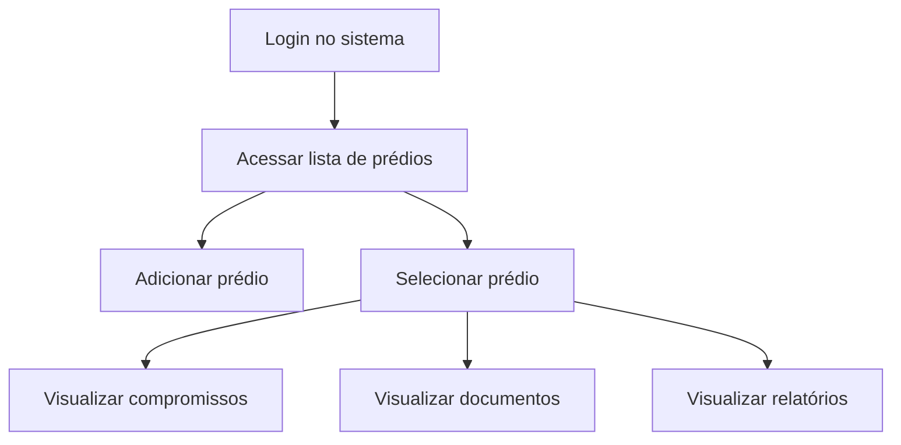
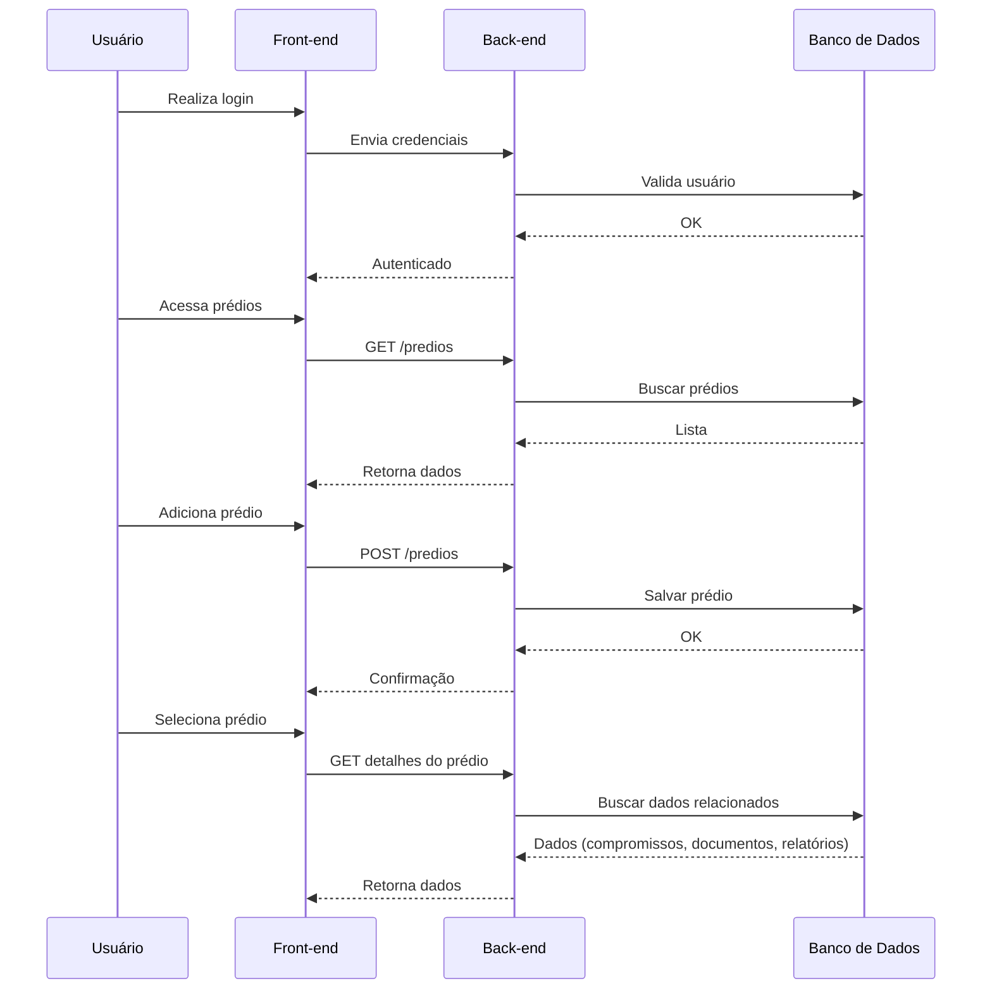

# RFC: Request for Comments — Projeto de Portfólio
<strong>Engenharia de Software - Católica SC</strong>

## Identificação
- <strong>Título do projeto: </strong>euSíndico
- <strong>Linha de projeto: </strong> Web mobile-first
- <strong>Autor: </strong>Pedro Lucas Luckow
- <strong>Data da proposta: </strong>09/04/2026
- <strong>Versão: </strong>1.3.0

## Sumário

### 1. Visão de Produto
- [1.1 Contexto e Problema](#11-contexto-e-problema)
- [1.2 Origem da Demanda](#12-origem-da-demanda-e-evidências)
- [1.3 Benchmark](#13-análise-de-soluções-existentes-benchmark)
- [1.4 Público-alvo](#14-público-alvo)
- [1.5 Objetivos do Projeto](#15-objetivos-do-projeto)
- [1.6 Métricas de Sucesso](#16-métricas-de-sucesso-kpis)

### 2. Engenharia de Requisitos
- [2.1 Personas](#21-personas)
- [2.2 Casos de Uso](#22-casos-de-uso-principais)
- [2.3 Requisitos Funcionais](#23-requisitos-funcionais-rfs)
- [2.4 Requisitos Não Funcionais](#24-requisitos-não-funcionais-rnfs)
- [2.5 Regras de Negócio](#25-regras-de-negócio)
- [2.6 Fora do Escopo](#26-fora-do-escopo)

### 3. Fluxos e Comportamento do Sistema
- [3.1 Fluxo Principal do Usuário](#31-fluxo-principal-do-usuário)
- [3.2 Fluxos Alternativos](#32-fluxos-alternativos)

## 1. Visão de produto e impacto
### 1.1 Contexto e problema

A gestão de atividades operacionais por síndicos profissionais apresenta desafios significativos, especialmente no que se refere à organização de compromissos, centralização de informações e controle documental. Esse problema é enfrentado principalmente por síndicos que administram múltiplos condomínios simultaneamente, exigindo um alto nível de organização e acompanhamento contínuo.

No contexto atual, o síndico (no caso deste projeto, um profissional atuante na área) utiliza diferentes aplicações para gerenciar suas responsabilidades. No entanto, essas ferramentas são, em sua maioria, voltadas à administração condominial geral — como controle financeiro, emissão de boletos, gestão de inadimplência e comunicação com moradores — e não ao gerenciamento das atividades operacionais do síndico em si. Tanto é que a maioria dos aplicativos usados são da própria administradora do condomínio.

Como consequência, tarefas importantes como:

- agendamento de compromissos (reuniões, visitas técnicas, inspeções),
- registro de atividades realizadas,
- organização de documentos (atas, normas internas, planejamentos),
- acompanhamento de relatórios mensais,

acabam sendo gerenciadas de forma descentralizada, muitas vezes utilizando aplicativos genéricos (como agendas e armazenamento em nuvem) ou até mesmo anotações manuais.

<strong>Soluções atuais</strong>

Atualmente, o problema é resolvido através da combinação de múltiplas ferramentas, tais como:

- aplicativos de gestão condominial (com foco administrativo),
- agendas digitais (como Google Agenda),
- armazenamento de arquivos em serviços separados (como Google Drive),
- anotações em blocos físicos ou aplicativos de notas.

<strong>Limitações das soluções atuais</strong>

As soluções utilizadas apresentam diversas limitações:

- Falta de centralização: informações importantes estão distribuídas em diferentes plataformas.
- Baixa aderência ao fluxo real de trabalho do síndico: ferramentas existentes não foram projetadas para a rotina operacional do síndico.
- Excesso de funcionalidades irrelevantes: sistemas administrativos possuem recursos que não são utilizados, gerando poluição visual e dificultando o uso.
- Dificuldade de rastreabilidade: não há um vínculo claro entre compromissos realizados e documentos gerados (ex: atas e relatórios).
- Baixa eficiência na geração de relatórios: relatórios mensais precisam ser montados manualmente com base em diferentes fontes de informação.

<strong>Exemplo real (estudo de caso)</strong>

No cenário observado, o síndico precisa:

- Utilizar aplicativos descentralizados para consultas rápidas de documentos;
- Registrar compromissos em aplicativos externos;
- Gerar relatórios de atividades mensais manualmente;
- Anotar ou lembrar de planejamentos futuros de um condomínio específico.

Esse fluxo evidencia retrabalho, risco de perda de informação e baixa eficiência operacional.

<strong>Motivação do projeto</strong>

Diante dessas limitações, identificou-se a necessidade de desenvolver uma solução específica, focada na rotina do síndico, com as seguintes características:

- centralização das informações em uma única plataforma;
- foco nas atividades operacionais;
- interface simplificada e objetiva (mobile-first);
- integração entre compromissos, prédios e documentos;
- geração automatizada de relatórios mensais.

Dessa forma, o projeto não se configura apenas como um exercício técnico, mas como uma solução para um problema real, validado por um usuário ativo na área, com potencial de aplicação prática e impacto direto na produtividade e organização do trabalho do síndico.

### 1.2 Origem da demanda e evidências

Através de conversas presenciais foram mapeados os problemas, as necessidades e validado o fluxo da aplicação, sendo realizados diversos ajustes até chegar na solução final. Foram analisadas as funcionalidades e experiência do usuário dos aplicativos utilizados pelo síndico e, a partir disso, criado os protótipos da solução. O fluxo e a identidade visual foram aprovadas. O projeto foi solicitado por um síndico profissional real. 

Observação: é possível visualizar os prints dos feedbacks no caminho "./prints/feedbacks"

### 1.3 Análise de soluções existentes (Benchmark)

Observação: os prints das telas principais dos aplicativos está disponível em "./prints/benchmark".

<strong>Solução 1: brCondos</strong>
- Link: https://brcondos.com.br
- Público-alvo: síndicos
- Funcionalidades principais: gestão financeira de condomínios
- Limitações: foco em administração financeira, não no dia a dia do síndico.

<strong>Solução 2: comApControle</strong>
- Link: https://vertcondominios.com.br/
- Público-alvo: síndicos, membros do conselho do condomínio
- Funcionalidades principais: gestão financeira de condomínios
- Limitações: foco em administração financeira, não no dia a dia do síndico.

<strong>Solução 3: Group Com</strong>
- Link: https://www.groupsoftware.com.br/administracao-de-condominios/group-com/
- Público-alvo: síndicos, membros do conselho, porteiros, prestadores de serviços
- Funcionalidades principais: gestão de condomínios, gestão de departamento pessoal, gestão de prestadores de serviços
- Limitações: excesso de funcionalidades.

<strong>Solução 4: Gruvi</strong>
- Link: https://gruvi.app/
- Público-alvo: síndicos, moradores, administradores
- Funcionalidades principais: gestão financeira, comunicação entre vizinhos, portarias
- Limitações: não há foco no dia a dia do síndico.

<strong>Solução 5: Seu Condomínio</strong>
- Link: https://www.seucondominio.com.br/
- Público-alvo: síndicos, moradores, administradores, porteiros
- Funcionalidades principais: gestão financeira, gestão de moradores, gestão de portarias
- Limitações: excesso de funcionalidades.

### 1.4 Público alvo

O sistema será usado preferencialmente por síndicos profissionais que necessitam organizar suas atividades e documentos de mais de um condomínio. O nível de conhecimento técnico esperado é baixo, por isso é necessário que seja um aplicativo focado em uma boa experiência do usuário.

### 1.5 Objetivos do projeto

<strong>Objetivo geral:</strong>
Desenvolver uma aplicação web mobile-first para auxiliar síndicos na gestão de suas atividades operacionais, promovendo a organização de compromissos, prédios e documentos em uma única plataforma. A solução visa centralizar informações e otimizar o acompanhamento das tarefas realizadas no dia a dia. Busca-se também aumentar a eficiência na geração de relatórios e no controle das atividades vinculadas a cada condomínio.

<strong>Objetivos específicos:</strong>
- Geração automatizada de relatórios;
- Centralização de documentos referentes aos condomínios;
- Gerenciamento de atividades realizadas e planejadas.

### 1.6 Métricas de Sucesso (KPIs)

- Suporte a 100 usuários simultâneos;
- Tempo médio de visualização de todo o fluxo inferior a 2 minutos;
- Tempo médio de consulta dos documentos inferior a 30 segundos;
- Tempo médio para registrar atividades inferior a 1 minuto;

## 2. Engenharia de requisitos
### 2.1 Personas
#### Persona 1: João da Silva (Síndico Profssional)
<strong>Contexto:</strong>
João tem 45 anos e atua como síndico profissional, sendo responsável pela administração de 6 condomínios simultaneamente. Sua rotina envolve reuniões, visitas técnicas, resolução de problemas operacionais e comunicação com moradores e prestadores de serviço.

<strong>Objetivos:</strong>
- Organizar compromissos por condomínio
- Facilitar a geração de relatórios mensais
- Centralizar documentos
- Reduzir retrabalho e perda de informações

<strong>Dificuldades:</strong>
- Uso de múltiplos sistemas
- Falta de integração entre atividades e documentos
- Perda de tempo na criação manual de relatórios
- Excesso de funcionalidades irrelevantes em sistemas atuais

#### Persona 2: Ana Souza (Assistente Administrativa)
<strong>Contexto:</strong>
Ana tem 30 anos e auxilia na organização das demandas do síndico. Ela é responsável por registrar informações, organizar documentos e dar suporte na elaboração de relatórios.

<strong>Objetivos:</strong>
- Registrar rapidamente atividades realizadas
- Organizar documentos por condomínio
- Acessar informações de forma clara e rápida

<strong>Dificuldades:</strong>
- Falta de padronização no armazenamento de arquivos
- Dificuldade em localizar informações antigas
- Dependência de diferentes sistemas para tarefas simples

### 2.2 Casos de uso principais
Os principais fluxos do sistema incluem:
- Criar conta e autenticar usuário;
- Cadastrar e gerenciar prédios;
- Criar, editar e visualizar compromissos;
- Associar compromissos a prédios;
- Registrar conclusão de compromissos;
- Fazer upload de documentos (atas, normas, relatórios);
- Consultar documentos por prédio;
- Gerar relatórios mensais de compromissos.

Diagrama de casos de uso:

### 2.3 Requisitos Funcionais (RFs)
- RF01 — O sistema deve permitir que o usuário crie uma conta.
- RF02 — O sistema deve permitir que o usuário realize login.
- RF03 — O sistema deve permitir que o usuário cadastre prédios.
- RF04 — O sistema deve permitir que o usuário visualize a lista de prédios cadastrados.
- RF05 — O sistema deve permitir que o usuário registre compromissos.
- RF06 — O sistema deve permitir que o usuário associe compromissos a um prédio.
- RF07 — O sistema deve permitir que o usuário edite e exclua compromissos.
- RF08 — O sistema deve permitir que o usuário marque compromissos como concluídos.
- RF09 — O sistema deve permitir que o usuário faça upload de documentos por prédio.
- RF10 — O sistema deve permitir que o usuário visualize e baixe documentos armazenados.
- RF11 — O sistema deve permitir que o usuário gere relatórios mensais com base nos compromissos registrados.

### 2.4 Requisitos Não Funcionais (RNFs)
- RNF01 — O sistema deve ter tempo de resposta inferior a 1500ms para operações comuns.
- RNF02 — O sistema deve garantir autenticação segura utilizando criptografia de senha.
- RNF03 — O sistema deve estar disponível 99% do tempo.
- RNF04 — O sistema deve suportar acesso simultâneo de pelo menos 100 usuários.
- RNF05 — A interface deve ser responsiva e adaptada para dispositivos móveis (mobile-first).
- RNF06 — O sistema deve garantir a integridade e segurança dos arquivos enviados.
- RNF07 — O sistema deve permitir fácil manutenção e evolução.

### 2.5 Regras de negócio
- RN01 — Apenas usuários autenticados podem acessar o sistema.
- RN02 — Todo compromisso deve estar vinculado a um prédio.
- RN03 — Apenas compromissos concluídos podem compor relatórios.
- RN04 — Todo documento deve estar vinculado a um prédio.
- RN05 — Não é permitido excluir prédios sem confirmação.

### 2.6 Fora do escopo

- Gestão financeira de condomínios
- Comunicação com moradores (chat/avisos)
- Integração com sistemas externos
- Aplicativo mobile nativo
- Controle de portaria e segurança

## 3. Fluxos e comportamento do sistema
### 3.1 Fluxo principal do usuário

- <strong>Fluxo "Gerenciamento de compromissos":</strong>
1. Usuário realiza o login no sistema
2. Acessa a lista de compromissos
3. Adiciona compromisso
4. Visualiza e/ou edita detalhes de um compromisso
5. Conclui ou remove compromisso

Diagrama de fluxo:

Diagrama de sequência

- <strong>Fluxo "Gerenciamento de prédios":</strong>
1. Usuário realiza login no sistema
2. Acessa a lista de prédios
3. Adiciona um prédio
4. Visualiza menus referentes a compromissos, documentos e relatórios de atividades

Diagrama de fluxo:

Diagrama de sequência

### 3.2 Fluxos alternativos

Fluxo "Falha no login":
1. O usuário insere credenciais inválidas
2. O sistema rejeita a autenticação
3. Uma mensagem de erro é exibida
4. O usuário pode tentar novamente

Fluxo "Falha no upload de documento":
1. O usuário tenta enviar um arquivo inválido ou muito grande
2. O sistema bloqueia o upload
3. Uma mensagem de erro é exibida
4. O usuário deve selecionar outro arquivo

Fluxo "Geração de relatório sem dados":
1. O usuário solicita relatório sem compromissos concluídos
2. O sistema informa que não há dados disponíveis
3. Nenhum relatório é gerado

Fluxo "Acesso sem autenticação":
1. O usuário tenta acessar o sistema sem login
2. O sistema redireciona para a tela de autenticação
