# RFC: Request for Comments — Projeto de Portfólio
<strong>Engenharia de Software - Católica SC</strong>

## Identificação
- <strong>Título do projeto: </strong>euSíndico
- <strong>Linha de projeto: </strong> Web mobile-first
- <strong>Autor: </strong>Pedro Lucas Luckow
- <strong>Data da proposta: </strong>09/04/2026
- <strong>Versão: </strong>2.0.0

## Sumário

### 1. Visão de Produto
- [1.1 Contexto e Problema](#11-contexto-e-problema)
- [1.2 Origem da Demanda](#12-origem-da-demanda-e-evidências)
- [1.3 Benchmark](#13-análise-de-soluções-existentes-benchmark)
- [1.4 Público-alvo](#14-público-alvo)
- [1.5 Objetivos do Projeto](#15-objetivos-do-projeto)
- [1.6 Métricas de Sucesso](#16-métricas-de-sucesso-kpis)

### 2. Engenharia de Requisitos
- [2.1 Personas](#21-personas)
- [2.2 Casos de Uso](#22-casos-de-uso-principais)
- [2.3 Requisitos Funcionais](#23-requisitos-funcionais-rfs)
- [2.4 Requisitos Não Funcionais](#24-requisitos-não-funcionais-rnfs)
- [2.5 Regras de Negócio](#25-regras-de-negócio)
- [2.6 Fora do Escopo](#26-fora-do-escopo)

### 3. Fluxos e Comportamento do Sistema
- [3.1 Fluxo Principal do Usuário](#31-fluxo-principal-do-usuário)
- [3.2 Fluxos Alternativos](#32-fluxos-alternativos)

### 4. Mockups e Experiência do Usuário (UX)
- [4.1 Fluxo de Navegação](#41-fluxo-de-navegação)
- [4.2 Wireframes ou Mockups das Telas](#42-wireframes-ou-mockups-das-telas)
- [4.3 Fluxo de Interação do Usuário](#43-fluxo-de-interação-do-usuário)
- [4.4 Feedback Inicial de Usuários](#44-feedback-inicial-de-usuários)

### 5. Arquitetura do Sistema
- [5.1 Diagrama C4](#51-diagrama-c4)
    - [5.1.1 Nível 1: Diagrama de Contexto](#511-nível-1-diagrama-de-contexto)
    - [5.1.2 Nível 2: Diagrama de Containers](#512-nível-2-diagrama-de-containers)
    - [5.1.3 Nível 3: Diagrama de Componentes](#513-nível-3-diagrama-de-componentes)
- [5.2 Modelo de Dados](#52-modelo-de-dados)
    - [5.2.1 DER (Diagrama Entidade Relacionamento)](#521-der-diagrama-entidade-relacionamento)
    - [5.2.2 Esquema Relacional](#522-esquema-relacional)
- [5.3 Principais componentes](#53-principais-componentes)
- [5.4 Stack tecnológica](#54-stack-tecnológica)

### 6. Segurança e Privacidade
- [6.1 Segurança da aplicação](#61-segurança-da-aplicação)
- [6.2 Privacidade e LGPD](#62-privacidade-e-lgpd)

### 7. Planejamento do projeto
- [7.1 Marcos de desenvolvimento](#71-marcos-de-desenvolvimento)

### 8. Referências
- [8.1 Documentação técnica](#81-documentação-técnica)
- [8.2 Ferramentas utilizadas](#82-ferramentas-utilizadas)

## 1. Visão de produto e impacto
### 1.1 Contexto e problema

A gestão de atividades operacionais por síndicos profissionais apresenta desafios significativos, especialmente no que se refere à organização de compromissos, centralização de informações e controle documental. Esse problema é enfrentado principalmente por síndicos que administram múltiplos condomínios simultaneamente, exigindo um alto nível de organização e acompanhamento contínuo.

No contexto atual, o síndico (no caso deste projeto, um profissional atuante na área) utiliza diferentes aplicações para gerenciar suas responsabilidades. No entanto, essas ferramentas são, em sua maioria, voltadas à administração condominial geral — como controle financeiro, emissão de boletos, gestão de inadimplência e comunicação com moradores — e não ao gerenciamento das atividades operacionais do síndico em si. Tanto é que a maioria dos aplicativos usados são da própria administradora do condomínio.

Como consequência, tarefas importantes como:

- agendamento de compromissos (reuniões, visitas técnicas, inspeções),
- registro de atividades realizadas,
- organização de documentos (atas, normas internas, planejamentos),
- acompanhamento de relatórios mensais,

acabam sendo gerenciadas de forma descentralizada, muitas vezes utilizando aplicativos genéricos (como agendas e armazenamento em nuvem) ou até mesmo anotações manuais.

<strong>Soluções atuais</strong>

Atualmente, o problema é resolvido através da combinação de múltiplas ferramentas, tais como:

- aplicativos de gestão condominial (com foco administrativo),
- agendas digitais (como Google Agenda),
- armazenamento de arquivos em serviços separados (como Google Drive),
- anotações em blocos físicos ou aplicativos de notas.

<strong>Limitações das soluções atuais</strong>

As soluções utilizadas apresentam diversas limitações:

- Falta de centralização: informações importantes estão distribuídas em diferentes plataformas.
- Baixa aderência ao fluxo real de trabalho do síndico: ferramentas existentes não foram projetadas para a rotina operacional do síndico.
- Excesso de funcionalidades irrelevantes: sistemas administrativos possuem recursos que não são utilizados, gerando poluição visual e dificultando o uso.
- Dificuldade de rastreabilidade: não há um vínculo claro entre compromissos realizados e documentos gerados (ex: atas e relatórios).
- Baixa eficiência na geração de relatórios: relatórios mensais precisam ser montados manualmente com base em diferentes fontes de informação.

<strong>Exemplo real (estudo de caso)</strong>

No cenário observado, o síndico precisa:

- Utilizar aplicativos descentralizados para consultas rápidas de documentos;
- Registrar compromissos em aplicativos externos;
- Gerar relatórios de atividades mensais manualmente;
- Anotar ou lembrar de planejamentos futuros de um condomínio específico.

Esse fluxo evidencia retrabalho, risco de perda de informação e baixa eficiência operacional.

<strong>Motivação do projeto</strong>

Diante dessas limitações, identificou-se a necessidade de desenvolver uma solução específica, focada na rotina do síndico, com as seguintes características:

- centralização das informações em uma única plataforma;
- foco nas atividades operacionais;
- interface simplificada e objetiva (mobile-first);
- integração entre compromissos, prédios e documentos;
- geração automatizada de relatórios mensais.

Dessa forma, o projeto não se configura apenas como um exercício técnico, mas como uma solução para um problema real, validado por um usuário ativo na área, com potencial de aplicação prática e impacto direto na produtividade e organização do trabalho do síndico.

### 1.2 Origem da demanda e evidências

Através de conversas presenciais foram mapeados os problemas, as necessidades e validado o fluxo da aplicação, sendo realizados diversos ajustes até chegar na solução final. Foram analisadas as funcionalidades e experiência do usuário dos aplicativos utilizados pelo síndico e, a partir disso, criado os protótipos da solução. O fluxo e a identidade visual foram aprovadas. O projeto foi solicitado por um síndico profissional real. 

Observação: é possível visualizar os prints dos feedbacks no caminho "./prints/feedbacks"

### 1.3 Análise de soluções existentes (Benchmark)

Observação: os prints das telas principais dos aplicativos está disponível em "./prints/benchmark".

<strong>Solução 1: brCondos</strong>
- Link: https://brcondos.com.br
- Público-alvo: síndicos
- Funcionalidades principais: gestão financeira de condomínios
- Limitações: foco em administração financeira, não no dia a dia do síndico.

<strong>Solução 2: comApControle</strong>
- Link: https://vertcondominios.com.br/
- Público-alvo: síndicos, membros do conselho do condomínio
- Funcionalidades principais: gestão financeira de condomínios
- Limitações: foco em administração financeira, não no dia a dia do síndico.

<strong>Solução 3: Group Com</strong>
- Link: https://www.groupsoftware.com.br/administracao-de-condominios/group-com/
- Público-alvo: síndicos, membros do conselho, porteiros, prestadores de serviços
- Funcionalidades principais: gestão de condomínios, gestão de departamento pessoal, gestão de prestadores de serviços
- Limitações: excesso de funcionalidades.

<strong>Solução 4: Gruvi</strong>
- Link: https://gruvi.app/
- Público-alvo: síndicos, moradores, administradores
- Funcionalidades principais: gestão financeira, comunicação entre vizinhos, portarias
- Limitações: não há foco no dia a dia do síndico.

<strong>Solução 5: Seu Condomínio</strong>
- Link: https://www.seucondominio.com.br/
- Público-alvo: síndicos, moradores, administradores, porteiros
- Funcionalidades principais: gestão financeira, gestão de moradores, gestão de portarias
- Limitações: excesso de funcionalidades.

### 1.4 Público alvo

O sistema será usado preferencialmente por síndicos profissionais que necessitam organizar suas atividades e documentos de mais de um condomínio. O nível de conhecimento técnico esperado é baixo, por isso é necessário que seja um aplicativo focado em uma boa experiência do usuário.

### 1.5 Objetivos do projeto

<strong>Objetivo geral:</strong>
Desenvolver uma aplicação web mobile-first para auxiliar síndicos na gestão de suas atividades operacionais, promovendo a organização de compromissos, prédios e documentos em uma única plataforma. A solução visa centralizar informações e otimizar o acompanhamento das tarefas realizadas no dia a dia. Busca-se também aumentar a eficiência na geração de relatórios e no controle das atividades vinculadas a cada condomínio.

<strong>Objetivos específicos:</strong>
- Geração automatizada de relatórios;
- Centralização de documentos referentes aos condomínios;
- Gerenciamento de atividades realizadas e planejadas.

### 1.6 Métricas de Sucesso (KPIs)

- Suporte a 100 usuários simultâneos;
- Tempo médio de visualização de todo o fluxo inferior a 2 minutos;
- Tempo médio de consulta dos documentos inferior a 30 segundos;
- Tempo médio para registrar atividades inferior a 1 minuto;

## 2. Engenharia de requisitos
### 2.1 Personas
#### Persona 1: João da Silva (Síndico Profssional)
<strong>Contexto:</strong>
João tem 45 anos e atua como síndico profissional, sendo responsável pela administração de 6 condomínios simultaneamente. Sua rotina envolve reuniões, visitas técnicas, resolução de problemas operacionais e comunicação com moradores e prestadores de serviço.

<strong>Objetivos:</strong>
- Organizar compromissos por condomínio
- Facilitar a geração de relatórios mensais
- Centralizar documentos
- Reduzir retrabalho e perda de informações

<strong>Dificuldades:</strong>
- Uso de múltiplos sistemas
- Falta de integração entre atividades e documentos
- Perda de tempo na criação manual de relatórios
- Excesso de funcionalidades irrelevantes em sistemas atuais

#### Persona 2: Ana Souza (Assistente Administrativa)
<strong>Contexto:</strong>
Ana tem 30 anos e auxilia na organização das demandas do síndico. Ela é responsável por registrar informações, organizar documentos e dar suporte na elaboração de relatórios.

<strong>Objetivos:</strong>
- Registrar rapidamente atividades realizadas
- Organizar documentos por condomínio
- Acessar informações de forma clara e rápida

<strong>Dificuldades:</strong>
- Falta de padronização no armazenamento de arquivos
- Dificuldade em localizar informações antigas
- Dependência de diferentes sistemas para tarefas simples

### 2.2 Casos de uso principais
Os principais fluxos do sistema incluem:
- Criar conta e autenticar usuário;
- Cadastrar e gerenciar prédios;
- Criar, editar e visualizar compromissos;
- Associar compromissos a prédios;
- Registrar conclusão de compromissos;
- Fazer upload de documentos (atas e normas);
- Realizar download de documentos (atas, normas e relatórios);
- Consultar documentos por prédio;
- Gerar relatórios mensais de compromissos.

Diagrama de Caso de Uso — Autenticação:
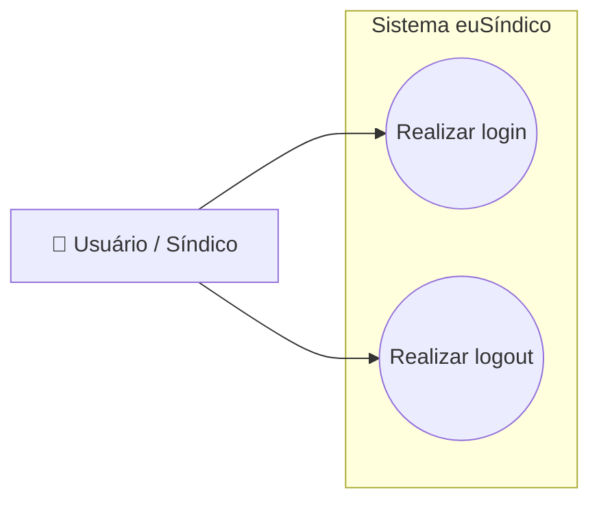

Diagrama de Caso de Uso — Gerenciamento de Perfil
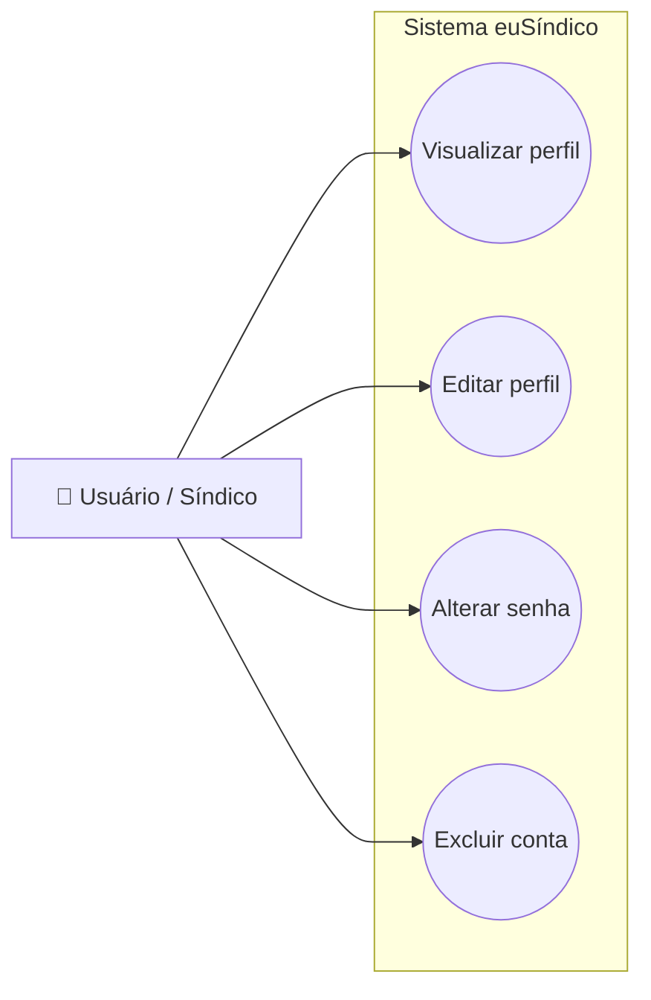

Diagrama de Caso de Uso — Gerenciamento de Compromissos
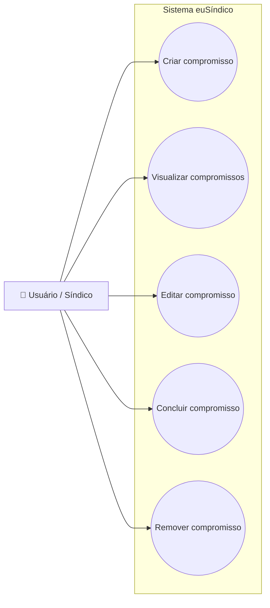

Diagrama de Caso de Uso — Gerenciamento de Prédios
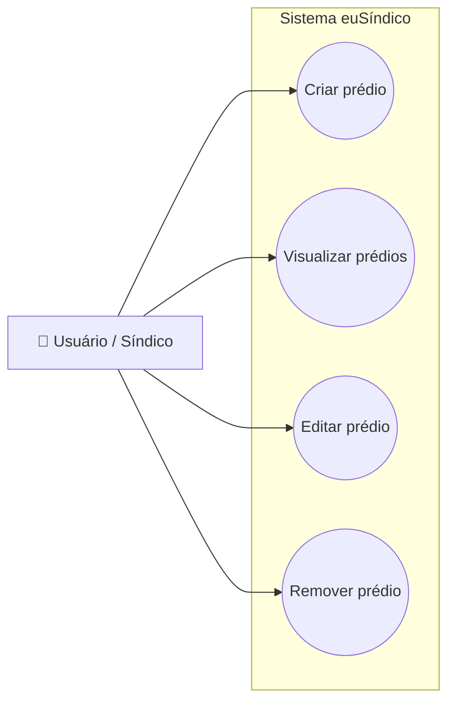

Diagrama de Caso de Uso — Gerenciamento de Planejamentos
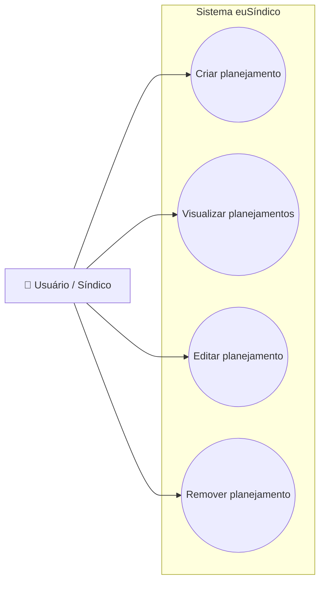

Diagrama de Caso de Uso — Gerenciamento de Documentos (Atas de reunião e Normas internas)
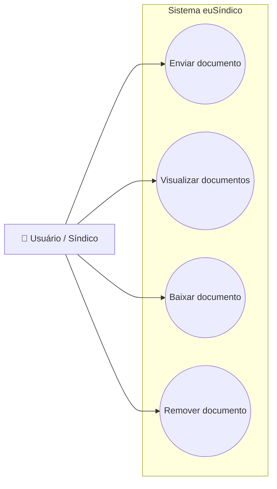

Diagrama de Caso de Uso — Relatórios Mensais
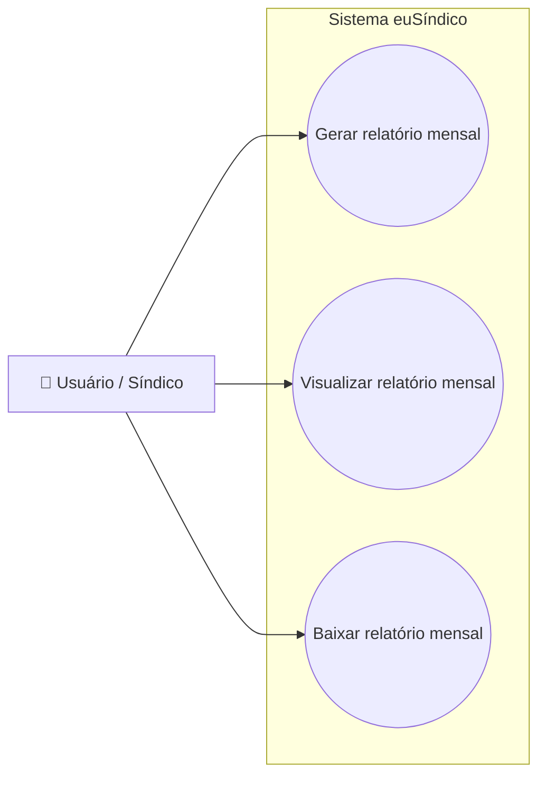

### 2.3 Requisitos Funcionais (RFs)

- RF01 — O sistema deve permitir que o usuário crie uma conta.
- RF02 — O sistema deve permitir que o usuário realize login.
- RF03 — O sistema deve permitir que o usuário realize logout.
- RF04 — O sistema deve permitir que o usuário visualize suas informações de perfil.
- RF05 — O sistema deve permitir que o usuário edite suas informações de perfil.
- RF06 — O sistema deve permitir que o usuário altere sua senha.
- RF07 — O sistema deve permitir que o usuário exclua sua conta.
- RF08 — O sistema deve permitir que o usuário cadastre prédios.
- RF09 — O sistema deve permitir que o usuário visualize prédios cadastrados.
- RF10 — O sistema deve permitir que o usuário edite prédios cadastrados.
- RF11 — O sistema deve permitir que o usuário remova prédios cadastrados.
- RF12 — O sistema deve permitir que o usuário registre compromissos.
- RF13 — O sistema deve permitir que o usuário associe compromissos a um prédio.
- RF14 — O sistema deve permitir que o usuário visualize compromissos cadastrados.
- RF15 — O sistema deve permitir que o usuário edite compromissos cadastrados.
- RF16 — O sistema deve permitir que o usuário remova compromissos cadastrados.
- RF17 — O sistema deve permitir que o usuário marque compromissos como concluídos.
- RF18 — O sistema deve permitir que o usuário registre planejamentos futuros.
- RF19 — O sistema deve permitir que o usuário visualize planejamentos futuros.
- RF20 — O sistema deve permitir que o usuário edite planejamentos futuros.
- RF21 — O sistema deve permitir que o usuário remova planejamentos futuros.
- RF22 — O sistema deve permitir que o usuário envie documentos (atas de reunião e normas internas) vinculados a um prédio.
- RF23 — O sistema deve permitir que o usuário visualize documentos (atas de reunião e normas internas) armazenados.
- RF24 — O sistema deve permitir que o usuário baixe documentos (atas de reunião e normas internas) armazenados.
- RF25 — O sistema deve permitir que o usuário remova documentos (atas de reunião e normas internas) armazenados.
- RF26 — O sistema deve permitir que o usuário gere relatórios mensais com base nos compromissos concluídos.
- RF27 — O sistema deve permitir que o usuário visualize relatórios mensais gerados.
- RF28 — O sistema deve permitir que o usuário baixe relatórios mensais gerados.

### 2.4 Requisitos Não Funcionais (RNFs)

- RNF01 — O sistema deve apresentar tempo de resposta inferior a 1500 ms para operações comuns.
- RNF02 — O sistema deve utilizar autenticação baseada em JWT com expiração de 8 horas para tokens de acesso.
- RNF03 — As senhas dos usuários devem ser armazenadas utilizando algoritmo de hash seguro (BCrypt).
- RNF04 — O sistema deve exigir senhas com no mínimo 8 caracteres, contendo letras maiúsculas, letras minúsculas, números e caracteres especiais.
- RNF05 — O sistema deve validar o formato do endereço de e-mail durante o cadastro e atualização de perfil.
- RNF06 — O sistema deve estar disponível pelo menos 99% do tempo.
- RNF07 — O sistema deve suportar pelo menos 100 usuários simultâneos.
- RNF08 — A interface deve ser responsiva e seguir a abordagem mobile-first.
- RNF09 — O sistema deve garantir a integridade e segurança dos arquivos enviados ao armazenamento.
- RNF10 — As listagens de prédios, compromissos, planejamentos, documentos e relatórios devem possuir paginação para manter o desempenho da aplicação.
- RNF11 — O sistema deve ser desenvolvido de forma modular, facilitando sua manutenção e evolução.

### 2.5 Regras de negócio

- RN01 — Apenas usuários autenticados podem acessar as funcionalidades protegidas do sistema.
- RN02 — Cada usuário poderá visualizar e gerenciar apenas os prédios associados à sua própria conta.
- RN03 — Todo compromisso deve estar obrigatoriamente vinculado a um prédio.
- RN04 — Todo planejamento futuro deve estar obrigatoriamente vinculado a um prédio.
- RN05 — Todo documento deve estar obrigatoriamente vinculado a um prédio.
- RN06 — Apenas compromissos concluídos poderão compor os relatórios mensais de atividades.
- RN07 — A exclusão de um prédio deverá ser confirmada pelo usuário antes de sua execução.
- RN08 — A exclusão de um prédio será lógica (soft delete), tornando o prédio e seus registros associados indisponíveis para consulta na interface da aplicação.
- RN09 — Prédios marcados como excluídos não poderão ser utilizados para cadastro ou edição de compromissos, planejamentos, documentos ou relatórios.
- RN10 — Compromissos devem possuir data e horário obrigatórios para cadastro.
- RN11 — Planejamentos futuros poderão ser cadastrados sem data definida e não poderão ser marcados como concluídos.
- RN12 — O sistema aceitará apenas arquivos nos formatos PDF, DOCX, XLSX, JPG e PNG, com tamanho máximo de 20 MB.
- RN13 — Os relatórios mensais deverão ser gerados em formato PDF, agrupando os compromissos concluídos do mês e ano selecionados.
- RN14 — Os compromissos deverão ser apresentados em ordem cronológica crescente, considerando a data e o horário do compromisso.

### 2.6 Fora do escopo

- Gestão financeira de condomínios
- Comunicação com moradores (chat/avisos)
- Integração com sistemas externos
- Aplicativo mobile nativo
- Controle de portaria e segurança

## 3. Fluxos e comportamento do sistema
### 3.1 Fluxo Principal do Usuário

#### Fluxo "Gerenciamento de Compromissos"

1. Usuário realiza o login no sistema.
2. Acessa a tela de compromissos.
3. Pesquisa compromissos pelo título ou aplica filtros.
4. Visualiza a lista de compromissos ordenada por data e horário.
5. Adiciona um novo compromisso.
6. Visualiza os detalhes de um compromisso.
7. Edita, conclui ou remove um compromisso.

**Diagrama de fluxo**

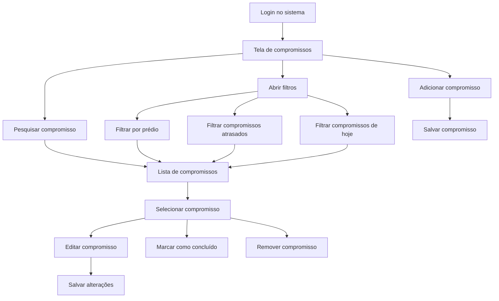

**Diagrama de sequência**

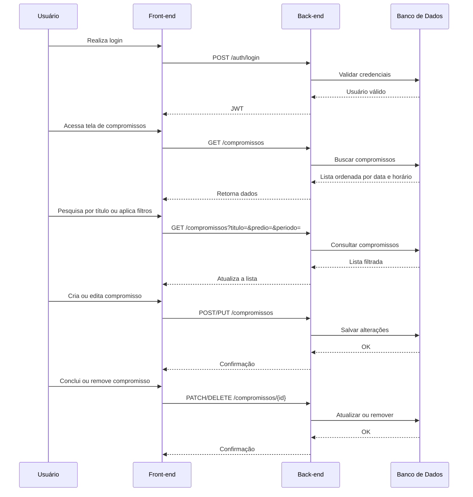

---

#### Fluxo "Gerenciamento de Prédios"

1. Usuário realiza o login no sistema.
2. Acessa a lista de prédios.
3. Adiciona um novo prédio ou seleciona um prédio existente.
4. Acessa a página do prédio.
5. Seleciona um dos módulos disponíveis:
   * Compromissos
   * Planejamentos
   * Atas
   * Normas
   * Relatórios
6. Visualiza os dados do módulo selecionado.

**Diagrama de fluxo**

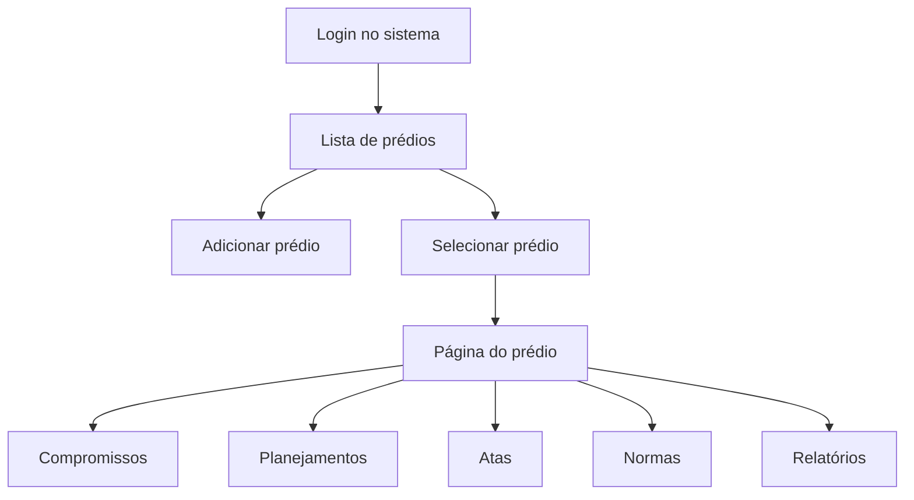

**Diagrama de sequência**

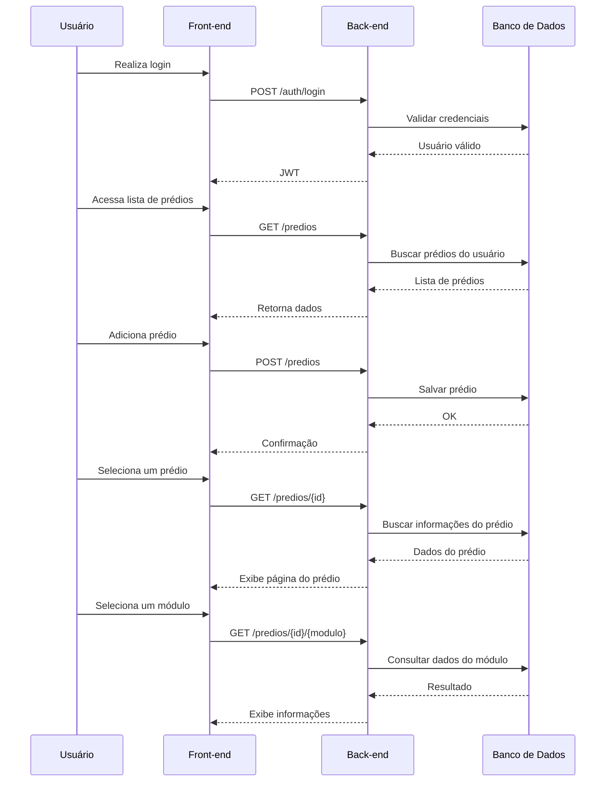

---

#### Fluxo "Gerenciamento da Conta"

1. Usuário realiza o login no sistema.
2. Acessa a tela de configurações.
3. Visualiza seus dados cadastrais.
4. Edita nome, e-mail ou senha.
5. Salva as alterações.
6. Opcionalmente realiza logout.
7. Opcionalmente solicita a exclusão definitiva da conta.

**Diagrama de fluxo**

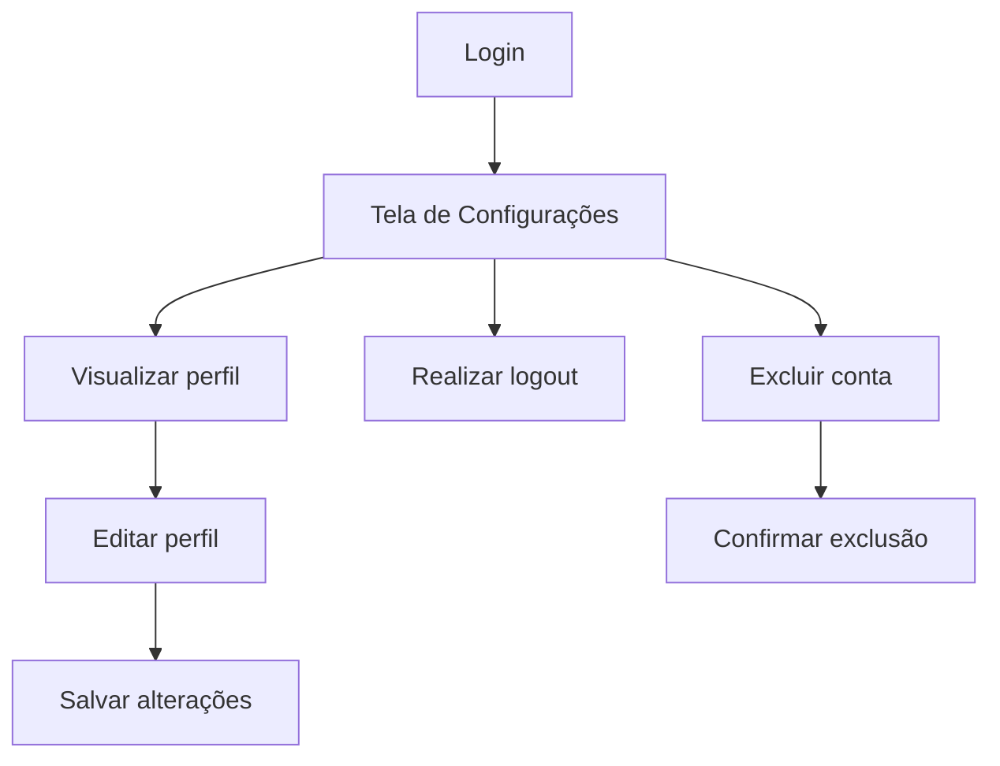

**Diagrama de sequência**

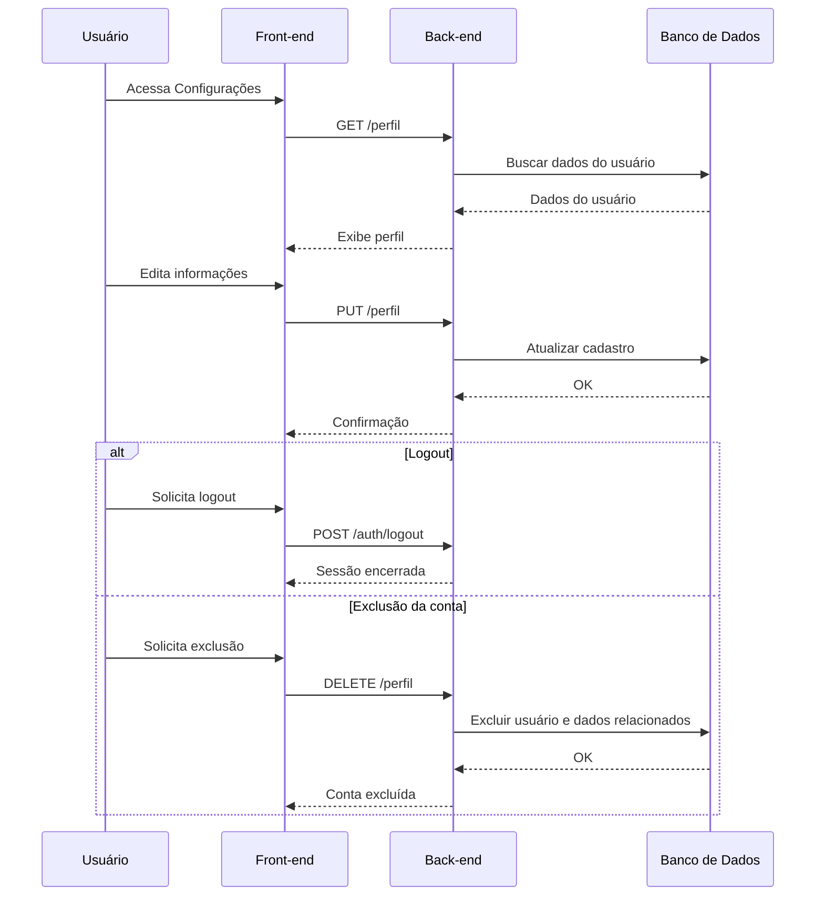

### 3.2 Fluxos alternativos

Fluxo "Falha no login":
1. O usuário insere credenciais inválidas
2. O sistema rejeita a autenticação
3. Uma mensagem de erro é exibida
4. O usuário pode tentar novamente

Fluxo "Falha no upload de documento":
1. O usuário tenta enviar um arquivo inválido ou muito grande
2. O sistema bloqueia o upload
3. Uma mensagem de erro é exibida
4. O usuário deve selecionar outro arquivo

Fluxo "Geração de relatório sem dados":
1. O usuário solicita relatório sem compromissos concluídos
2. O sistema informa que não há dados disponíveis
3. Nenhum relatório é gerado

Fluxo "Acesso sem autenticação":
1. O usuário tenta acessar o sistema sem login
2. O sistema redireciona para a tela de autenticação

## 4. Mockups e Experiência do Usuário (UX)
### 4.1 Fluxo de Navegação

- Vídeo demonstrando o fluxo de navegação:

https://github.com/user-attachments/assets/7d883675-cfd8-4522-a5cf-90c05b4f0ad8

- Diagrama de fluxo de navegação:
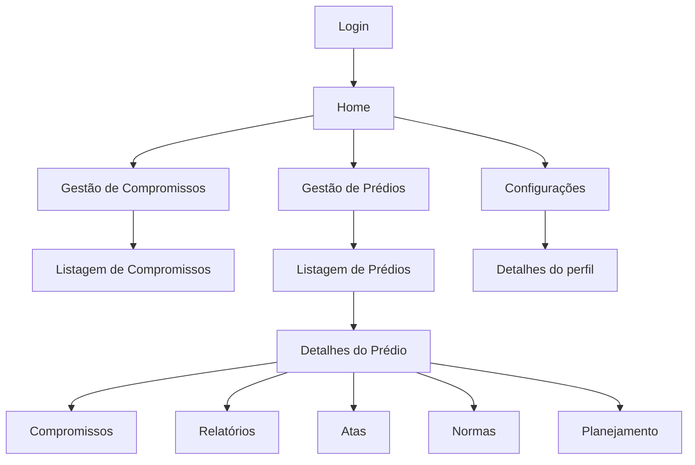

### 4.2 Wireframes ou Mockups das Telas

- Tela inicial:

Nessa tela o usuário pode selecionar a opção de "Compromissos", "Prédios", "Configurações" e "Logout"

 

- Tela "Compromissos":

Nessa tela o usuário poderá visualizar os seus compromissos do dia, adicionar novos, concluir ou removê-los, buscá-los e adicionar filtros a busca

 

- Tela "Detalhes do compromisso":

Nessa tela o usuário poderá visualizar e editar os detalhes do compromisso, tais como: prédio vinculado, data e horário, prestador de serviços e detalhes

 

- Tela "Prédios":

Nessa tela o usuário poderá visualizar os prédios cadastrados e adicionar novos

 

- Tela "Detalhes do prédio":

Nessa tela o usuário poderá visualizar informações gerais sobre o prédio e os menus de "Compromissos", "Relatórios de atividade", "Atas", "Normas" e "Planejamentos futuros"

 

- Telas: "Relatórios de atividades", "Atas" e "Normas":

Telas que possuem uma estrutura semelhante, sendo responsáveis por anexação ou geração e armazenamento de documentos

 

### 4.3 Fluxo de Interação do Usuário

Abaixo está um print da prototipação feita para as telas. O resutado pode ser visto no vídeo anexado no tópico [4.1 Fluxo de Navegação](#41-fluxo-de-navegação)

### 4.4 Feedback Inicial de Usuários

É possível visualizar os prints dos feedbacks no caminho "./prints/feedbacks"

## 5. Arquitetura do Sistema

Esta seção demonstra como o sistema será construído.

### 5.1 Diagrama C4
#### 5.1.1 Nível 1: Diagrama de Contexto

#### 5.1.2 Nível 2: Diagrama de Containers

#### 5.1.3 Nível 3: Diagrama de Componentes

### 5.2 Modelo de dados

#### Visão Geral

O modelo de dados do sistema foi estruturado para permitir o gerenciamento de:

* usuários;
* prédios;
* compromissos;
* planejamento futuros;
* documentos (atas e normas);
* relatórios mensais.

A modelagem foi desenvolvida considerando:

* separação de responsabilidades;
* escalabilidade;
* facilidade de manutenção;
* rastreabilidade entre entidades.

#### 5.2.1 DER (Diagrama Entidade Relacionamento)

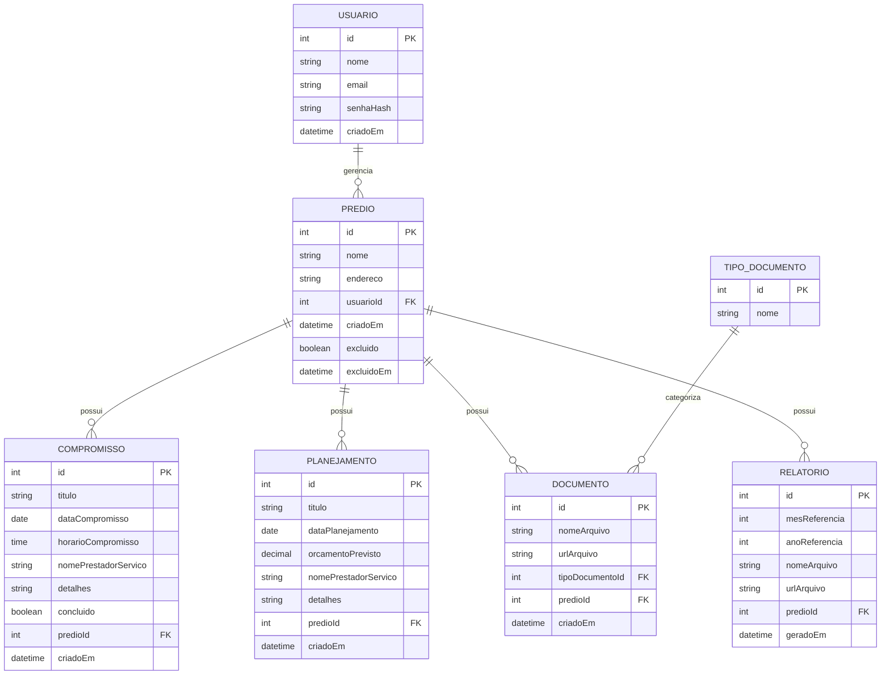

---

#### 5.2.2 Esquema Relacional

##### Tabela: usuarios

| Campo | Tipo | Restrição |
| --- | --- | --- |
| id | INT | PK |
| nome | VARCHAR(150) | NOT NULL |
| email | VARCHAR(150) | UNIQUE |
| senha_hash | VARCHAR(255) | NOT NULL |
| criado_em | DATETIME | NOT NULL |

---

##### Tabela: predios

| Campo | Tipo | Restrição |
| --- | --- | --- |
| id | INT | PK |
| nome | VARCHAR(150) | NOT NULL |
| endereco | VARCHAR(255) | NOT NULL |
| usuario_id | INT | FK |
| criado_em | DATETIME | NOT NULL |
| excluido | BOOLEAN | NOT NULL |
| excluidoEm | DATETIME | NULL |

---

##### Tabela: compromissos

| Campo | Tipo | Restrição |
| --- | --- | --- |
| id | INT | PK |
| titulo | VARCHAR(150) | NOT NULL |
| data_compromisso | DATE | NOT NULL |
| horario_compromisso | TIME | NOT NULL |
| nome_prestador_servico | VARCHAR(150) | NULL |
| detalhes | TEXT | NULL |
| concluido | BOOLEAN | NOT NULL |
| predio_id | INT | FK |
| criado_em | DATETIME | NOT NULL |

---

##### Tabela: planejamentos

| Campo | Tipo | Restrição |
| --- | --- | --- |
| id | INT | PK |
| titulo | VARCHAR(150) | NOT NULL |
| data_planejamento | DATE | NULL |
| orcamento_previsto | DECIMAL(10,2) | NULL |
| nome_prestador_servico | VARCHAR(150) | NULL |
| detalhes | TEXT | NULL |
| predio_id | INT | FK |
| criado_em | DATETIME | NOT NULL |

---

##### Tabela: tipo_documento

| Campo | Tipo | Restrição |
| --- | --- | --- |
| id | INT | PK |
| nome | VARCHAR(50) | NOT NULL |

Valores diponíveis são "Atas" e "Normas"

---

##### Tabela: documentos

| Campo | Tipo | Restrição |
| --- | --- | --- |
| id | INT | PK |
| nome_arquivo | VARCHAR(255) | NOT NULL |
| url_arquivo | VARCHAR(255) | NOT NULL |
| tipo_documento_id | INT | FK |
| predio_id | INT | FK |
| criado_em | DATETIME | NOT NULL |

---

##### Tabela: relatorios

| Campo | Tipo | Restrição |
| --- | --- | --- |
| id | INT | PK |
| mes_referencia | INT | NOT NULL |
| ano_referencia | INT | NOT NULL |
| nome_arquivo | VARCHAR(255) | NOT NULL |
| url_arquivo | VARCHAR(255) | NOT NULL |
| predio_id | INT | FK |
| gerado_em | DATETIME | NOT NULL |

---

### 5.3 Principais Componentes

O sistema **euSíndico** é estruturado em torno de sete módulos funcionais, todos expostos por uma API RESTful desenvolvida em ASP.NET Core, seguindo a arquitetura em camadas **Controller → Service → Repository**.

* **Módulo de Autenticação e Conta** 
  Responsável pelo cadastro de novos usuários (RF01), autenticação (RF02), encerramento da sessão (RF03), visualização e edição das informações de perfil (RF04–RF06) e exclusão da conta (RF07). É composto pelo **AuthController** e **PerfilController**, que delegam as regras de negócio aos serviços **AuthService** e **PerfilService**. A autenticação é baseada em tokens JWT, enquanto as senhas são armazenadas utilizando BCrypt.

* **Módulo de Gerenciamento de Prédios** 
  Responsável pelo cadastro, visualização, edição e remoção de prédios (RF08–RF11). O **PredioController** encaminha as requisições ao **PredioService**, responsável por validar as regras de negócio e persistir os dados no banco de dados relacional.

* **Módulo de Compromissos** 
  Responsável pelo gerenciamento completo dos compromissos (RF12–RF17), incluindo cadastro, associação a um prédio, consulta, edição, remoção e conclusão. Também oferece pesquisa por título e filtros por prédio e período, retornando os resultados ordenados cronologicamente. O **CompromissoService** fornece ainda os dados utilizados na geração dos relatórios mensais.

* **Módulo de Planejamentos Futuros** 
  Responsável pelo cadastro, visualização, edição e remoção de planejamentos futuros (RF18–RF21). Diferentemente dos compromissos, planejamentos não possuem obrigatoriedade de data e não podem ser marcados como concluídos. O módulo é composto pelo **PlanejamentoController** e **PlanejamentoService**.

* **Módulo de Documentos** 
  Responsável pelo gerenciamento de documentos (atas de reunião e normas internas) vinculados aos prédios (RF22–RF25). O **DocumentoService** realiza upload, download, consulta e remoção de arquivos armazenados no AWS S3, mantendo apenas seus metadados no banco de dados MySQL.

* **Módulo de Relatórios** 
  Responsável pela geração, armazenamento, visualização e download dos relatórios mensais (RF26–RF28). O **RelatorioService** consulta os compromissos concluídos do mês selecionado, gera um documento em formato PDF e o armazena no AWS S3 para posterior acesso pelo usuário.

* **Camada de Persistência** 
  Compartilhada por todos os módulos, a camada de repositórios (**Repositories**) abstrai o acesso ao banco de dados MySQL utilizando o Entity Framework como ORM. Essa camada centraliza as operações de leitura e escrita, promovendo desacoplamento entre a lógica de negócio e a infraestrutura de persistência.

* **Armazenamento de Arquivos** 
  O AWS S3 atua como componente de infraestrutura responsável pelo armazenamento dos arquivos binários da aplicação, incluindo atas de reunião, normas internas e relatórios mensais em PDF. O acesso ao serviço é realizado exclusivamente pelos módulos de Documentos e Relatórios por meio de conexões HTTPS.

### 5.4 Stack tecnológica

A stack tecnológica do projeto foi definida considerando:

- experiência prévia do desenvolvedor;
- facilidade de manutenção;
- produtividade no desenvolvimento;
- escalabilidade;
- integração entre tecnologias;
- adequação ao contexto web mobile-first.

---

#### Vue.js

O front-end da aplicação será desenvolvido utilizando Vue.js.

A tecnologia foi escolhida devido:

- facilidade de desenvolvimento de interfaces reativas;
- componentização da aplicação;
- alta produtividade no desenvolvimento;
- boa integração com APIs REST;
- experiência prévia do desenvolvedor com o framework.

Além disso, Vue.js possui excelente compatibilidade com aplicações mobile-first e permite construção de interfaces dinâmicas e organizadas.

---

#### Vuetify

O framework Vuetify será utilizado na construção da interface gráfica da aplicação.

Sua escolha ocorreu devido:

- disponibilidade de componentes prontos;
- produtividade no desenvolvimento;
- facilidade de criação de layouts responsivos;
- integração nativa com Vue.js;
- suporte à abordagem mobile-first.

O uso do Vuetify também auxilia na padronização visual do sistema.

---

#### ASP.NET Core (C#)

O backend será desenvolvido utilizando ASP.NET Core com linguagem C#.

A tecnologia foi escolhida devido:

- alta performance;
- robustez para construção de APIs;
- organização arquitetural;
- forte tipagem da linguagem;
- facilidade de manutenção;
- integração com Entity Framework Core;
- experiência prévia do desenvolvedor.

ASP.NET Core também oferece recursos nativos relacionados à segurança, autenticação e escalabilidade.

---

#### Entity Framework Core

O Entity Framework Core será utilizado como ORM (Object Relational Mapper) da aplicação.

Sua escolha ocorreu devido:

- facilidade de integração com ASP.NET Core;
- produtividade no acesso a dados;
- redução de código SQL manual;
- suporte a migrations;
- facilidade de manutenção do banco de dados.

O ORM permitirá maior organização e abstração da camada de persistência.

---

#### MySQL

O banco de dados relacional utilizado será o MySQL.

A tecnologia foi escolhida devido:

- confiabilidade;
- ampla utilização no mercado;
- boa performance;
- compatibilidade com aplicações web;
- facilidade de integração com Entity Framework Core.

Além disso, o modelo relacional atende adequadamente às necessidades de organização e relacionamento das entidades do sistema.

---

#### AWS S3

O armazenamento de arquivos será realizado utilizando AWS S3 (Amazon Simple Storage Service).

A tecnologia foi escolhida devido:

- armazenamento escalável de arquivos;
- alta disponibilidade;
- segurança;
- facilidade de integração com aplicações web;
- suporte a upload e download de arquivos;
- ampla utilização no mercado.

Além disso, o AWS S3 oferece boa integração com aplicações ASP.NET Core e permite gerenciamento eficiente dos arquivos enviados pelos usuários.

---

#### Figma

O Figma será utilizado para prototipação das interfaces da aplicação.

Sua escolha ocorreu devido:

- facilidade de criação de protótipos;
- colaboração visual;
- validação de fluxo de navegação;
- organização da identidade visual;
- agilidade na construção de interfaces.

O Figma será utilizado durante a etapa de definição da experiência do usuário e prototipação das telas.

## 6. Segurança e Privacidade

A segurança da informação é um aspecto fundamental do projeto, considerando que o sistema armazenará dados de usuários, informações de condomínios e documentos enviados pelo síndico. Durante o desenvolvimento serão adotadas práticas de desenvolvimento seguro para reduzir riscos de vulnerabilidades e proteger as informações armazenadas.

### 6.1 Segurança da Aplicação

#### Autenticação e Autorização

O acesso ao sistema será realizado por meio de autenticação utilizando JWT (JSON Web Token). Após o login, cada requisição protegida deverá apresentar um token válido para acesso aos recursos da aplicação. Além disso, somente usuários autenticados poderão acessar informações relacionadas aos seus próprios condomínios.

#### Armazenamento Seguro de Senhas

Será utilizado algoritmo de hash seguro (BCrypt) para armazenamento das credenciais, impossibilitando a recuperação direta da senha original.

#### Segurança dos Arquivos

Os documentos enviados pelos usuários serão armazenados no AWS S3. O acesso aos arquivos será realizado apenas por usuários autenticados e autorizados, evitando exposição pública dos documentos. Também serão realizadas validações quanto ao tipo e tamanho dos arquivos enviados.

#### Proteção contra OWASP Top 10

Durante o desenvolvimento serão adotadas medidas para reduzir as principais vulnerabilidades descritas pelo OWASP Top 10, incluindo:

- autenticação segura;
- controle de autorização;
- validação de entrada de dados;
- proteção contra SQL Injection através do Entity Framework Core;
- proteção contra Cross-Site Scripting (XSS) por meio da renderização segura do Vue.js;
- utilização de HTTPS para comunicação entre cliente e servidor;
- tratamento adequado de erros sem exposição de informações sensíveis.

### 6.2 Privacidade e LGPD

O sistema será desenvolvido considerando os princípios estabelecidos pela Lei Geral de Proteção de Dados (LGPD), coletando apenas as informações necessárias para o funcionamento da aplicação.

#### Dados coletados

Serão armazenados os seguintes dados:

- nome do usuário;
- endereço de e-mail;
- senha (armazenada em formato criptografado por hash);
- informações dos prédios cadastrados;
- compromissos;
- planejamentos;
- documentos enviados;
- relatórios gerados.

Não serão coletados dados considerados sensíveis pela LGPD.

#### Armazenamento dos Dados

Os dados estruturados serão armazenados em banco de dados MySQL. Os documentos enviados serão armazenados no AWS S3. Todo o acesso ocorrerá mediante autenticação do usuário.

#### Exclusão de Dados

O usuário poderá solicitar a exclusão de sua conta e dos dados associados.

Após a solicitação, serão removidos:

- dados cadastrais;
- prédios;
- compromissos;
- planejamentos;
- documentos;
- relatórios gerados.

A exclusão será realizada de forma permanente.

## 7. Planejamento do projeto

O desenvolvimento do projeto será realizado de forma incremental, permitindo a validação contínua das funcionalidades implementadas e a evolução gradual da aplicação até sua versão final.

### 7.1 Marcos de desenvolvimento

| Marco | Descrição | Prazo |
| ------ | --------- | ------ |
| M1 | Configuração do ambiente de desenvolvimento (Vue.js, ASP.NET Core, MySQL e AWS S3) | Semana 1 |
| M2 | Definição da arquitetura e modelagem de dados | Semana 2 |
| M3 | Implementação da autenticação e gerenciamento de prédios | Semana 3 e 4 |
| M4 | Implementação dos módulos de compromissos e planejamentos futuros | Semana 5 e 6 |
| M5 | Implementação do gerenciamento de documentos | Semana 7 e 8 |
| M6 | Implementação da geração de relatórios mensais | Semana 9 |
| M7 | Testes funcionais, correções e melhorias de usabilidade | Semana 10 e 11 |
| M8 | Implantação da aplicação em ambiente de produção e entrega da versão final | Semana 12 |

## 8. Referências

### 8.1 Documentação técnica

- Vue.js. Vue.js Documentation. Disponível em: https://vuejs.org/. Acesso em: jun. 2026.
- Vuetify. Vuetify Documentation. Disponível em: https://vuetifyjs.com/. Acesso em: jun. 2026.
- Microsoft. ASP.NET Core Documentation. Disponível em: https://learn.microsoft.com/aspnet/core. Acesso em: jun. 2026.
- Microsoft. Entity Framework Core Documentation. Disponível em: https://learn.microsoft.com/ef/core. Acesso em: jun. 2026.
- Oracle. MySQL Documentation. Disponível em: https://dev.mysql.com/doc/. Acesso em: jun. 2026.
- Amazon Web Services. Amazon S3 Documentation. Disponível em: https://docs.aws.amazon.com/s3/. Acesso em: jun. 2026.
- JWT. JSON Web Tokens (JWT). Disponível em: https://jwt.io/. Acesso em: jun. 2026.
- OWASP Foundation. OWASP Top 10. Disponível em: https://owasp.org/www-project-top-ten/. Acesso em: jun. 2026.
- Governo Federal. Lei Geral de Proteção de Dados (Lei nº 13.709/2018). Disponível em: https://www.planalto.gov.br/ccivil_03/_ato2015-2018/2018/lei/l13709.htm. Acesso em: jun. 2026.

### 8.2 Ferramentas utilizadas

- Visual Studio. Disponível em: https://visualstudio.microsoft.com/ Acesso em: jun. 2026
- Visual Studio Code. Disponível em: https://code.visualstudio.com/ Acesso em: jun. 2026
- GitHub. Disponível em: https://github.com/ Acesso em: jun. 2026
- Figma. Disponível em: https://www.figma.com/ Acesso em: jun. 2026
