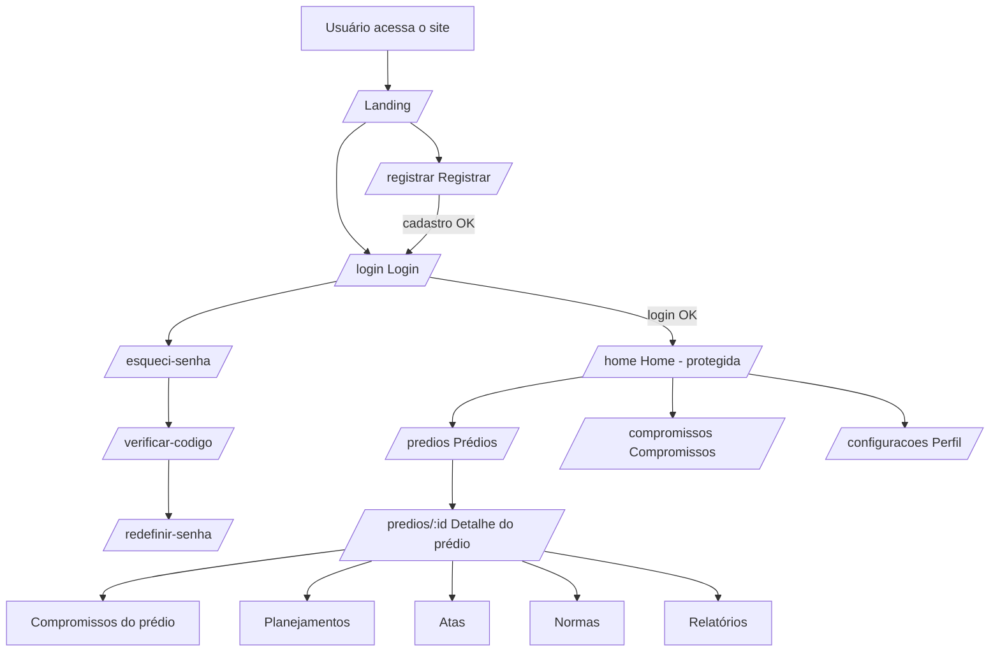
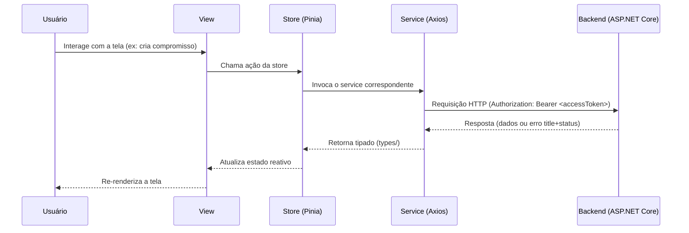

# Arquitetura — Frontend euSíndico

SPA (Single Page Application) desenvolvida em **Vue.js 3 + TypeScript**, seguindo a abordagem mobile-first definida no [RFC](../../documentation/RFC/RFC.md) (RNF08) e a stack tecnológica da seção 5.4 (Vue.js, Vuetify). Este documento é o equivalente, do lado do frontend, ao [ARCHITECTURE.md do backend](../../backend/documentation/ARCHITECTURE.md) — vale a leitura de ambos para entender como as duas pontas se conectam.

> **Nota sobre TypeScript:** o RFC (seção 5.4) especifica Vue.js, mas não menciona TypeScript explicitamente. A escolha de usar TypeScript é uma decisão desta camada, não do RFC original — mesmo espírito de adição documentada que o backend já fez para o RF06-A. Justificativa: o backend é fortemente tipado (C#), com DTOs explícitos em cada Service; sem TypeScript, essa tipagem se perderia inteiramente na borda entre as duas aplicações, e divergências entre o que a API realmente retorna e o que o frontend espera só apareceriam em runtime. Com TypeScript, os `types/` do frontend espelham os DTOs do backend e o compilador aponta a divergência antes mesmo de rodar.

> **Nota sobre a landing page:** o fluxo de navegação original do RFC (seção 4.1) começa direto em `Login`. Este projeto adiciona uma **landing page pública** antes da tela de login — o usuário entra no site, vê informações sobre o produto, e só então decide se quer se cadastrar ou entrar. Essa adição não está prevista no RFC v2.1.0; está registrada aqui pelo mesmo motivo que o RF06-A foi registrado no backend: é uma mudança de escopo real, não deveria ficar implícita no código.

## Sumário

1. [Stack tecnológica](#1-stack-tecnológica)
2. [Estrutura de pastas](#2-estrutura-de-pastas)
3. [Fluxo de dependências entre camadas](#3-fluxo-de-dependências-entre-camadas)
4. [Módulos da aplicação](#4-módulos-da-aplicação)
5. [Roteamento e guarda de rotas](#5-roteamento-e-guarda-de-rotas)
6. [Comunicação com o backend](#6-comunicação-com-o-backend)
7. [Fluxo de uma requisição, ponta a ponta](#7-fluxo-de-uma-requisição-ponta-a-ponta)
8. [Hospedagem (planejada)](#8-hospedagem-planejada)

## 1. Stack tecnológica

| Tecnologia | Papel | Referência |
|---|---|---|
| **Vue.js 3** (Composition API, `<script setup>`) | Framework de UI | RFC 5.4 |
| **TypeScript** | Tipagem estática, espelha os DTOs do backend | Decisão desta camada (ver nota acima) |
| **Vuetify 3** | Biblioteca de componentes, layout responsivo mobile-first | RFC 5.4 |
| **Vue Router 4** | Roteamento client-side, guarda de rotas autenticadas | — |
| **Pinia** | Gerenciamento de estado (sessão do usuário, dados em cache de tela) | Sucessor oficial do Vuex, integração nativa com Composition API |
| **Axios** | Cliente HTTP, com interceptor de renovação de token | Necessário para o fluxo de refresh token (ver seção 6) |
| **Vite** | Build tool e dev server | Padrão atual do ecossistema Vue 3 |
| **Zod** | Validação de schema em runtime das respostas da API, na fronteira do `services/` | TypeScript só valida em tempo de compilação — Zod garante que o formato *real* da resposta bate com o `types/` esperado |
| **VeeValidate** (+ Zod) | Validação de formulários, integrado ao Vuetify | Reaproveita os mesmos schemas Zod da validação de resposta da API para validar os formulários de entrada — uma única fonte de verdade para o "formato de um DTO" |
| **Vitest** | Testes unitários (funções puras, composables, stores, schemas Zod) — detalhado em [TEST.md](TEST.md) | Padrão do scaffold oficial do Vue 3 (`create-vue`); roda em Node/jsdom, sem precisar de um browser real |
| **Cypress** | Testes de componente (montagem de Vue real) e end-to-end — detalhado em [TEST.md](TEST.md) | Definido para este projeto |

## 2. Estrutura de pastas

```
frontend/
├── public/                      # Assets estáticos servidos como estão (favicon, robots.txt)
├── src/
│   ├── assets/                  # Imagens, fontes, estilos globais (SCSS/CSS)
│   ├── components/              # Componentes de UI reutilizáveis e "burros" (sem chamada a API)
│   ├── composables/             # Funções `use*` com lógica reativa reutilizável (ex: useCompromissoFiltros)
│   ├── layouts/                 # Esqueletos de página (LandingLayout, AuthLayout, AppLayout)
│   ├── views/                   # Componentes de página, um por rota, organizados por módulo (seção 4)
│   ├── router/                  # Definição de rotas e guarda de navegação (seção 5)
│   ├── stores/                  # Stores Pinia — um por módulo/domínio (seção 4)
│   ├── services/                # Uma função por endpoint da API, usando a instância do Axios (seção 6)
│   ├── schemas/                 # Schemas Zod dos DTOs trocados com o backend (fonte de verdade em runtime)
│   ├── types/                   # Tipos TypeScript, inferidos dos schemas (`z.infer<typeof schema>`)
│   ├── utils/                   # Funções puras: formatação, validação client-side (seção 4 do SECURITY.md)
│   ├── plugins/                 # Configuração de bibliotecas (vuetify.ts, axios.ts)
│   ├── App.vue
│   └── main.ts
├── cypress/
│   ├── e2e/                     # Testes end-to-end, organizados por módulo
│   ├── component/               # Testes de componente (ver TEST.md)
│   ├── fixtures/                # Dados mockados para cy.intercept
│   └── support/                 # Comandos customizados e configuração global do Cypress
├── .env.example                 # Modelo de variáveis de ambiente (nunca contém segredos — ver SECURITY.md)
├── vite.config.ts
├── vitest.config.ts
├── tsconfig.json
├── eslint.config.js
└── package.json
```

Testes unitários (Vitest) ficam colocados junto do código que testam (ex: `utils/senhaValidator.ts` + `utils/senhaValidator.spec.ts`) — ver [TEST.md](TEST.md).

### Responsabilidade de cada pasta

| Pasta | Responsabilidade | Não é responsabilidade desta pasta |
|---|---|---|
| `views/` | Montar a tela: compor componentes, ler/escrever no store, reagir a eventos de rota | Chamar `axios` diretamente, conter regra de negócio complexa |
| `components/` | Renderizar UI a partir de `props`, emitir eventos (`emits`) | Conhecer stores ou fazer chamadas HTTP — um componente reutilizável não deveria saber de onde vêm os dados |
| `stores/` (Pinia) | Guardar e expor estado compartilhado entre telas (sessão do usuário, listas já carregadas), orquestrar chamadas aos `services/` | Conhecer detalhes de HTTP (status code, headers) — isso é do `services/` |
| `services/` | Encapsular cada chamada HTTP a um endpoint específico da API, validando a resposta com `schemas/` antes de devolvê-la tipada | Manter estado (isso é do `stores/`), decidir o que fazer com o resultado |
| `schemas/` | Descrever o formato real de cada DTO (Zod) — usado tanto para validar respostas da API quanto formulários (via VeeValidate) | Conter lógica de UI ou de chamada HTTP |
| `types/` | Tipos TypeScript inferidos de `schemas/` — nunca escritos à mão em paralelo, para não divergir do schema em runtime | Validar nada em runtime — é só o tipo estático |
| `composables/` | Lógica reativa reutilizável entre componentes (ex: paginação, debounce de busca) | Fazer parte da árvore de componentes diretamente |
| `router/` | Definir rotas e aplicar a guarda de autenticação (seção 5) | Conter lógica de tela |

## 3. Fluxo de dependências entre camadas

```
views/  ──depende de──>  stores/  ──depende de──>  services/  ──depende de──>  schemas/ (e types/)
  │                                                                    
  └──usa──> components/ (sem dependência de stores/services)
```

Regra equivalente à "as setas só apontam para dentro" do backend: um `component/` nunca importa `axios` nem uma `store`; quem precisa de dados busca na `store` (ou recebe via `props`) e delega ações via `emits`. Uma `view/` pode falar com a `store` do seu módulo; a `store` é quem chama o `service/` correspondente. Isso mantém os componentes de UI testáveis isoladamente (ver [TEST.md](TEST.md), testes de componente) e evita que uma chamada HTTP fique espalhada por múltiplos componentes.

## 4. Módulos da aplicação

Espelhando os módulos do backend ([ARCHITECTURE.md](../../backend/documentation/ARCHITECTURE.md), seção 5.3), com a adição do módulo de Landing (frontend-only, sem contraparte no backend):

| Módulo | Views | Store | Service | Endpoints consumidos |
|---|---|---|---|---|
| **Landing** *(novo, ver nota no topo)* | `LandingView` | — (página estática/institucional) | — | nenhum |
| **Autenticação e Conta** | `LoginView`, `RegistrarView`, `EsqueciSenhaView`, `VerificarCodigoView`, `RedefinirSenhaView`, `PerfilView` | `authStore`, `recuperacaoSenhaStore`, `perfilStore` | `authService`, `perfilService` | `/auth/*`, `/perfil` |
| **Prédios** | `PrediosListView`, `PredioDetalheView` | `predioStore` | `predioService` | `/predios/*` |
| **Compromissos** | `CompromissosListView`, `CompromissoDetalheView` | `compromissoStore` | `compromissoService` | `/predios/{id}/compromissos` |
| **Planejamentos** | `PlanejamentosListView`, `PlanejamentoDetalheView` | `planejamentoStore` | `planejamentoService` | `/predios/{id}/planejamentos` |
| **Documentos** (atas e normas) | `DocumentosListView`, `DocumentoDetalheView` | `documentoStore` | `documentoService` | `/predios/{id}/documentos` |
| **Relatórios** | `RelatoriosListView`, `RelatorioDetalheView` | `relatorioStore` | `relatorioService` | `/predios/{id}/relatorios` |

O **`recuperacaoSenhaStore`** é atípico entre as stores: em vez de cachear uma lista já carregada, ele guarda o *estado do fluxo* de recuperação de senha (RF06-A) entre as três telas — e-mail informado, código verificado e o instante em que o cooldown de reenvio expira (ver [SECURITY.md](SECURITY.md), seção 4). O e-mail e o cooldown são espelhados em `sessionStorage` para o **timer sobreviver a um F5** — sem isso, recarregar zeraria a contagem e permitiria um reenvio que o backend aceitaria (204) sem enviar nada, uma UX enganosa. O **código verificado nunca é persistido** (é um segredo). Por isso, após um reload: `/verificar-codigo` sem e-mail volta para `/esqueci-senha`, e `/redefinir-senha` sem código volta para `/verificar-codigo`. Esses dados vivem na store (não em `query`/`params` de rota) para não expor e-mail/código na URL.

`DocumentoDetalheView` e `RelatorioDetalheView` incluem uma **pré-visualização do arquivo** antes do download (ex: visualizador de PDF embutido para PDFs, miniatura para JPG/PNG) — evita um download às cegas só para conferir se é o arquivo certo. Para tipos sem preview viável no navegador (DOCX, XLSX), a tela mostra os metadados (nome, tipo, data de envio) e o botão de download direto, sem tentar renderizar o conteúdo.

## 5. Roteamento e guarda de rotas



| Rota | Pública? | Layout |
|---|---|---|
| `/` (Landing) | Sim | `LandingLayout` |
| `/login`, `/registrar`, `/esqueci-senha`, `/verificar-codigo`, `/redefinir-senha` | Sim | `AuthLayout` |
| `/home`, `/predios/**`, `/compromissos/**`, `/configuracoes` | **Não** — exige sessão ativa | `AppLayout` |

A guarda global de navegação (`router.beforeEach`) verifica se a rota de destino exige autenticação (`meta.requiresAuth`) e consulta o `authStore`. Sem sessão válida, o usuário é redirecionado para `/login` — nunca para `/`, já que quem tenta acessar uma rota protegida já demonstrou intenção de entrar no sistema, não de conhecer o produto. Esse comportamento é o equivalente, no frontend, ao fluxo "Acesso sem autenticação" descrito no [RFC](../../documentation/RFC/RFC.md#32-fluxos-alternativos) (seção 3.2) — lá o RFC previa redirecionamento "para a tela de autenticação", o que hoje significa `/login`, não a landing page.

**Modelo de navegação dentro da área logada:** sem menu inferior persistente — a Home funciona como hub central (cards centralizados para Compromissos/Prédios/Configurações) e concentra também a ação de Logout, apresentada como **FAB** (botão de ação flutuante, canto inferior direito) para padronizar com o FAB de ação das telas filhas — não é mais um ícone fixo visível em toda rota protegida. Cada tela filha exibe um cabeçalho compartilhado (seta de voltar + título + atalho para Home) e seu próprio FAB de ação ("adicionar"/"criar"/"gerar"); como a Home é um hub (sem ação de criar), seu único FAB é o de Logout, então não há o problema de "botão em cima de botão".

O destino do botão "voltar" **não** usa o histórico do navegador (`router.back()`) — descartado deliberadamente por não ser determinístico: quebra em F5/deep link (a pilha de histórico da aba não reflete o caminho lógico dentro do app) e pode se comportar de forma inesperada quando o próprio app navega programaticamente (ex: a guarda de rota redirecionando para `/login`). Em vez disso, cada rota declara seu destino de volta em `route.meta.voltarPara`, uma função pura `(route) => destino` calculada a partir dos parâmetros da própria rota — ex: `/predios/:predioId/compromissos` sempre volta para `/predios/:predioId`, nunca para `/home`, e isso vale igual após um F5 ou um deep link direto, já que não depende de nenhum estado de navegação acumulado.

Por isso `AppLayout` é só a casca comum (`v-app` + `v-main` + `router-view`), sem nenhuma ação própria — Logout vive só na `HomeView` (ver [AUTHENTICATION.md](AUTHENTICATION.md), seção 6). O cabeçalho de navegação das telas filhas (seta de voltar + título + atalho para Home) é um componente compartilhado entre módulos, não recriado individualmente por `view`.

## 6. Comunicação com o backend

- Uma única instância do Axios (`plugins/axios.ts`), com `baseURL` vindo de `import.meta.env.VITE_API_BASE_URL` (nunca hardcoded — necessário para apontar para o backend local em desenvolvimento e para o AWS App Runner em produção).
- **Autenticação e renovação de sessão:** como o token é anexado a cada requisição e renovado automaticamente em caso de `401` está descrito por inteiro em **[AUTHENTICATION.md](AUTHENTICATION.md)** — não duplicado aqui.
- **Tratamento de erro:** o backend responde erros num formato mínimo, só `title` + `status` (sem `type`/`code` — ver decisão registrada em memória do projeto). Por isso o frontend **nunca** deve decidir o que fazer com base no texto de `title` — a lógica de UI (redirecionar, mostrar mensagem X ou Y) deve se basear exclusivamente no `status` HTTP. As mensagens exibidas ao usuário são definidas no próprio frontend (ex: um `409` no cadastro sempre vira "este e-mail já está cadastrado", independente do texto exato que o backend mandar).

## 7. Fluxo de uma requisição, ponta a ponta



## 8. Hospedagem (planejada)

Consistente com o que já está registrado no [ARCHITECTURE.md do backend](../../backend/documentation/ARCHITECTURE.md), seção "Hospedagem":

- **Frontend:** AWS Amplify Hosting (build + deploy + CDN + HTTPS a partir do repositório Git).
- **Backend:** AWS App Runner — URL configurada via `VITE_API_BASE_URL` no build de produção do Amplify.
- **Segredos/configuração de build:** variáveis de ambiente do próprio Amplify Console (nunca versionadas) — ver [SECURITY.md](SECURITY.md), seção "Variáveis de ambiente".

O backend já libera `http://localhost:5173` via CORS para desenvolvimento (ver [SECURITY.md](SECURITY.md), seção 7). Antes do primeiro deploy real, falta só adicionar a origem de produção (domínio do Amplify) — ver pendência em [SECURITY.md](SECURITY.md), seção "Pendências conhecidas".
