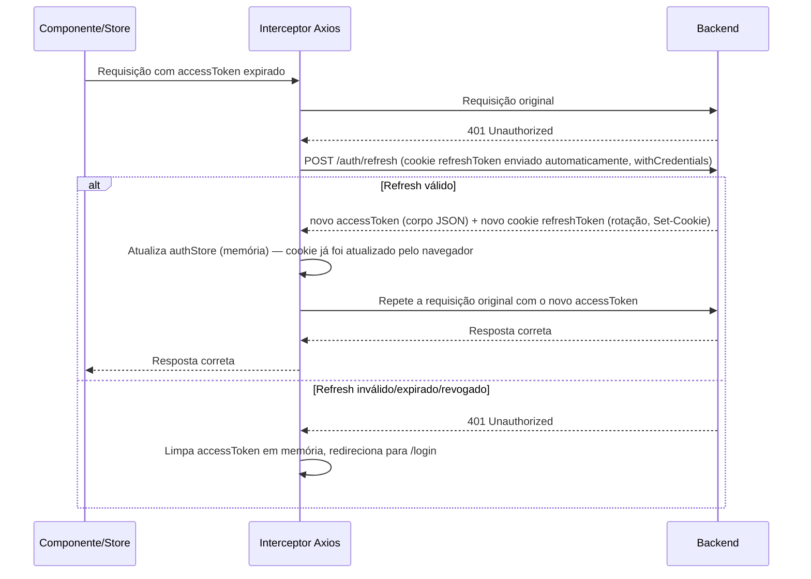

# Autenticação — Frontend euSíndico

Este documento centraliza **onde e como o token vive no frontend**: armazenamento, renovação silenciosa e logout. É o equivalente frontend do [AUTHENTICATION.md do backend](../../backend/documentation/AUTHENTICATION.md) (que descreve cada endpoint, `AuthController`/`AuthService`) — juntos, os dois cobrem o fluxo ponta a ponta. Existia antes espalhado em pedaços por [SECURITY.md](SECURITY.md) e [ARCHITECTURE.md](ARCHITECTURE.md); centralizado aqui para não ficar redescrevendo a mesma coisa em vários arquivos. **[SECURITY.md](SECURITY.md) assume o fluxo abaixo como dado e foca só no raciocínio de risco** (por que é seguro o suficiente, o que ainda falta) — vale ler os dois.

## Sumário

1. [Visão geral](#1-visão-geral)
2. [Onde cada peça mora na arquitetura](#2-onde-cada-peça-mora-na-arquitetura)
3. [Armazenamento dos tokens](#3-armazenamento-dos-tokens)
4. [Bootstrap da sessão ao carregar a aplicação (F5)](#4-bootstrap-da-sessão-ao-carregar-a-aplicação-f5)
5. [Renovação automática do access token](#5-renovação-automática-do-access-token)
6. [Logout](#6-logout)

## 1. Visão geral

> **Atualizado após a migração do backend para cookie `httpOnly`** (commit `feat(backend-auth): migrate refresh token to httponly cookie and restrict CORS to explicit origins`). A versão anterior deste documento descrevia o refresh token no corpo JSON + `localStorage`; esse desenho foi substituído pelo abaixo.

O backend emite `accessToken` (JWT, ~30 min) no corpo JSON da resposta de `POST /auth/login` e `POST /auth/refresh`. O `refreshToken` (opaco, revogável, 8h) **nunca aparece no corpo JSON** — é emitido via `Set-Cookie`, `HttpOnly` + `Secure` + `SameSite=None`, restrito a `Path=/auth` (ver [AUTHENTICATION.md do backend](../../backend/documentation/AUTHENTICATION.md) e [SECURITY.md do backend](../../backend/documentation/SECURITY.md), seção 1). O frontend só é responsável por guardar o `accessToken` e anexá-lo em toda requisição autenticada (`Authorization: Bearer <token>`); o refresh token é gerenciado inteiramente pelo navegador — invisível a JavaScript. Toda chamada Axios precisa de `withCredentials: true` para o cookie ser enviado/recebido em requisições cross-origin (frontend e backend em domínios diferentes).

## 2. Onde cada peça mora na arquitetura

Seguindo a divisão descrita em [ARCHITECTURE.md](ARCHITECTURE.md):

| Componente | Responsabilidade |
|---|---|
| `stores/authStore.ts` (Pinia) | Guarda o `accessToken` em memória (estado reativo, nunca persistido) e a flag de "autenticado"; expõe as ações `login`, `logout`, `bootstrap`. |
| `services/authService.ts` | Uma função por endpoint de `/auth/*` (`login`, `refresh`, `logout`, `registrar`, os três de recuperação de senha), tipadas com `schemas/` (Zod). Não sabe onde o token é guardado — só faz a chamada HTTP e devolve o resultado. |
| `plugins/axios.ts` | Instância única do Axios, com `withCredentials: true` (necessário para o cookie `httpOnly` do refresh token trafegar cross-origin); interceptor de requisição anexa o `Authorization` header a partir do `authStore`; interceptor de resposta trata `401` renovando a sessão (seção 5). |
| `router/index.ts` (guarda de navegação) | Antes de entrar numa rota protegida, confere `authStore.isAuthenticated` — e, na primeira vez, dispara o bootstrap da sessão (seção 4) antes de checar; sem sessão, redireciona para `/login` (ver [ARCHITECTURE.md](ARCHITECTURE.md), seção 5). |

## 3. Armazenamento dos tokens

O cookie `httpOnly` (inacessível a JavaScript) é a opção mais segura para o refresh token, e é o que o backend usa desde a migração — o frontend não guarda o refresh token em nenhuma estrutura própria (nem `localStorage`, nem `authStore`); ele simplesmente não é visível a este lado. A análise de risco está em [SECURITY.md](SECURITY.md), seção 1.

| | Access token | Refresh token |
|---|---|---|
| Onde fica | Em memória (`authStore`, Pinia) | Cookie `HttpOnly` gerenciado pelo navegador — nunca acessível a JavaScript |
| Sobrevive a um F5 (reload)? | Não — perdido de propósito | Sim — o cookie persiste, o navegador o reenvia sozinho |
| Por que essa escolha | Reduz a janela de exposição do token mais "poderoso" (autentica toda requisição) | `HttpOnly` elimina o risco de um XSS ler o token; `Path=/auth` limita o cookie só aos endpoints que precisam dele |

## 4. Bootstrap da sessão ao carregar a aplicação (F5)

Como o refresh token vive num cookie `HttpOnly`, o frontend não tem como *verificar* sua existência via JavaScript antes de tentar usá-lo — não existe um `if (localStorage.getItem(...))` equivalente. A única forma de saber é tentar `POST /auth/refresh` e ver se o navegador anexa um cookie válido.

**O bootstrap não roda incondicionalmente em `main.ts`** — rodar isso para toda rota, inclusive a landing pública, gastaria uma chamada de rede (e um `401` previsível) em telas que não têm nada a ver com sessão. Em vez disso, é a guarda de navegação (`router/index.ts`, `router.beforeEach`) quem dispara `authStore.bootstrap()`, e só quando as três condições valem ao mesmo tempo: a rota de destino exige autenticação (`meta.requiresAuth`), o usuário ainda não está autenticado em memória, e o bootstrap ainda não foi tentado nesta sessão da SPA (`authStore.bootstrapped`, que vira `true` depois da primeira tentativa, com sucesso ou não — evita repetir a chamada a cada navegação subsequente). Se houver cookie válido, a chamada volta com um novo `accessToken`; se não houver (ou estiver expirado/revogado), retorna `401` e o usuário segue como não-autenticado, sendo redirecionado para `/login`. Do ponto de vista de quem já estava logado, a sessão "sobrevive" a um F5 feito diretamente numa rota protegida (ou a um deep link) sempre que o cookie ainda for válido — a perda do access token em memória é um detalhe de implementação invisível.

## 5. Renovação automática do access token

Interceptor de resposta do Axios (`plugins/axios.ts`), replicando o Fluxo 4 do [AUTHENTICATION.md do backend](../../backend/documentation/AUTHENTICATION.md):

Um único interceptor centraliza essa lógica — nenhuma `view`/`store` precisa saber que uma renovação aconteceu no meio do caminho.

## 6. Logout

Segue à risca a "Responsabilidade do frontend no logout" já documentada no [AUTHENTICATION.md do backend](../../backend/documentation/AUTHENTICATION.md) (Fluxo 5):

1. Chama `POST /auth/logout` (sem corpo — o `refreshToken` vai sozinho via cookie, `withCredentials: true`) com o `accessToken` no header `Authorization`. O backend revoga o token no banco e limpa o cookie via `Set-Cookie` de expiração.
2. **Independentemente do resultado da chamada** (sucesso, falha de rede, timeout), `authStore.logout()` apaga o `accessToken` em memória — a falha da chamada é capturada (`catch`) e nunca repassada a quem chamou, exatamente para que o passo 3 sempre aconteça mesmo se o backend não responder. Não há nada para limpar do lado do refresh token — o cookie não é acessível/gerenciável por JavaScript.
3. Redireciona para `/login`.

Ponto de atenção para quem for mexer aqui: um `try { ... } finally { limparSessao() }` **sem** `catch` não é suficiente — ele limpa a sessão, mas ainda deixa o erro se propagar depois do `finally`, e quem chamou `logout()` (`HomeView.vue` — único lugar onde o botão (FAB) de Logout existe, ver [ARCHITECTURE.md](ARCHITECTURE.md), seção 5) nunca chegaria a executar o redirecionamento. Foi exatamente esse bug que apareceu num teste E2E de logout com falha de rede simulada — corrigido adicionando o `catch`.
